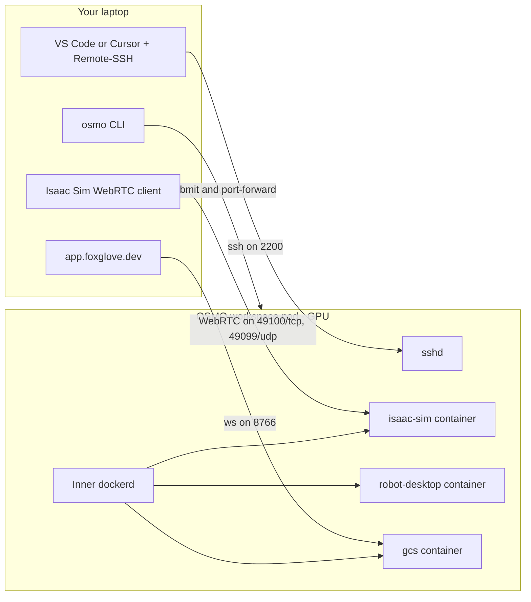

# AirStack on OSMO — Recommended Remote Development Workflow

This is AirStack's recommended day-to-day development path going forward.
You submit one OSMO workflow that spins up a GPU pod running the full
three-container AirStack stack (Isaac Sim, robot-desktop, GCS), attach VS
Code or Cursor to it over Remote-SSH, and stream Isaac Sim and the GCS
Foxglove dashboard back to your browser.

Why this is the recommended path:

- **Pooled GPUs.** A lab's GPUs are shared on-demand across the whole team
  instead of pinned one-per-desktop. Onboarding doesn't require buying
  hardware.
- **No local CUDA / Docker / driver maintenance.** Your laptop just needs
  `git`, an SSH key, and an IDE. macOS, Windows, and Linux all work
  identically.
- **Same image as CI and field robots.** The OSMO pod runs the exact
  Docker images that the system tests and deployed robots run, so your
  dev environment can't drift away from production.
- **One-command onboarding.** A new student goes from zero to "Isaac Sim
  streaming into my browser" with `airstack osmo:setup` followed by
  `airstack osmo:up` — no install marathon.
- **Hardware bigger than your laptop.** The pod has more CPU/RAM/GPU than
  most dev laptops, even if you have a GPU laptop.

> **Still want local development on a Linux+GPU desktop?** It works and
> can be faster for tight inner loops — see
> [Getting Started](../getting_started/index.md). It just isn't the
> recommended default anymore.

## Who is this for?

Anyone developing AirStack — Mac, Windows, or Linux, with or without a
local GPU.

You're comfortable using `git` from a terminal, you have an SSH key
(`~/.ssh/id_ed25519` or similar), and you have either VS Code or Cursor
installed. That's the entire local-machine bar.

## Architecture in a sentence

`airstack osmo:up` (which wraps `osmo workflow submit`) spins up a GPU pod
that runs sshd plus a Docker-in-Docker daemon. Inside that pod, `airstack
up` brings up the familiar three AirStack containers (Isaac Sim,
robot-desktop, GCS). Your IDE attaches over Remote-SSH; Isaac Sim and
Foxglove are reached via separate port-forwards.



## Prerequisites

| You need | Why |
|---|---|
| A local clone of AirStack (`git clone https://github.com/castacks/AirStack.git`) | The `airstack osmo:*` wrappers, the workflow YAML, and the Foxglove extensions all live in the repo |
| The [`osmo` CLI](https://github.com/NVIDIA/OSMO) on your `PATH` | Submitting workflows and port-forwarding |
| `osmo login` done once | Stores your auth token in `~/.config/osmo` |
| An SSH keypair (e.g. `~/.ssh/id_ed25519`) | The pod authorises your pubkey at submit time. Generate one with `ssh-keygen -t ed25519` if you don't already have one. |
| **VS Code with the Remote-SSH extension** *or* **Cursor with its Remote-SSH equivalent** | Where you'll actually edit AirStack code |
| Optional: Foxglove desktop app, or just `app.foxglove.dev` | View ROS topics |
| Optional: an Omniverse Streaming Client / WebRTC browser client | View the streamed Isaac Sim render |

You **do not** need: Docker, NVIDIA drivers, `airstack install`, `airstack
setup`, sudo, or Linux.

> **Lab admin prerequisites (someone else's job, once).** A lab admin
> pushes the `airstack-osmo-workspace` image to
> `airlab-docker.andrew.cmu.edu`. Details in
> [`osmo/README.md`](https://github.com/castacks/AirStack/blob/main/osmo/README.md).
>
> **Your job, once:** the next step.

## Step 0 — Register your OSMO credentials (one time)

OSMO credentials are **per-user** (each Andrew ID has its own Nucleus token,
its own AirLab Docker password, its own OSMO profile). You register them
once with the `osmo` CLI on your laptop and OSMO injects them into every
workflow you submit afterwards. They never leave your OSMO profile and your
laptop never sees the values again.

You need three credentials. The exact names matter — the workflow YAML
references them by these exact names.

From your AirStack clone, run:

```bash
git clone https://github.com/castacks/AirStack.git
cd AirStack
./airstack.sh osmo:setup
```

This prompts for your Andrew ID, AirLab Docker password, and Nucleus API
token (get one at <https://airlab-nucleus.andrew.cmu.edu/omni/web3/> →
right-click cloud icon → **API Tokens** → Create), then registers the
three credentials with OSMO. The values go directly to your OSMO profile
— nothing is written to local disk.

> **macOS prereq: bash 4+.** macOS ships bash 3.2 by default and the
> `airstack` CLI needs bash 4+. If you see
> `airstack.sh requires bash 4 or newer`, install a modern bash with:
>
> ```bash
> brew install bash
> ```
>
> No further config needed — `airstack.sh` auto-detects the Homebrew bash
> at `/opt/homebrew/bin/bash` (Apple Silicon) or `/usr/local/bin/bash`
> (Intel) and re-execs under it. You don't need to change your login shell.

### Verify

List your credentials:

```bash
osmo credential list
```

You should see all three (`airlab-docker-registry`, `airlab-docker-login`,
`airlab-nucleus`). To rotate any of them later, just re-run
`./airstack.sh osmo:setup`.

<details>
<summary><strong>Under the hood — the three raw `osmo credential set` calls</strong></summary>

`airstack osmo:setup` (defined in
[`.airstack/modules/osmo.sh`](https://github.com/castacks/AirStack/blob/main/.airstack/modules/osmo.sh)
as `cmd_osmo_setup`) is equivalent to running these three commands by hand
— useful for debugging or rotating one credential at a time:

```bash
# 1. AirLab Docker registry (REGISTRY) — for OSMO's outer image-pull of
#    airlab-docker.andrew.cmu.edu/airstack/airstack-osmo-workspace
osmo credential set airlab-docker-registry \
  --type REGISTRY \
  --payload registry=airlab-docker.andrew.cmu.edu \
            username=<your_andrew_id> \
            auth='<your_andrew_password>'

# 2. AirLab Docker login (GENERIC) — for the *inner* dockerd inside the
#    pod to `docker login` and pull the AirStack image set
osmo credential set airlab-docker-login \
  --type GENERIC \
  --payload username=<your_andrew_id> \
            password='<your_andrew_password>'

# 3. AirLab Nucleus (GENERIC) — for Isaac Sim to authenticate against
#    omniverse://airlab-nucleus.andrew.cmu.edu (API token, NOT password)
osmo credential set airlab-nucleus \
  --type GENERIC \
  --payload omni_user=<your_andrew_id> \
            omni_pass='<your_nucleus_api_token>' \
            omni_server=omniverse://airlab-nucleus.andrew.cmu.edu/NVIDIA/Assets/Isaac/5.1
```

</details>

> **Why three credentials?** It's tempting to consolidate. The reason for
> the split: OSMO REGISTRY credentials drive Kubernetes `imagePullSecrets`
> (auto-attached, never exposed as env vars), while GENERIC credentials are
> what get injected as env vars inside the running container. The pod
> needs **both** kinds of access — outer pull of the workspace image, plus
> inner login from the inner dockerd to pull AirStack images.

## Step 1 — Add an SSH config entry (one time)

VS Code and Cursor's Remote-SSH "Connect to Host…" picker reads
`~/.ssh/config`. Add this block once and the host shows up by name forever:

```bash
cat >> ~/.ssh/config <<'EOF'

Host airstack-osmo
  HostName localhost
  Port 2200
  User root
  # Every OSMO workflow boots a fresh pod with a fresh sshd host key, so
  # any saved fingerprint for [localhost]:2200 will be wrong on the next
  # `airstack osmo:up`. Skip the host-key check here: this alias only
  # connects via the local port-forward, so the security boundary is
  # OSMO's authenticated control-plane tunnel — not the SSH fingerprint.
  # /dev/null keeps known_hosts clean (no stale entries pile up); LogLevel
  # ERROR silences the "Permanently added [localhost]:2200" banner.
  StrictHostKeyChecking no
  UserKnownHostsFile /dev/null
  LogLevel ERROR
  # SSH agent forwarding so `git push` from inside the pod uses your
  # local laptop's SSH key (the pod's sshd has AllowAgentForwarding yes
  # baked in by osmo/workspace/sshd_config). Without this, the pod has
  # no key to push to github.com with — its ~/.ssh/ only holds the
  # authorized_keys file for inbound connections.
  ForwardAgent yes
  # macOS Keychain integration — first push from the pod auto-loads
  # your key into the local ssh-agent and unlocks it via the system
  # keychain (no passphrase prompts). Harmless on Linux: those clients
  # ignore the option. AddKeysToAgent works on both OSes.
  AddKeysToAgent yes
  UseKeychain yes
EOF
```

The `localhost:2200` is what we'll port-forward to in step 4.

> **Already added the old block?** If your `~/.ssh/config` still has
> `StrictHostKeyChecking accept-new` for `airstack-osmo` from an earlier
> setup, replace it with the three lines above. As a one-time cleanup of
> the stale fingerprint left behind by previous pods, also run:
>
> ```bash
> ssh-keygen -R "[localhost]:2200"
> ```
>
> `airstack osmo:ide` does this scrub for you on every run, so you only
> need it once when migrating.

> **Smoke-test the agent forward** once the pod is up: SSH in and run
> `ssh-add -l` — you should see your local key listed. If you see "The
> agent has no identities", run `ssh-add ~/.ssh/id_ed25519` on your
> laptop and reconnect.

## Step 2 — Submit the workflow

From the AirStack clone:

```bash
./airstack.sh osmo:up --pool airstack
```

This submits
[`osmo/workflows/airstack-dev.yaml`](https://github.com/castacks/AirStack/blob/main/osmo/workflows/airstack-dev.yaml)
with your local SSH pubkey injected as `SSH_PUB_KEY` — that's what
authorises **your** key on **this** workflow (each student passes their
own at submit time; the lab admin doesn't manage a global
`authorized_keys` file).

`airstack osmo:up` prints a workflow id like `airstack-dev-1` and stores
it in `~/.airstack/osmo-state`, so the rest of the `airstack osmo:*`
commands in this tutorial pick it up automatically — no `export WF=...`
needed. To target a specific workflow for a single invocation, export
`AIRSTACK_OSMO_WF=<id>`.

<details>
<summary><strong>Under the hood — raw `osmo workflow submit`</strong></summary>

`airstack osmo:up` (defined in
[`.airstack/modules/osmo.sh`](https://github.com/castacks/AirStack/blob/main/.airstack/modules/osmo.sh)
as `cmd_osmo_up`) is equivalent to:

```bash
osmo workflow submit osmo/workflows/airstack-dev.yaml \
  --pool airstack \
  --set-env "SSH_PUB_KEY=$(cat ~/.ssh/id_ed25519.pub)"
```

Save the printed workflow id as `$WF` if you're using the raw form, and
substitute it for `airstack osmo:*` in the rest of the tutorial.

</details>

## Step 3 — Wait for the stack to come up

Tail the lead task's logs and watch for milestones:

```bash
./airstack.sh osmo:logs
```

Expected milestones, in order (each is one line in the log):

1. `[entrypoint] sshd listening on :22` — VS Code/Cursor can attach.
2. `[entrypoint] dockerd ready` — the inner Docker daemon is up.
3. `Successfully built airstack_isaac-sim` *(or `Pulled` if pre-built)* —
   the image set is in place.
4. `airstack-isaac-sim-livestream-1 ... started`
5. `airstack-robot-desktop-1 ... started`
6. `airstack-gcs-1 ... started`

If step (1) appears, you can attach the IDE while the rest is still
spinning up — the bring-up will continue in the background.

<details>
<summary><strong>Under the hood — raw `osmo workflow logs`</strong></summary>

`airstack osmo:logs` (defined in
[`.airstack/modules/osmo.sh`](https://github.com/castacks/AirStack/blob/main/.airstack/modules/osmo.sh)
as `cmd_osmo_logs`) just exec's:

```bash
osmo workflow logs $WF -t workspace -n 500
```

The `osmo` CLI's `workflow logs` command prints the last N lines and then
keeps the stream open as new lines arrive (it already behaves like `tail
-f`, even though `--help` only documents `-n LAST_N_LINES`). Ctrl+C to
stop. Override the task / tail length with `OSMO_LOGS_TASK` /
`OSMO_LOGS_TAIL` env vars.

</details>

## Step 4 — Forward sshd and attach the IDE

In one terminal, run:

```bash
./airstack.sh osmo:ide
```

This (a) starts the `localhost:2200 → pod:22` port-forward with a 24h
connect-timeout (matching the workflow's `exec_timeout`), waits for the
tunnel to come up, then (b) launches Cursor or VS Code (whichever it
finds on `PATH`) pre-attached to
`vscode-remote://ssh-remote+airstack-osmo/root/AirStack`. **Leave the
terminal running** for the length of your session — closing it tears the
tunnel down.

The IDE installs its remote server in the pod on first connect (~50 MB,
slower on a fresh pod, cached on subsequent connects). Then:

1. The IDE should open `/root/AirStack` automatically. (If not:
   **Open Folder…** → `/root/AirStack`.)
2. Open the integrated terminal — you're root in `/root/AirStack`.
3. Edit code in the IDE; the changes land directly on the pod's disk.

Verify everything is wired up by running:

```bash
docker ps
```

You should see four containers: `airstack-isaac-sim-livestream-1`,
`airstack-robot-desktop-1`, `airstack-gcs-1`, plus the AirStack CLI helper.

<details>
<summary><strong>Under the hood — raw port-forward + manual IDE attach</strong></summary>

`airstack osmo:ide` (defined in
[`.airstack/modules/osmo.sh`](https://github.com/castacks/AirStack/blob/main/.airstack/modules/osmo.sh)
as `cmd_osmo_ide`) is equivalent to running the port-forward by hand:

```bash
osmo workflow port-forward $WF workspace --port 2200:22 --connect-timeout 86400
```

…then in the editor:

- **VS Code:** Command Palette → **Remote-SSH: Connect to Host…** → pick
  `airstack-osmo`.
- **Cursor:** the same flow under its remote-development menu.

Add `--no-open` to `airstack osmo:ide` to only run the port-forward and
attach the IDE manually.

</details>

## Step 5 — Pick a feature branch and start working

The pod cloned `main` into `/root/AirStack` on startup. Treat it like any
git working tree:

```bash
git checkout -b my-feature
# edit code in the IDE...
bws --packages-select <your_package>   # build inside the robot-desktop container per AGENTS.md
```

Standard ROS 2 commands work from the integrated terminal:

```bash
docker exec airstack-robot-desktop-1 bash -c "ros2 node list"
docker exec airstack-robot-desktop-1 bash -c "ros2 topic hz /robot_1/odometry"
```

This is the same `docker exec` pattern documented in
[AGENTS.md](https://github.com/castacks/AirStack/blob/main/AGENTS.md) — the
fact that you're on a remote pod is invisible from inside the IDE.

## Step 6 — View Isaac Sim (WebRTC livestream)

Isaac Sim runs headless inside the pod with the Kit
`omni.kit.livestream.webrtc` extension enabled (configured by the
`isaac-sim-livestream` Compose profile). To view it locally:

```bash
./airstack.sh osmo:webrtc
```

This spawns the UDP port-forward (media, `49099`) in the background and
runs the TCP port-forward (signaling, `49100`) in the foreground — leave
that terminal running.

Then point the **Omniverse Streaming Client** (or a WebRTC-capable browser
client) at `http://localhost`. The simulation viewport shows up the same
way it would on a local Linux desktop.

<details>
<summary><strong>Under the hood — raw TCP + UDP port-forwards</strong></summary>

`airstack osmo:webrtc` (defined in
[`.airstack/modules/osmo.sh`](https://github.com/castacks/AirStack/blob/main/.airstack/modules/osmo.sh)
as `cmd_osmo_webrtc`) is equivalent to running the two raw port-forwards
in separate terminals — Kit's WebRTC needs both TCP signaling and UDP
SRTP media, and the AirStack workflow pins both to single ports rather
than scanning the Kit default range:

```bash
# Terminal A — TCP signaling (49100):
osmo workflow port-forward $WF workspace --port 49100 --connect-timeout 86400

# Terminal B — UDP media (49099, pinned by the Pegasus launch script):
osmo workflow port-forward $WF workspace --port 49099 --udp --connect-timeout 86400
```

</details>

## Step 7 — View ROS topics in Foxglove

The GCS container runs `foxglove_bridge` on container-port `8765`,
published as host-port `8766` on the workspace pod. To install the
AirStack Foxglove extensions locally and forward the websocket in one
step:

```bash
./airstack.sh osmo:foxglove
```

This copies the AirStack Foxglove extensions (Robot Tasks, Waypoint
Editor, Polygon Editor) into your local Foxglove Desktop user-extensions
dir (default `~/.foxglove-studio/extensions`; override with
`OSMO_FOXGLOVE_EXT_DIR`, skip with `OSMO_FOXGLOVE_SKIP_EXTENSIONS=1` for
`app.foxglove.dev` which doesn't load local extensions), then runs the
`localhost:8766 → pod:8766` port-forward in the foreground — leave the
terminal running.

Then in [https://app.foxglove.dev](https://app.foxglove.dev) (or Foxglove
Desktop):

1. **Open connection** → `ws://localhost:8766`.
2. **Layouts** → **Import from file** →
   [`gcs/foxglove_extensions/airstack_default.json`](https://github.com/castacks/AirStack/blob/main/gcs/foxglove_extensions/airstack_default.json)
   from your AirStack clone.
3. Pick the imported layout from the layout dropdown in the top-right.

The full Foxglove flow — layout import, panel customisation, DDS bridge
naming — is documented at
[Foxglove Visualization](../gcs/foxglove.md). The only OSMO-specific
difference is the `osmo:foxglove` line in front of it.

<details>
<summary><strong>Under the hood — raw `osmo workflow port-forward`</strong></summary>

`airstack osmo:foxglove` (defined in
[`.airstack/modules/osmo.sh`](https://github.com/castacks/AirStack/blob/main/.airstack/modules/osmo.sh)
as `cmd_osmo_foxglove`) wraps the extension install plus:

```bash
osmo workflow port-forward $WF workspace --port 8766:8766 --connect-timeout 86400
```

Set `OSMO_FOXGLOVE_SKIP_EXTENSIONS=1` to only run the port-forward.

</details>

## Step 8 — Commit and push from inside the IDE

The pod's filesystem is **ephemeral**. The persistence boundary is git, not
disk. Commit and push every meaningful chunk of work — a Source Control
panel commit + push, or in the integrated terminal:

```bash
git add -A
git commit -m "WIP: feature X"
git push -u origin my-feature
```

Once your branch is on the remote, you can pull it from anywhere — your
laptop, a fresh pod tomorrow, a colleague's machine.

> **Configuring git auth in the pod.** The pod is yours for the session.
> Inside the IDE's integrated terminal, set `git config user.name`,
> `user.email`, and configure your push auth (HTTPS + a GitHub PAT, or a
> per-pod SSH key the IDE forwards via `AllowAgentForwarding yes`). The
> `airstack-osmo-workspace` image deliberately does not bake any one
> student's git creds.

## Step 9 — Tearing down

When you're done:

```bash
./airstack.sh osmo:down
```

This prints a 5-second warning then cancels the workflow stored in
`~/.airstack/osmo-state`. Hit Ctrl-C in the grace window if you submitted
by accident.

> **Push first.** Anything that's still in your working tree, in `.git/`
> but not pushed, in `build/`, in `bags/`, or in `/root/` outside the repo
> **will be lost** on cancel. The pod is cattle. If you forget and need
> something pulled out, see "I forgot to push before tearing down" below
> *before* hitting cancel.

<details>
<summary><strong>Under the hood — raw `osmo workflow cancel`</strong></summary>

`airstack osmo:down` (defined in
[`.airstack/modules/osmo.sh`](https://github.com/castacks/AirStack/blob/main/.airstack/modules/osmo.sh)
as `cmd_osmo_down`) is equivalent to:

```bash
osmo workflow cancel $WF
```

</details>

## Troubleshooting

| Symptom | Likely cause | Fix |
|---|---|---|
| `Remote-SSH: Connection refused` after a working session | Port-forward died (laptop slept, network blip) | Re-run `./airstack.sh osmo:ide` |
| `Permission denied (publickey)` on Remote-SSH | The pod authorised a different pubkey than the one your local SSH client is offering | Confirm `cat ~/.ssh/id_ed25519.pub` matches the key that was injected at submit time. Re-submit with `./airstack.sh osmo:down && ./airstack.sh osmo:up --pool airstack`. |
| `airstack osmo:logs` shows `ERROR: SSH_PUB_KEY not set` | The submit didn't inject a pubkey (e.g. you ran raw `osmo workflow submit` without `--set-env`) | `./airstack.sh osmo:down`, then resubmit with `./airstack.sh osmo:up --pool airstack` (it injects `SSH_PUB_KEY` automatically). |
| `docker pull` fails inside the pod with `unauthorized` | Your `airlab-docker-login` credential is missing or has the wrong Andrew ID/password | Re-run `./airstack.sh osmo:setup`. |
| Logs show `WARN: airlab-nucleus OSMO credential not set` and Isaac Sim asset loads fail, **or** Isaac Sim shows "Login Required: Unable to connect server omniverse://airlab-nucleus..." with the auth-service log showing `InternalCredentials.auth … 'username': '<your_andrew_id>' … status: 'DENIED'` (no `Tokens.auth_with_api_token` call) | The pod is doing **password auth** instead of **API-token auth**. Inside the pod, `simulation/isaac-sim/docker/omni_pass.env` must have `OMNI_USER=$$omni-api-token` (literal `$$`, the sentinel for API-token auth — docker-compose v2 collapses `$$` to `$` on its way to the container). The OSMO entrypoint sets this automatically when `OMNI_PASS` looks like a JWT; if you see `OMNI_USER=<your_andrew_id>` in the file, recreate the container with `docker compose --profile desktop --profile isaac-sim-livestream up -d isaac-sim-livestream` (`restart` does NOT re-read `env_file`). |
| Logs show `WARN: airlab-nucleus OSMO credential not set` and Isaac Sim asset loads fail, **or** Isaac Sim shows "Login Required: Unable to connect server omniverse://airlab-nucleus..." with the auth-service log showing `Tokens.auth_with_api_token … status: 'DENIED'` | Your `airlab-nucleus` API token is missing, expired, or revoked (rotation invalidates the predecessor). Confirm by SSH'ing the Nucleus host and running `sudo docker logs --tail 200 base_stack-nucleus-auth-1`. Regenerate the token at <https://airlab-nucleus.andrew.cmu.edu/omni/web3/>, then `./airstack.sh osmo:setup` and `./airstack.sh osmo:down && ./airstack.sh osmo:up --pool airstack` to resubmit (or live-edit `simulation/isaac-sim/docker/omni_pass.env` in the pod and recreate the `isaac-sim-livestream` container — see row above). |
| Isaac Sim container restarts repeatedly | GPU not visible to the inner Docker daemon (toolkit not configured on the node) | Lab admin task. From inside the pod: `docker info \| grep -i runtime` should list `nvidia`. |
| Isaac Sim is up but the WebRTC stream is blank | The Pegasus script isn't getting `--/app/livestream/enabled=true`, or the wrong Compose profile is active | In the integrated terminal: `docker logs airstack-isaac-sim-livestream-1`. Confirm `ISAAC_SIM_LIVESTREAM=true` and that the `isaac-sim-livestream` profile is the one running (`docker ps`). |
| Foxglove "no connection" | Port-forward died, GCS container hasn't started yet, or browser is caching an old connection | Re-run `./airstack.sh osmo:foxglove`; check `docker ps` shows `airstack-gcs-1` Up; try `ws://127.0.0.1:8766` instead of `ws://localhost:8766`. |
| First Remote-SSH connect takes forever | VS Code / Cursor downloading its remote server (~50 MB) into the fresh pod | Wait it out the first time. Subsequent connects to the same pod hit the cache. |
| **I forgot to push before tearing down** | The pod is still up; cancel hasn't fired yet | Don't run `./airstack.sh osmo:down`. SSH in via the existing port-forward (`./airstack.sh osmo:ide --no-open` if the tunnel is gone), push from the IDE terminal, *then* tear down. If the workflow has already terminated and the pod is gone, the work is gone — git is the only persistence layer. |

## What survives `airstack osmo:down`?

| Artifact | Lives in | Survives? |
|---|---|---|
| Code committed and pushed to a feature branch | GitHub | **Yes** |
| Code committed but not pushed | Pod-local `.git` | **No** |
| Uncommitted edits in the IDE | Pod-local working tree | **No** |
| `colcon build` outputs (`build/`, `install/`, `log/`) | `/root/AirStack/**/ros_ws/...` | **No** (gitignored Linux x86_64 binaries; rebuild trivially) |
| Inner-dockerd image cache | Pod-local Docker layer cache | **No** |
| Bag files, sim recordings, debug screenshots | `/root/AirStack/bags/`, etc. | **No** — pull selectively via `osmo workflow rsync download "$(cat ~/.airstack/osmo-state)" <pod-path>:<local-path>` *before* tearing down |

The rule of thumb: **commit + push every time you'd save a file in a
git-tracked sense.** The Source Control panel is the persistence boundary.

## See also

- [`osmo/README.md`](https://github.com/castacks/AirStack/blob/main/osmo/README.md)
  — lab-admin reference (pool prerequisites, OSMO credential registration,
  workspace image build, validation stages).
- [Foxglove Visualization](../gcs/foxglove.md) — full layout import +
  panel-customisation flow once your `airstack osmo:foxglove` is up.
- [AGENTS.md](https://github.com/castacks/AirStack/blob/main/AGENTS.md) —
  inside-the-pod workflow once you're attached: `bws`, `sws`, `docker exec`,
  ROS 2 commands.
- [Getting Started](../getting_started/index.md) — the local-Linux-GPU
  alternative.
