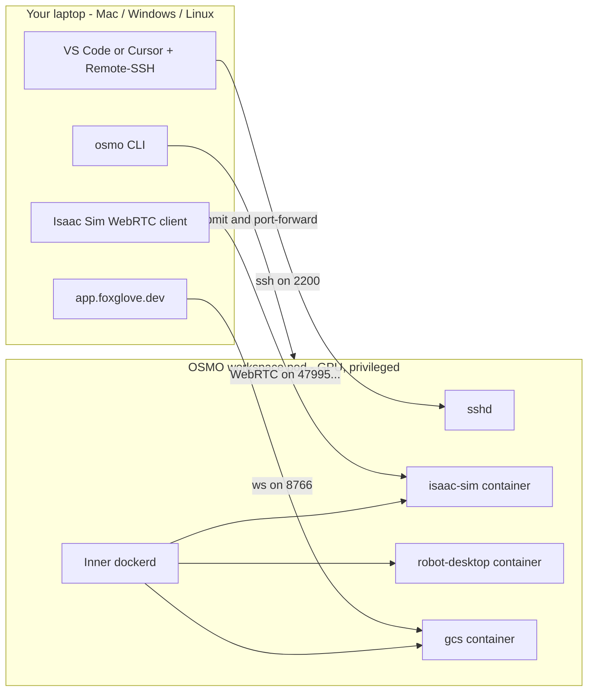

# AirStack on OSMO — Remote Development on Mac, Windows, or any Linux

This tutorial walks through developing on AirStack from a laptop that has
**no Docker, no NVIDIA GPU, and no AirStack source tree of its own**. You'll
attach VS Code or Cursor to a remote OSMO pod via Remote-SSH, edit code as
if it were local, and stream Isaac Sim and the GCS Foxglove dashboard back
to your browser through `osmo workflow port-forward`.

> **Prefer local development on a Linux+GPU desktop?** Use the
> [Getting Started](../getting_started/index.md) flow instead — `airstack
> install` + `airstack up` is faster and doesn't depend on a remote
> scheduler. This tutorial is for everyone *else*.

## Who is this for?

You want to develop AirStack and one of these is true:

- You're on **macOS or Windows**.
- You have a Linux laptop but **no NVIDIA GPU**.
- Your lab shares a single GPU pool through OSMO and you'd like a
  zero-installation onboarding path for new students.

You're comfortable using `git` from a terminal, you have an SSH key
(`~/.ssh/id_ed25519` or similar), and you have either VS Code or Cursor
installed. That's the entire local-machine bar.

## Architecture in a sentence

`osmo workflow submit` spins up a privileged GPU pod that runs sshd plus a
Docker-in-Docker daemon. Inside that pod, `airstack up` brings up the
familiar three AirStack containers (Isaac Sim, robot-desktop, GCS). Your IDE
attaches over Remote-SSH; Isaac Sim and Foxglove are reached via separate
port-forwards.



## Prerequisites

| You need | Why |
|---|---|
| The [`osmo` CLI](https://github.com/NVIDIA/OSMO) on your `PATH` | Submitting workflows and port-forwarding |
| `osmo login` done once | Stores your auth token in `~/.config/osmo` |
| An SSH keypair (e.g. `~/.ssh/id_ed25519`) | The pod authorises your pubkey at submit time. Generate one with `ssh-keygen -t ed25519` if you don't already have one. |
| **VS Code with the Remote-SSH extension** *or* **Cursor with its Remote-SSH equivalent** | Where you'll actually edit AirStack code |
| Optional: Foxglove desktop app, or just `app.foxglove.dev` | View ROS topics |
| Optional: an Omniverse Streaming Client / WebRTC browser client | View the streamed Isaac Sim render |

You **do not** need: Docker, NVIDIA drivers, `airstack install`, `airstack
setup`, a local clone of AirStack, sudo, or Linux.

> **Lab admin prerequisites (someone else's job, once).** A lab admin
> confirms the OSMO pool allows `privileged: true` on a GPU node and pushes
> the `airstack-osmo-workspace` image to `airlab-docker.andrew.cmu.edu`.
> Details in
> [`osmo/README.md`](https://github.com/castacks/AirStack/blob/main/osmo/README.md)
> and the [one-time pool setup section below](#one-time-pool-setup-admin).
>
> **Your job, once:** the next step.

## One-time pool setup (admin)

If `osmo workflow submit` returns:

```
Server responded with status code 400
Error message: Workflow submit failed:
Task with platform: <name> does not have privileged flag enabled. Task workspace
```

…then the OSMO pool you're targeting has `privileged_allowed: false` and the
DinD workspace can't run. You need a pool admin to flip it. **As of the
AirLab `airlab-share-01` deployment audit (May 2026), every pool ships with
`privileged_allowed: false` by default.**

Audit pools yourself first:

```bash
osmo pool list -t json | python3 -c "
import json, sys
for ns in json.load(sys.stdin)['node_sets']:
    for p in ns['pools']:
        for n, plat in p['platforms'].items():
            print(f\"{p['name']:25} {n:10} priv={plat['privileged_allowed']}\")"
```

If none show `priv=True`, send your pool admin a note like this:

> Subject: Please enable privileged on the `airstack` pool
>
> Hi — I'm using the AirStack OSMO remote-dev workflow which runs the
> existing AirStack docker-compose stack inside a single pod via
> Docker-in-Docker (so students keep the `airstack up` UX). DinD requires
> `privileged: true` on the workspace task — without it the inner dockerd
> can't manage cgroups, overlayfs, the airstack_network bridge, or GPU
> device passthrough.
>
> Could you flip the `airstack` pool's platform to allow privileged tasks?
> Equivalent of:
>
> ```yaml
> platforms:
>   default:
>     privileged_allowed: true
> ```
>
> No `host_network_allowed` change is needed — `osmo workflow port-forward`
> reaches the pod NS, which is enough for our Isaac Sim WebRTC and Foxglove
> streams. Workflow YAML for reference:
> `osmo/workflows/airstack-dev.yaml` in the AirStack repo. Setup details:
> `osmo/README.md`.

Once enabled, target that pool with `--pool airstack` in Step 2.

## Step 0 — Register your OSMO credentials (one time)

OSMO credentials are **per-user** (each Andrew ID has its own Nucleus token,
its own AirLab Docker password, its own OSMO profile). You register them
once with the `osmo` CLI on your laptop and OSMO injects them into every
workflow you submit afterwards. They never leave your OSMO profile and your
laptop never sees the values again.

You need three credentials. The exact names matter — the workflow YAML
references them by these exact names.

### Option A — interactive helper (recommended)

If you have a local AirStack clone:

```bash
airstack osmo:setup
```

This prompts for your Andrew ID, AirLab Docker password, and Nucleus API
token, then runs the three `osmo credential set` commands below for you.

> **macOS prereq: bash 4+.** macOS ships bash 3.2 by default and the
> `airstack` CLI needs bash 4+. If you see
> `airstack.sh requires bash 4 or newer`, install a modern bash with:
>
> ```bash
> brew install bash
> ```
>
> No further config needed — `airstack.sh` auto-detects the Homebrew bash
> at `/opt/homebrew/bin/bash` (Apple Silicon) or `/usr/local/bin/bash`
> (Intel) and re-execs under it. You don't need to change your login shell.

### Option B — three commands, copy-paste

If you'd rather run the commands yourself (or you're on a laptop without an
AirStack clone), here they are:

#### 1. AirLab Docker registry (REGISTRY type)

Used by OSMO to pull the workspace image into the pod. OSMO auto-attaches
this to any image whose hostname matches `registry=` — you don't need to
reference it in YAML.

```bash
osmo credential set airlab-docker-registry \
  --type REGISTRY \
  --payload registry=airlab-docker.andrew.cmu.edu \
            username=<your_andrew_id> \
            auth='<your_andrew_password>'
```

#### 2. AirLab Docker login (GENERIC type)

The same Andrew ID + password, but as a **GENERIC** credential so the
**inner** dockerd inside the pod can `docker login` it and pull the
AirStack images. This duplication is unfortunately necessary — REGISTRY
credentials are for OSMO's outer image-pull only and aren't exposed to the
container as env vars.

```bash
osmo credential set airlab-docker-login \
  --type GENERIC \
  --payload username=<your_andrew_id> \
            password='<your_andrew_password>'
```

#### 3. AirLab Nucleus (GENERIC type)

Nucleus authenticates with an **API token**, not your password. To get one:
go to <https://airlab-nucleus.andrew.cmu.edu/omni/web3/>, log in,
right-click the cloud icon in the top-right → **API Tokens** → create a new
token. Save it — Nucleus shows it once.

```bash
osmo credential set airlab-nucleus \
  --type GENERIC \
  --payload omni_user=<your_andrew_id> \
            omni_pass='<your_nucleus_api_token>' \
            omni_server=omniverse://airlab-nucleus.andrew.cmu.edu/NVIDIA/Assets/Isaac/5.1
```

### Verify

List your credentials:

```bash
osmo credential list
```

You should see all three. To rotate any of them later, just re-run the
matching `osmo credential set` command.

> **Why three credentials?** It's tempting to consolidate. The reason for
> the split: OSMO REGISTRY credentials drive Kubernetes `imagePullSecrets`
> (auto-attached, never exposed as env vars), while GENERIC credentials are
> what get injected as env vars inside the running container. The pod
> needs **both** kinds of access — outer pull of the workspace image, plus
> inner login from the inner dockerd to pull AirStack images.

## Step 1 — Add an SSH config entry (one time)

VS Code and Cursor's Remote-SSH "Connect to Host…" picker reads
`~/.ssh/config`. Add this block once and the host shows up by name forever:

```bash
cat >> ~/.ssh/config <<'EOF'

Host airstack-osmo
  HostName localhost
  Port 2200
  User root
  StrictHostKeyChecking accept-new
  # SSH agent forwarding so `git push` from inside the pod uses your
  # local laptop's SSH key (the pod's sshd has AllowAgentForwarding yes
  # baked in by osmo/workspace/sshd_config). Without this, the pod has
  # no key to push to github.com with — its ~/.ssh/ only holds the
  # authorized_keys file for inbound connections.
  ForwardAgent yes
  # macOS Keychain integration — first push from the pod auto-loads
  # your key into the local ssh-agent and unlocks it via the system
  # keychain (no passphrase prompts). Harmless on Linux: those clients
  # ignore the option. AddKeysToAgent works on both OSes.
  AddKeysToAgent yes
  UseKeychain yes
EOF
```

The `localhost:2200` is what we'll port-forward to in step 4.

> **Smoke-test the agent forward** once the pod is up: SSH in and run
> `ssh-add -l` — you should see your local key listed. If you see "The
> agent has no identities", run `ssh-add ~/.ssh/id_ed25519` on your
> laptop and reconnect.

## Step 2 — Submit the workflow

The repo ships the workflow at
[`osmo/workflows/airstack-dev.yaml`](https://github.com/castacks/AirStack/blob/main/osmo/workflows/airstack-dev.yaml).
You don't need a local AirStack clone to submit it — `osmo workflow submit`
takes a path and uploads the YAML.

```bash
# If you don't have AirStack cloned locally:
curl -fsSL -o airstack-dev.yaml \
  https://raw.githubusercontent.com/castacks/AirStack/main/osmo/workflows/airstack-dev.yaml

# Submit:
osmo workflow submit airstack-dev.yaml \
  --pool airstack \
  --set-env "SSH_PUB_KEY=$(cat ~/.ssh/id_ed25519.pub)"
```

> **Got `Task with platform ... does not have privileged flag enabled`?**
> The pool you picked doesn't allow privileged tasks. See the
> [one-time pool setup section](#one-time-pool-setup-admin) above —
> AirLab's default pools all ship with privileged off and need an admin
> to flip it on.

The `--set-env "SSH_PUB_KEY=..."` line is what authorises **your** key on
**this** workflow. Each student passes their own pubkey at submit time —
the lab admin doesn't manage a global authorized_keys file.

The command prints a workflow ID like `airstack-dev-1`. Save it; you'll
reuse it for every other command in this tutorial. The shell snippets below
assume you've stored it as `WF`:

```bash
export WF=airstack-dev-1
```

## Step 3 — Wait for the stack to come up

Tail the lead task's logs and watch for milestones:

```bash
osmo workflow logs $WF workspace --follow
```

Expected milestones, in order (each is one line in the log):

1. `[entrypoint] sshd listening on :22` — VS Code/Cursor can attach.
2. `[entrypoint] dockerd ready` — the inner Docker daemon is up.
3. `Successfully built airstack_isaac-sim` *(or `Pulled` if pre-built)* —
   the image set is in place.
4. `airstack-isaac-sim-livestream-1 ... started`
5. `airstack-robot-desktop-1 ... started`
6. `airstack-gcs-1 ... started`

If step (1) appears, you can attach the IDE while the rest is still
spinning up — the bring-up will continue in the background.

## Step 4 — Forward sshd and attach the IDE

In one terminal, start the port-forward and **leave it running** for the
length of your session. The 24h connect-timeout matches the workflow's
`exec_timeout`:

```bash
osmo workflow port-forward $WF workspace --port 2200:22 --connect-timeout 86400
```

In your editor:

- **VS Code:** Command Palette → **Remote-SSH: Connect to Host…** → pick
  `airstack-osmo`.
- **Cursor:** the same flow under its remote-development menu.

The IDE installs its remote server in the pod on first connect (~50 MB,
slower on a fresh pod, cached on subsequent connects). Then:

1. **Open Folder…** → `/root/AirStack`.
2. Open the integrated terminal — you're root in `/root/AirStack`.
3. Edit code in the IDE; the changes land directly on the pod's disk.

Verify everything is wired up by running:

```bash
docker ps
```

You should see four containers: `airstack-isaac-sim-livestream-1`,
`airstack-robot-desktop-1`, `airstack-gcs-1`, plus the AirStack CLI helper.

## Step 5 — Pick a feature branch and start working

The pod cloned `main` into `/root/AirStack` on startup. Treat it like any
git working tree:

```bash
git checkout -b my-feature
# edit code in the IDE...
bws --packages-select <your_package>   # build inside the robot-desktop container per AGENTS.md
```

Standard ROS 2 commands work from the integrated terminal:

```bash
docker exec airstack-robot-desktop-1 bash -c "ros2 node list"
docker exec airstack-robot-desktop-1 bash -c "ros2 topic hz /robot_1/odometry"
```

This is the same `docker exec` pattern documented in
[AGENTS.md](https://github.com/castacks/AirStack/blob/main/AGENTS.md) — the
fact that you're on a remote pod is invisible from inside the IDE.

## Step 6 — View Isaac Sim (WebRTC livestream)

Isaac Sim runs headless inside the pod with the Kit
`omni.kit.livestream.webrtc` extension enabled (configured by the
`isaac-sim-livestream` Compose profile). To view it locally, forward the
livestream port range — **two** terminals because livestream uses both TCP
and UDP:

```bash
# Terminal A (TCP):
osmo workflow port-forward $WF workspace \
  --port 47995-48012,49000-49007,49100 --connect-timeout 86400
```

```bash
# Terminal B (UDP):
osmo workflow port-forward $WF workspace \
  --port 47995-48012,49000-49007 --udp --connect-timeout 86400
```

Then point the **Omniverse Streaming Client** (or a WebRTC-capable browser
client) at `http://localhost`. The simulation viewport shows up the same
way it would on a local Linux desktop.

## Step 7 — View ROS topics in Foxglove

The GCS container runs `foxglove_bridge` on container-port `8765`,
published as host-port `8766` on the workspace pod. Forward it once:

```bash
osmo workflow port-forward $WF workspace --port 8766:8766 --connect-timeout 86400
```

Then in [https://app.foxglove.dev](https://app.foxglove.dev):

1. **Open connection** → `ws://localhost:8766`.
2. **Layouts** → **Import from file** →
   [`gcs/foxglove_extensions/airstack_default.json`](https://github.com/castacks/AirStack/blob/main/gcs/foxglove_extensions/airstack_default.json)
   from your local AirStack clone (or download it via the GitHub raw URL).
3. Pick the imported layout from the layout dropdown in the top-right.

The full Foxglove flow — layout import, panel customisation, DDS bridge
naming — is documented at
[Foxglove Visualization](../gcs/foxglove.md). The only OSMO-specific
difference is the `port-forward` line in front of it.

## Step 8 — Commit and push from inside the IDE

The pod's filesystem is **ephemeral**. The persistence boundary is git, not
disk. Commit and push every meaningful chunk of work — a Source Control
panel commit + push, or in the integrated terminal:

```bash
git add -A
git commit -m "WIP: feature X"
git push -u origin my-feature
```

Once your branch is on the remote, you can pull it from anywhere — your
laptop, a fresh pod tomorrow, a colleague's machine.

> **Configuring git auth in the pod.** The pod is yours for the session.
> Inside the IDE's integrated terminal, set `git config user.name`,
> `user.email`, and configure your push auth (HTTPS + a GitHub PAT, or a
> per-pod SSH key the IDE forwards via `AllowAgentForwarding yes`). The
> `airstack-osmo-workspace` image deliberately does not bake any one
> student's git creds.

## Step 9 — Tearing down

When you're done:

```bash
osmo workflow cancel $WF
```

> **Push first.** Anything that's still in your working tree, in `.git/`
> but not pushed, in `build/`, in `bags/`, or in `/root/` outside the repo
> **will be lost** on cancel. The pod is cattle. If you forget and need
> something pulled out, see "I forgot to push before tearing down" below
> *before* hitting cancel.

## Troubleshooting

| Symptom | Likely cause | Fix |
|---|---|---|
| `Remote-SSH: Connection refused` after a working session | Port-forward died (laptop slept, network blip) | Re-run `osmo workflow port-forward $WF workspace --port 2200:22 --connect-timeout 86400` |
| `Permission denied (publickey)` on Remote-SSH | The pod authorised a different pubkey than the one your local SSH client is offering | Confirm `cat ~/.ssh/id_ed25519.pub` matches what was passed to `--set-env "SSH_PUB_KEY=..."`. Re-submit if the wrong key was used. |
| `osmo workflow logs` shows `ERROR: SSH_PUB_KEY not set` | You forgot `--set-env` on submit | Cancel the workflow and resubmit with `--set-env "SSH_PUB_KEY=$(cat ~/.ssh/id_ed25519.pub)"` |
| `docker pull` fails inside the pod with `unauthorized` | Your `airlab-docker-login` credential is missing or has the wrong Andrew ID/password | Re-run `airstack osmo:setup` (or the `osmo credential set airlab-docker-login ...` command in Step 0). |
| Logs show `WARN: airlab-nucleus OSMO credential not set` and Isaac Sim asset loads fail | Your `airlab-nucleus` credential is missing or its API token expired | Re-run `airstack osmo:setup` after generating a fresh Nucleus API token. |
| Isaac Sim container restarts repeatedly | GPU not visible to the inner Docker daemon (toolkit not configured on the node) | Lab admin task. From inside the pod: `docker info \| grep -i runtime` should list `nvidia`. |
| Isaac Sim is up but the WebRTC stream is blank | The Pegasus script isn't getting `--/app/livestream/enabled=true`, or the wrong Compose profile is active | In the integrated terminal: `docker logs airstack-isaac-sim-livestream-1`. Confirm `ISAAC_SIM_LIVESTREAM=true` and that the `isaac-sim-livestream` profile is the one running (`docker ps`). |
| Foxglove "no connection" | Port-forward died, GCS container hasn't started yet, or browser is caching an old connection | Restart the `--port 8766:8766` forward; check `docker ps` shows `airstack-gcs-1` Up; try `ws://127.0.0.1:8766` instead of `ws://localhost:8766`. |
| First Remote-SSH connect takes forever | VS Code / Cursor downloading its remote server (~50 MB) into the fresh pod | Wait it out the first time. Subsequent connects to the same pod hit the cache. |
| **I forgot to push before tearing down** | The pod is still up; cancel hasn't fired yet | Don't cancel. SSH in via the existing port-forward, push from the IDE terminal, *then* cancel. If the workflow has already terminated and the pod is gone, the work is gone — git is the only persistence layer. |

## What survives a `osmo workflow cancel`?

| Artifact | Lives in | Survives? |
|---|---|---|
| Code committed and pushed to a feature branch | GitHub | **Yes** |
| Code committed but not pushed | Pod-local `.git` | **No** |
| Uncommitted edits in the IDE | Pod-local working tree | **No** |
| `colcon build` outputs (`build/`, `install/`, `log/`) | `/root/AirStack/**/ros_ws/...` | **No** (gitignored Linux x86_64 binaries; rebuild trivially) |
| Inner-dockerd image cache | Pod-local Docker layer cache | **No** |
| Bag files, sim recordings, debug screenshots | `/root/AirStack/bags/`, etc. | **No** — pull selectively via `osmo workflow rsync download $WF <pod-path>:<local-path>` *before* cancel |

The rule of thumb: **commit + push every time you'd save a file in a
git-tracked sense.** The Source Control panel is the persistence boundary.

## See also

- [`osmo/README.md`](https://github.com/castacks/AirStack/blob/main/osmo/README.md)
  — lab-admin reference (pool prerequisites, OSMO credential registration,
  workspace image build, validation stages).
- [Foxglove Visualization](../gcs/foxglove.md) — full layout import +
  panel-customisation flow once your `port-forward 8766:8766` is up.
- [AGENTS.md](https://github.com/castacks/AirStack/blob/main/AGENTS.md) —
  inside-the-pod workflow once you're attached: `bws`, `sws`, `docker exec`,
  ROS 2 commands.
- [Getting Started](../getting_started/index.md) — the local-Linux-GPU
  alternative.
