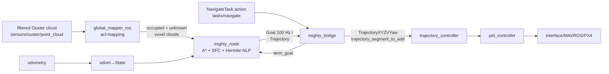

# Design Spec: MIGHTY local planner as external module (`asm_mighty`) — droan_gl R7 replacement

> Notebook entry: `notebook/010-mighty-local-planner-module/` · Date started: 2026-08-28 02:31 · Last updated: 2026-08-28 02:31 · Branch: `airstack-paper` · Commit: `4c104385`
>
> Campaign: `Agent study (paper Sec. VI-C)` — primary (R7 prerequisite). Secondary: `Modular AirStack (RFC #379/#380)` — the lead explicitly wants this integration to **stress-test the external-module workflow** (`airstack module add`), so module-system friction findings are a deliverable, not incidental.
>
> **Status: `WIP`** (2.1/2.2/2.3 DONE — module builds on Jazzy, 44/44
> gtests, smoke passes, full_mighty flies takeoff→route→land in Isaac
> through the untouched seams; 2.4 DONE — practice pillar field 5/5 action
> runs PASS (min clearances 1.06–1.37 m) + follower-mode (global_plan
> topic, study route contract) validated; 2.5 WIP — campaign v6 pinned
> (study/mighty-swap 89097539, asm_mighty v0.1.0-dev1 at PRIVATE
> castacks/asm_mighty), judge deltas implemented (R7 budget 240 s,
> practice/eval split with judge-time eval-scene staging), reference
> workspace prepared; solvability batch pending)

## 1. Problem Context

### Why replace the local planner

droan_gl hit its architectural ceiling on the agent study's R7 obstacle-route
rung (evidence: [008](../008-droan-gl-r7-avoidance-fix/design_spec.md) addendum,
[009](../009-droan-gl-yaw-sweep-unstick/design_spec.md)). Frozen SAFE config:
0/5 (absorbing PAUSE hovers). With the yaw-sweep unstick (notebook 009): hovers
eliminated, routes complete, zero crashes — but still 0/10 against the 1.0 m
clearance gate. The residual failure modes are architectural to the 2018-era
reactive design:

- **vote-blocked pockets** — no persistent map; spinning in place cannot erase
  accumulated collision votes;
- **close-quarters near-contacts (0.01–0.26 m)** — sensor FOV holes (86°-ish
  forward stereo) + voxel quantization.

Per the lead's pre-registered criterion (2026-08-27, recorded in
[strategy.md](../strategy.md) §Direction log 2026-08-28): *if the yaw heuristic
doesn't work, swap to a modern map-based local planner as the R7 prerequisite.*
The yaw heuristic didn't clear the gate. This entry executes the swap.

Positioning stake (lead, 2026-08-27): "the reference stack that lets you focus
on your global planner and not worry about local planning" requires a
reliably-performing local planner. R7 stays a **composition rung** — the
benchmark stays frozen; the *stack* gets fixed (strategic choice #6).

### Candidate evaluation (session 2026-08-28)

Two candidates were researched (repos cloned/read + papers read):

| | **MIGHTY** (mit-acl/mighty, RA-L 2026, arXiv:2511.10822) | **diffaero** (flyingbitac/diffaero, arXiv:2509.10247) |
|---|---|---|
| Class | Classical map-based: A* → convex safe corridor (DecompROS2) → quintic-Hermite-spline soft-constrained NLP (bundled GCOPTER-derived L-BFGS; **no Gurobi**) | Differentiable-sim **training framework**; deployable artifact is a self-trained visuomotor policy (16×9 depth → acceleration @ ~30 Hz) |
| Fit to R7 residuals | Persistent sliding voxel map + explicit unknown-space handling kills vote-pockets; 360° lidar input + 0.2 m (tunable) hard corridor margin kills FOV-hole shaves | Re-imports the failure class: reactive, memoryless, ~86° FOV, 5 m range, velocity-slaved yaw; trained on collision-terminate, not clearance margin |
| Interface | 100 Hz full-state setpoints + trajectory msg → adapts cleanly to `TrajectoryXYZVYaw` behind the existing trajectory_controller | Attitude+thrust PX4 offboard — **bypasses trajectory_controller/PID/safety plumbing** |
| State | ROS 2 Humble, BSD-3, all deps SHA-pinned, active (pushed 2026-08-27), PX4-proven to 6.7 m/s, CPU-only | BSD-3 framework, but no pretrained checkpoint, deploy/ROS repo private (404), reference deploy ROS 1, dormant since 2025-12 |

**Decision (lead, 2026-08-28): MIGHTY.** diffaero is **postponed** — it remains
attractive for the hardware depth-only story (no heavy lidar) as a possible
future `asm_diffaero` module + overnight-training demo, but it is not the R7
unblock and is off the study's critical path.

R7 difficulty check (from `agent_study/obstacles/layout_r7.json`): 14 pillars
(r 0.64–1.09 m) over 40×40 m, minimum surface-to-surface gap **3.9 m**,
clearance gate 1.0 m, 240 s per checkpoint. MIGHTY's published benchmarks
(100 % success in 300×40 m random forests, cylinders r 1.0–1.5 m) are far
denser. The requirement here is **reliability, not agility**.

### Decisions already made in session

1. **Slot behind the existing NavigateTask / trajectory_controller seam** — the
   judge and the trajectory_controller → PID → safety-monitor chain stay
   untouched (frozen-benchmark rule). Cost: double-tracking (MIGHTY's 100 Hz
   setpoints re-tracked by trajectory_controller) sacrifices its tracking-error
   advantage — irrelevant for R7's bar.
2. **Goal feeding: route checkpoints as successive `term_goal`s** (simplest).
   MIGHTY runs its own A* over a 15 m horizon inside a 20×20×3 m sliding map,
   so the global-plan→lookahead indirection is unnecessary for R7 routes; a
   `global_plan` input remains a declared (optional) endpoint for stack purity.
3. **`asm_mighty` as an EXTERNAL module repo** (lead, 2026-08-28) — not an
   in-tree pinned branch — explicitly to stress-test the RFC #379 module
   integration feature. `asm_` prefix per module-repo convention
   (asm_dfm2_disturbances / asm_optitrack / asm_macvo precedent).
4. **Campaign v6 bundling**: the swap forces a study re-pin (new campaign id);
   fold in the queued judge changes (R7 budget 240 s, HARD_CAP_S 1800,
   practice/eval layout split, R7 scene = answer key) so recalibration happens
   once. The 2026-08-27 restructure-rebase variable is absorbed by the same
   bump.

### Constraints

- **ICRA deadline 2026-09-15**; the agent study is the paper's
  longest-wall-clock item — this swap is on the critical path. Budget: ~1–2
  weeks to reference-solvability re-demonstration.
- Robot container is ROS 2 **Jazzy**; MIGHTY targets Humble/22.04 → port
  needed (core deps rclcpp/PCL/Eigen/message_filters/OpenMP; Gazebo-Classic
  bits are CMake-conditional and stay OFF — Jazzy dropped Classic anyway).
- Isaac Sim shares the judge machine's GPU; MIGHTY is CPU-only (NUC-13-class
  in the paper) — a resource *improvement* over droan_gl's OpenGL pipeline.
- MIGHTY has **no hover fallback on replan failure** (keeps executing the last
  committed trajectory) — AirStack's drone_safety_monitor stays in the loop
  unchanged.
- Study assets (R7 layout, routes, judge) remain in the PRIVATE `agent_study/`
  repo. `asm_mighty` is a **platform fix** (public, castacks org) and contains
  nothing answer-key-derived; R7 tuning *values* justified only by generic
  clearance reasoning, never by the eval layout.

## 2. Proposed Implementation

Data flow (target state, `full_mighty` stack):

### 2.1 `asm_mighty` module repo (port + packaging) — `DESIGN/TODO`

New repo `castacks/asm_mighty` (follow the `create-module` skill; study
`asm_macvo` as the closest precedent — it also carries heavy vendored deps).

- **Vendored/pinned packages** (from upstream `mighty.repos`, SHA-pinned):
  `mighty` (planner core), `dynus_interfaces` (msgs: `State`, `Goal`,
  `Trajectory`, `DynTraj`), `DecompROS2`/`decomp_util` (convex decomposition),
  `acl-mapping` (`global_mapper_ros` voxel mapper). Everything BSD-3 or
  permissive; no solver licenses. EXCLUDE: `uav_simulator`, Gazebo forks,
  livox drivers, ground-robot `mpc`/casadi (sim-only or hardware-only extras
  we don't need).
- **Humble→Jazzy port**: build all four against Jazzy in the robot image;
  expected work is API drift in rclcpp/message_filters/pcl_ros and
  CMake modernization. Keep Gazebo-conditional targets off. Patches carried as
  commits on our fork branches, pinned in the module's `.repos`.
- **module.yaml** manifest with canonical-default launch args (RFC #379 §2/§4
  single-locus rule), image deps entering via module layer
  (`airstack module lock --build`) if anything beyond the base image's
  PCL/Eigen is needed.
- **`test_stack/`** + module CI caller per the module contract.
- Register in `castacks/airstack-modules-index` after v0.1.0 tag (DECLARED
  compat: this AirStack VERSION line).

### 2.2 `mighty_bridge` adapter node (in module) — `DESIGN/TODO`

One small ROS 2 package inside `asm_mighty` that makes MIGHTY a drop-in for
the droan_gl contract:

- **NavigateTask action server** at `tasks/navigate` (same task_msgs interface
  droan_gl serves — this is how the judge's ROUTE.txt gets flown). On goal:
  feed waypoints as successive `term_goal` (`geometry_msgs/PoseStamped`) to
  `mighty_node`, advancing on arrival radius; handle `force_goal_z` /
  `default_goal_z` so checkpoint altitudes are respected.
- **State in**: adapt upstream `convert_odom_to_state`
  (nav_msgs/Odometry → `dynus_interfaces/State`) to AirStack's existing
  odometry chain — PX4 EKF2 → MAVROS → `odometry_conversion`
  (`/{robot}/odometry_conversion/odometry`, `map`/`base_link` frames),
  the same source all downstream nodes use. **No new odometry work**:
  the paper's DLIO was their hardware state estimator, orthogonal to
  the planner. Verify `State`'s velocity frame convention against
  upstream's DLIO-oriented converter (nav_msgs twist is body-frame).
  Map registration for `global_mapper_ros` rides the same TF tree
  `odometry_conversion` already broadcasts (map→base_link; URDF gives
  base_link→ouster — identical to how VDB registers the cloud); their
  `world` frame name maps to our `map` in config. Hardware note (out of
  scope for v6): a map-based planner is drift-sensitive — when this
  goes to hardware, evaluate DLIO (authors' choice, fits our Ouster) or
  the MAC-VO module; EKF2-in-sim is drift-free and R7 is judged on sim
  ground truth regardless.
- **Trajectory out**: sample MIGHTY's `Goal` (100 Hz full-state setpoint:
  p, v, a, j, yaw, dyaw) / `Trajectory` into `airstack_msgs/TrajectoryXYZVYaw`
  segments on `trajectory_controller/trajectory_segment_to_add`, plus
  `set_trajectory_mode` (ADD_SEGMENT semantics mirroring droan_gl's publish
  pattern; takeoff/landing planners keep owning override/mode elsewhere).
- **Optional declared endpoint**: `global_plan` (nav_msgs/Path) input for
  non-study stacks that want the global-planner indirection.
- Watchdog: if MIGHTY stops publishing (replan failure), stop appending
  segments and surface a diagnostics flag — the trajectory_controller then
  naturally holds; safety monitor unchanged.

### 2.3 `full_mighty` stack folder — `DESIGN/TODO`

`stacks/full_mighty/`: copy of `full_default` with the droan_gl include
swapped for the `asm_mighty` canonical launch include, plus `global_mapper_ros`
fed from `/$(env ROBOT_NAME)/sensors/ouster/point_cloud` (runs ALONGSIDE VDB —
the global layer keeps its map). `modules.repos` pins `asm_mighty` at a tag.
Wiring deviations only in the stack entry file (single-locus rule);
regenerate `wiring.md`. Trunk `full_default` keeps droan_gl for now — flipping
the trunk default is a separate lead decision after v6 validates.

Study side: campaign v6 pins a `study/mighty-swap` AirStack branch whose trial
default stack is `full_mighty` (the exact mechanism — judge `--stack` flag vs
branch default — decided with the v6 config; see 2.5).

### 2.4 R7-oriented tuning — `DESIGN/TODO`

`mighty.yaml` starting point: v_max 2.0 m/s, a_max 5.0, drone_bbox 0.5 m,
plan horizon 15 m, SFC margin 0.2 m. Changes to validate: raise the effective
clearance so the 1.0 m gate has margin (SFC margin ≈ 0.8–1.0 m — generic
reasoning from the gate value, NOT from the eval layout; the field's 3.9 m
minimum gap is answer-key knowledge and must not justify any parameter),
map z-band to cover flight altitude, voxel res vs Ouster density. Yaw:
velocity-aligned default is fine (360° lidar sensing — no FOV coupling).

### 2.5 Campaign v6 mechanics (agent_study repo) — `DESIGN/TODO`

Not AirStack code, recorded here for completeness; executed in
`agent_study/`: new pin (branch + commit + images), judge changes carried in
(R7 budget 240 s, HARD_CAP_S 1800, practice/eval layout split, R7 scene as
answer key), `config_sha256` refresh, reference-solvability re-demonstration
under the frozen v6 params (test plan (e)), HANDOFF.md update.

### Affected packages

| Package | Change |
|---------|--------|
| `castacks/asm_mighty` (NEW external repo) | mighty + dynus_interfaces + DecompROS2 + acl-mapping (Jazzy-ported, SHA-pinned) + `mighty_bridge` + module.yaml + test_stack + CI |
| `stacks/full_mighty/` (NEW) | Stack folder: full_default topology with MIGHTY local layer; modules.repos pins asm_mighty |
| `castacks/airstack-modules-index` | Register asm_mighty v0.1.0 |
| `agent_study/` (private) | v6 config, judge deltas, re-pin, solvability record |
| (unchanged) `trajectory_controller`, `drone_safety_monitor`, takeoff/landing, judge harness | Frozen seam — no edits |

### Interfaces

| Topic / Service / Param | Type | Direction | Purpose |
|-------------------------|------|-----------|---------|
| `/{robot}/sensors/ouster/point_cloud` | sensor_msgs/PointCloud2 | in (global_mapper) | filtered lidar → occupancy |
| `occupancy_grid`, `unknown_grid` | sensor_msgs/PointCloud2 | global_mapper → mighty | occupied / unknown voxel centers |
| `/{robot}/odometry_conversion/odometry` | nav_msgs/Odometry | in (bridge) | existing EKF2/MAVROS-derived odometry → `dynus_interfaces/State` on `state` |
| `/{robot}/tasks/navigate` | task_msgs action | in (bridge) | judge/GCS route execution (unchanged seam) |
| `term_goal` | geometry_msgs/PoseStamped | bridge → mighty | current route checkpoint |
| `goal` (100 Hz), `trajectory` | dynus_interfaces/Goal, /Trajectory | mighty → bridge | planned spline samples |
| `/{robot}/trajectory_controller/trajectory_segment_to_add` | airstack_msgs/TrajectoryXYZVYaw | bridge → controller | unchanged seam |
| `/{robot}/trajectory_controller/set_trajectory_mode` | (existing) | bridge → controller | segment/override mode |
| `/{robot}/global_plan` | nav_msgs/Path | in (bridge, optional) | declared endpoint for non-study wiring |

## 3. Test Plan

### (a) Module build + workflow stress test

- **What is run:** `airstack module add <asm_mighty url> --version v0.1.0` on a
  clean checkout; `airstack module doctor`; `bws` in the robot container;
  module CI caller on the module repo. Every friction point of the module
  workflow is logged as it occurs (this is the lead-requested stress test).
- **What is measured:** clean colcon build of all ported packages on Jazzy;
  doctor green; CI green; count + severity of module-workflow defects and
  manual bypasses needed.
- **Pass criteria:** module installs and builds via the module CLI **without
  manual bypass**; any bypass or defect is filed as an issue and listed in the
  results (workflow findings feed the Modular AirStack campaign).

### (b) Planner smoke test (no Isaac)

- **What is run:** upstream-style fake_sim / synthetic-cloud session inside the
  robot container: publish a canned Ouster-like cloud + odometry, send a
  `term_goal`.
- **What is measured:** global_mapper produces occupied/unknown grids;
  mighty_node replans (target ≥20 Hz effective) and publishes `Goal`/
  `Trajectory`; bridge emits well-formed `TrajectoryXYZVYaw` segments.
- **Pass criteria:** continuous segment stream toward the goal, no solver
  crashes over a 5 min session, CPU within budget (no GPU use).

### (c) Isaac integration flight (empty world)

- **What is run:** `airstack up --stack full_mighty --sim isaac`; takeoff →
  NavigateTask multi-waypoint route → land (R5/R6-equivalent, judged with the
  standard waypoint checker tolerances).
- **What is measured:** in-order corridor arrival, goal error, landing;
  interaction with takeoff/landing planner and safety monitor (no mode fights
  on the trajectory_controller).
- **Pass criteria:** route completes in order; goal error ≤ the R6 bar
  (droan_gl reference achieved 0.07 m; ≤0.3 m acceptable here since
  double-tracking adds error); clean land; zero safety-monitor interventions.

### (d) Isaac obstacle-avoidance flight (practice layout)

- **What is run:** full_mighty in a pillar-field world using the PRACTICE
  layout (per the approved practice/eval split — never the eval answer-key
  layout), fresh seeded routes.
- **What is measured:** ground-truth min clearance, collisions, route
  completion time vs 240 s/checkpoint, replan latency under load (Isaac on
  GPU + MIGHTY on CPU).
- **Pass criteria:** ≥4/5 clean traversals with min clearance ≥1.0 m and zero
  collisions; no absorbing-hover or vote-pocket-analog behavior. Tuning
  iterations (2.4) recorded per-run here.

### (e) R7 reference-solvability re-demonstration (frozen v6)

- **What is run:** in `agent_study/`: v6 config frozen (pin, judge deltas,
  budgets), then judge-scored R7 flights of the reference solution via the
  workspace `./judge` shim on the EVAL layout, fresh judge-issued routes.
- **What is measured:** official R7 verdicts + recorded clearances; R6 and R8
  regression (one flight each) under the same pin.
- **Pass criteria:** **≥4/5 R7 passes with zero collisions in all runs**
  (stretch: 5/5); R6 + R8 still pass. This unblocks campaign v6 trials.

### (f) Docs + catalog

- **What is run:** module README (per template), module registered in the
  index, `full_mighty` stack README + wiring.md, mkdocs nav + catalog
  regeneration (`tools/gen_docs_catalog.py`), `mkdocs build --strict`.
- **What is measured / pass criteria:** strict docs build green; catalog shows
  asm_mighty; stack docs explain the droan_gl↔mighty swap as a C1
  module-swap example.
