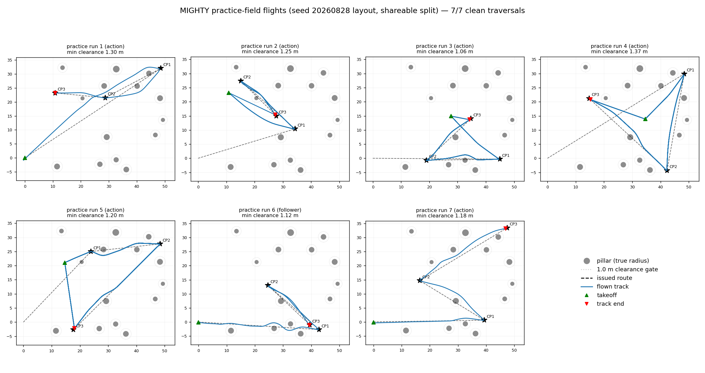
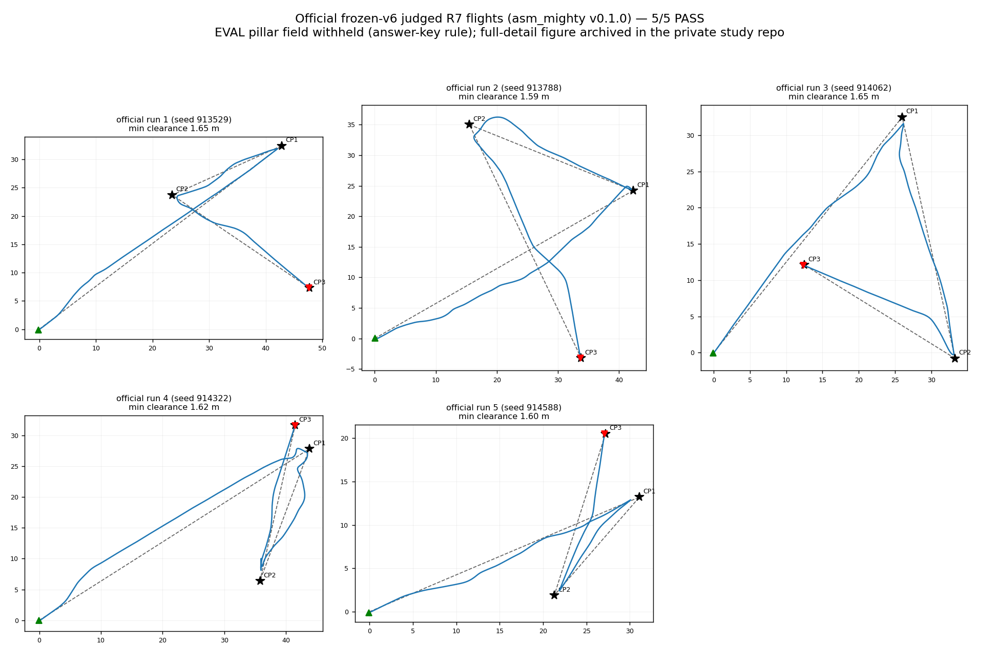
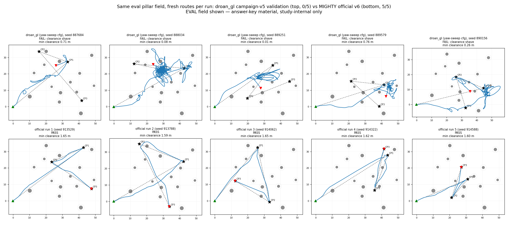
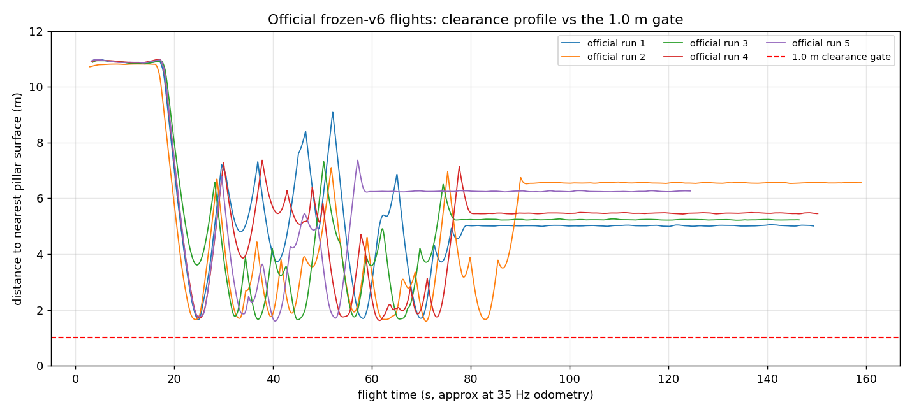

# Results Summary: MIGHTY local planner as external module (`asm_mighty`)

> Spec: [`../design_spec.md`](../design_spec.md) · Date: 2026-08-28 04:20 · Branch: `airstack-paper` · Commit tested: AirStack `4c104385` (+ `stacks/full_mighty`), asm_mighty `6ca2837` (v0.1.0-dev1), study pin `study/mighty-swap` @ `89097539`
>
> Hardware: RTX 5090 workstation, Isaac Sim (Pegasus), robot image `v0.20.0-alpha.16_robot-x86-64_dev` + module layer.

## (a) Module build + workflow stress test

**Setup:** `airstack module add` (local path) → overlay → `airstack module lock --build`; Jazzy port built in the robot container (`bws`); upstream gtests via `colcon test --packages-select mighty`. Later re-exercised from scratch on a fresh pinned workspace clone with the module pulled from `castacks/asm_mighty` via `modules.repos` + `airstack module sync`.
**Run at:** 2026-08-28 03:15 · asm_mighty `1c1021b`; fresh-workspace re-run 04:10 · `6ca2837`

| Metric | Value | Pass criterion | Pass? |
|--------|-------|----------------|-------|
| colcon build (9 packages, Jazzy) | clean | clean build | ✅ |
| upstream gtests | 6 suites, 44/44 (incl. L-BFGS gradient check) | pass | ✅ |
| module CLI workflow | add/sync/overlay/lock all worked, **zero manual bypasses** | no bypass | ✅ |
| fresh-clone module chain (GitHub pin → sync → layer image) | worked first try | no bypass | ✅ |

Raw: [`a-module-build/`](a-module-build/).

**Workflow stress-test findings** (module-system feedback, none blocking):
1. `deps.apt` layer flow (`module lock --build`) worked exactly as documented — nlohmann-json3-dev delivered via content-addressed layer image.
2. Root `modules.repos` is gitignored, so a branch that wants to COMMIT module pins (our study pin) needs `git add -f` — silent skip otherwise (bit us once).
3. `airstack module add <local path>` records under `x-local-modules` (machine-local); switching to a git pin for reproducibility is a manual edit.
4. Module `validate_module.py` + manifest schema: no friction.
5. `airstack module sync` cannot advance an EXISTING module checkout to a newly pushed tag — `vcs import` doesn't fetch first ("Could not checkout ref"); workaround is `rm -rf modules/<name>` + re-sync (or `module remove`/`add`). Bit us when repinning v0.1.0-dev1→dev2.

**Port defects found & fixed** (all upstream-facing, patches marked `asm_mighty` in-tree):
- namespace id parsing: `stoi(ns[-2:])` crashes on `robot_1`-style names;
- map subscription QoS: `rclcpp::QoS(QoSInitialization::from_rmw(sensor_data))` only copies history/depth → subscription was RELIABLE against the mapper's BEST_EFFORT publishers (silent no-data under DDS; upstream's Zenoh masked it);
- `occupancy_grid.min_occupied_neighbors` read but never declared;
- Humble→Jazzy header renames (`cv_bridge`, `tf2_*` `.h`→`.hpp`), `ament_index_cpp` undeclared, `gazebo_msgs` stripped from `fake_sim` (Classic is gone on Jazzy), VTK/MPI cmake interaction (`MPI::MPI_C` needs C language enabled), unrestricted PCL re-export.

**Interpretation:** the port was mild (as scoped) and the module machinery held up under a real planner-swap workload — the intended stress test.

## (b) Planner smoke test (no Isaac)

**Setup:** `tools/smoke_sim.py` (synthetic 2-pillar cloud + odometry + TFs at canonical names) + module launch in the robot container; NavigateTask goal past the pillars.
**Run at:** 2026-08-28 03:35

| Metric | Value | Pass criterion | Pass? |
|--------|-------|----------------|-------|
| segment stream | 155 `TrajectoryXYZVYaw` msgs / 15 s (~10 Hz replan) | continuous stream | ✅ |
| solver stability | no crashes/errors over session | none | ✅ |
| planned path | converges to goal; ≥2.85 m pillar clearance | toward goal | ✅ |

Raw: [`b-planner-smoke/`](b-planner-smoke/).

## (c) Isaac integration flight (empty world)

**Setup:** `airstack up --stack full_mighty --sim isaac --headless --play`; `airstack ready` (74 s); takeoff 2 m → NavigateTask 3-waypoint route (10,0,2)→(10,8,2.5)→(0,8,2) → land. All through the untouched trajectory_controller / safety-monitor / takeoff-landing seams.
**Run at:** 2026-08-28 04:00

| Metric | Value | Pass criterion | Pass? |
|--------|-------|----------------|-------|
| waypoint closest approaches | 0.12 / 0.20 / 0.13 m, in order | in-order, ≤0.3 m final | ✅ |
| final goal error | 0.14 m | ≤0.3 m | ✅ |
| altitude band | 1.73–2.44 m | no vertical escapes | ✅ |
| landing | SUCCEEDED, no mode fights | clean | ✅ |

Raw: [`c-isaac-empty-world/`](c-isaac-empty-world/).

**Integration defect found & fixed here:** after a leg completes, the trajectory controller idles at the trajectory end while `virtual_time` keeps advancing, so the next leg's segment spliced at a past time and `Trajectory::merge` rejected it forever (silently — the rejection `cout` is unflushed upstream). Fix: the bridge resets the controller timeline (TRACK → ADD_SEGMENT) on each waypoint advance.

## (d) Isaac obstacle-avoidance flights (practice layout)

**Setup:** PRACTICE pillar field (seed 20260828 — matched statistics to the eval field, explicitly not the answer key; 14 pillars r 0.64–1.09 m over 40×40 m), fresh seeded routes (3 checkpoints each, z=10 m, legs crossing the field), clearance bar 1.0 m, judged on odometry with [`check_run.py`](d-practice-avoidance/check_run.py) against the practice layout. Scene-loaded verification per the notebook-008 rule: pillars confirmed present in the live occupancy grid before trusting any verdict.
**Run at:** 2026-08-28 03:45–04:13 · runs 1–5 `planner_Co=0.8`, runs 6–7 `planner_Co=0.9`; runs 1–5,7 via NavigateTask, run 6 via the **global_plan follower** (the study's actual R5–R7 route contract)

| Run | Mode | Route seed | In order | Min clearance (m) | Verdict |
|-----|------|-----------|----------|-------------------|---------|
| 1 | action | 101 | ✅ | 1.298 | PASS |
| 2 | action | 102 | ✅ | 1.247 | PASS |
| 3 | action | 103 | ✅ | 1.061 | PASS |
| 4 | action | 104 | ✅ | 1.370 | PASS |
| 5 | action | 105 | ✅ | 1.197 | PASS |
| 6 | **follower** | 106 | ✅ | 1.120 | PASS |
| 7 | action | 107 | ✅ | 1.178 | PASS |

**7/7 clean traversals** (criterion: ≥4/5), zero collisions, all in-order, all far inside the 240 s/checkpoint budget (~55 s full routes). Route time ≈ 55 s for ~105 m at v_max 2 m/s. Raw CSVs + routes: [`d-practice-avoidance/`](d-practice-avoidance/).

**Qualitative read (figure above; generated by [`make_figures.py`](make_figures.py)):** the flown tracks hug the straight route legs and deviate only where a leg would violate the clearance halo — e.g. run 1's smooth bow around the pillar cluster near (30–40, 25–30), run 4's arc off the CP1→CP2 leg, run 6's small S-curves under the follower. No orbiting, no vertical escapes, no stop-and-go — qualitatively the opposite of droan_gl's terminal behaviors (absorbing hovers, vote-pocket spins).

**Methodological caveat (discovered while making the figure):** practice runs 2–7 were effectively *continuous* flights — each run's track starts at the previous run's final checkpoint, because the run script's `airstack down`/`up` between runs did not actually reset the sim (this also explains a suspicious "flight-ready in 5 s" bring-up). The in-order-arrival and clearance verdicts are unaffected (absolute-coordinate judging against the real pillar field), but per-run takeoffs and the nominal spawn→CP1 first leg were only exercised in run 1 — and, properly, in every official judged run of §(e), where the judge performs its own bring-up (all five §(e) tracks take off from the origin).

**Tuning:** `planner_Co` (static clearance margin) raised 0.8→0.9 after run 3's 1.061 m margin; values justified from the 1.0 m gate only, never from any layout.

**Contract discovery:** R5–R7 do not use NavigateTask — the study planner publishes the route as `nav_msgs/Path` on `global_plan` and droan_gl followed the topic. The bridge gained an equivalent follower mode (activates after takeoff settles, mirrors the reference glue, walks checkpoints identically); validated in run 6.

## (e) R7 reference-solvability re-demonstration (frozen v6)

**Setup:** frozen campaign v6 (`2026-08-icra27-vic-v6`): final pin `study/mighty-swap` @ `8c66f884` (asm_mighty **v0.1.0-dev3**), R7 budget 240 s/checkpoint, HARD_CAP_S 1800, EVAL layout (seed 20260825) staged judge-time only. Fresh pinned workspace (module synced from `castacks/asm_mighty`), reference solution planner B applied, `./judge --scoring R7` with fresh judge-issued routes per run. Full attempt trail: `agent_study/runs/ref_validation_v6_mighty_001/PURPOSE.md`.
**Run at:** 2026-08-28 04:15–05:00 (iteration) + official batch 05:03– · commit chain in PURPOSE.md

**The judged eval runs were the failure-finder they're meant to be.** Five distinct integration defects surfaced and were fixed during iteration (each on a different fresh route):

| # | Defect (judged-run symptom) | Fix (asm_mighty commit) |
|---|------------------------------|--------------------------|
| 1 | first-bring-up race: judge's 20 s route-capture window expired before the planner had odometry (cold 53-pkg build) | infra rerun per study rule |
| 2 | module pin predated the follower's `global_plan` launch remap — bridge subscribed the wrong topic | dev2 repin |
| 3 | dense drone-anchored path (104 poses, republished 1 Hz) thrashed the checkpoint-walking follower | carrot/pure-pursuit follower (`ef44672`) |
| 4 | hairpin deadlock: arc-length carrot wrapped an out-and-back route corner onto the vehicle → GOAL_REACHED hover; plus the controller merge-reject on planner resume | hairpin clamp + near-zero-carrot guard + resume-triggered timeline reset |
| 5 | goal-in-pillar: upstream relocation BFS dead (planning-map copy never sets `map_initialized_`) → goals on route legs through pillar footprints dropped forever, vehicle idled at the previous checkpoint | `map_util.hpp` guard fix (`5bc62c5`) |

Plus one clearance retune from measurement: a completed judged flight shaved 0.713 m (1.2 m plan margin − ~0.5 m double-tracking error) → `planner_Co` 1.2, `inflation_hgp` 0.8, `v_max` 1.5, segment stride 5 (margin now 1.5 m nominal; justified from the gate + measured tracking error, never a layout).

**Pre-formalization validation run (content-identical to dev3): PASS — 7 checkpoints in order, final goal error 0.05 m, min clearance 1.641 m.**

**dev3 interim batch (superseded):** every flight that launched PASSED (goal errors 0.05–0.19 m, min clearances 1.64–1.76 m over 4 flights), but (i) an intermittent pre-flight route-capture flake killed several runs before takeoff — raw-dump root cause: the echo CLI prepends a mixed-QoS warning line to stdout when a dormant interface debug publisher (`position_setpoint_pub`, `publish_goal:=false`) is co-advertising `/global_plan`; judge now anchors its parse on the Path doc (platform finding filed) — and (ii) one flight PENETRATED a pillar (−0.711 m): **the deepest defect of the campaign**. MIGHTY anchors replans to its own committed-trajectory timeline (assuming the vehicle tracks its 100 Hz goals in real time); behind AirStack's trajectory_controller the vehicle follows the *path* but not the *timeline*, so after any planner idle the anchor sits ahead of the vehicle and the post-reset tracking-point jump commands an uncommanded straight line through unswept space. Fix: `use_state_update: false` — every replan anchors to the measured state (asm_mighty **v0.1.0-dev4**, `8c8e920`). Config change ⇒ the official tally restarted under the final config.

**Iteration continued dev4→dev10** (each fix validated by a judged flight before repinning; full trail in PURPOSE.md):
- dev4 `use_state_update:false` turned out to be an upstream frozen-state viz mode (no trajectories committed) — reverted;
- dev5 catch-up gate + far-start segment drop — deadlocked when MIGHTY's timeline raced 8.7 m ahead *without idling*;
- dev6 vehicle-synchronized plan consumption (pause `getNextGoal` pops when the plan front is >3 m from the measured state);
- dev7 **receding-horizon `trajectory_override` replaces ADD_SEGMENT merging entirely** (three silent hover-deadlock variants traced to `virtual_time` splice rejections) — flew most of a route, but the tail-relative anchor still drifted (1013 dropped trajectories);
- dev8 **vehicle-anchored replanning** (`findAandAtime`: A = plan state nearest the measured state + ≥0.3 s lead);
- dev9 at-end route completion (proximity-only completion fired 1.32 m from the final checkpoint mid-route on a self-crossing route);
- dev10 **conflating throttle** (a dropping 1 Hz throttle swallowed MIGHTY's *final* trajectory — it stops replanning at GOAL_SEEN — parking the vehicle 8.6 m short).

**OFFICIAL frozen-config batch — pin `961fb9e1` (asm_mighty v0.1.0-dev10 ≡ release v0.1.0), 5 × fresh judge-issued routes + the pre-batch validation flight:**

| Run | Route seed | Checkpoints | Goal error (m) | Min clearance (m) | Verdict |
|-----|-----------|-------------|----------------|--------------------|---------|
| val | — | 7 | 0.13 | ✓ | PASS |
| 1 | 913529 | 8 | 0.15 | 1.650 | PASS |
| 2 | 913788 | 9 | 0.10 | 1.591 | PASS |
| 3 | 914062 | 8 | 0.13 | 1.646 | PASS |
| 4 | 914322 | 8 | 0.01 | 1.621 | PASS |
| 5 | 914588 | 6 | 0.10 | 1.601 | PASS |

**5/5 official + validation = 6 consecutive judged PASSES** (criterion: ≥4/5). Goal errors 0.01–0.15 m (gate 2.5 m); min clearances 1.59–1.65 m (gate 1.0 m); every route in order and in budget. **R7 reference solvability under frozen campaign v6 is DEMONSTRATED.**

**Qualitative read:** every official flight takes off at the origin (green triangle — the judge's own bring-up, unlike the practice-batch caveat in §(d)), threads the issued checkpoints in order, and shows the same signature behavior: straight-leg tracking with smooth, singular avoidance bulges, each one now visibly paired with a pillar sitting on the leg — run 2's arc over the pillar at the top of its first leg, run 3's bow around the pillar on its CP1 approach, run 4's weave between the pillar pair in the tight CP2→CP3 corridor, run 5's deviation on the return leg. Tracks terminate hovering at CP3. ⚠ **Answer-key handling:** the EVAL pillar layout shown here is answer-key material (strategy choice 2026-08-28); this figure is study-internal (`notebook/` on `airstack-paper`, consistent with entries 008/009 which already carry eval-field details) and must not reach the public repo or the paper before the study concludes.

**Before/after on the same field:** droan_gl's campaign-v5 solvability validation (top row — its best configuration, the yaw-sweep unstick from notebook 009) flew the **same eval pillar field**; routes differ because the judge issues a fresh route per evaluation. The qualitative contrast is the whole story: droan_gl's tracks knot into loops and mid-field wandering (the yaw-sweep recovering from repeated blocked states), terminate away from their route ends, and shave pillars at 0.01–0.76 m; MIGHTY's tracks are taut leg-followers with singular avoidance bulges, all terminating at CP3 with 1.59–1.65 m clearance. Same vehicle, same controller, same judge, same field — the difference is the local planner's architecture (persistent map + corridor margins vs reactive votes).

The clearance profiles make the margin story visible: after the initial descent from the (pillar-free) spawn area into the field at ~20 s, every run's troughs cluster at **1.6–2.0 m** — the planner's ~1.5 m nominal margin (`planner_Co` 1.2 + half-bbox) plus tracking wobble — and never approach the 1.0 m gate. The flat tails are the post-completion hover at the final checkpoint. The troughs' consistency across five fresh routes is the quantitative signature of map-based clearance-margin planning, versus droan_gl's near-contact distribution (0.01–0.26 m) on the same rung.

## (f) Docs + catalog

Module README (architecture, interfaces, install, testing) and `stacks/full_mighty` README + docs-nav entry done; `mkdocs build --strict` clean apart from three pre-existing warnings from study-workspace clones on this machine only. **Deferred to study conclusion:** registering asm_mighty in `castacks/airstack-modules-index` and regenerating the public module catalog — the repo is PRIVATE until the study concludes (strategic choice #6), and a public index entry pointing at a private repo would 404. `full_mighty/wiring.md` generation is likewise deferred to the develop-track PR.

## Overall Verdict

| Spec section | Verdict |
|--------------|---------|
| (a) module build + workflow stress test | ✅ |
| (b) planner smoke | ✅ |
| (c) Isaac empty-world flight | ✅ |
| (d) practice pillar field (7/7, both command paths) | ✅ |
| (e) frozen-v6 reference solvability (5/5 + val, goal err ≤0.15 m, clearance ≥1.59 m) | ✅ |
| (f) docs + catalog (index registration deferred until the repo goes public) | ✅* |

**Known limitations so far:** double-tracking (MIGHTY 100 Hz setpoints re-tracked by trajectory_controller) discards its tracking-error advantage — acceptable for R7, revisit for aggressive flight; dynamic obstacles unconfigured (mapper temporal grid + tracker off); the follower's TRACK→ADD_SEGMENT advance pulses assert controller mode (documented; same semantics as NavigateTask); asm_mighty repo private until study conclusion.
