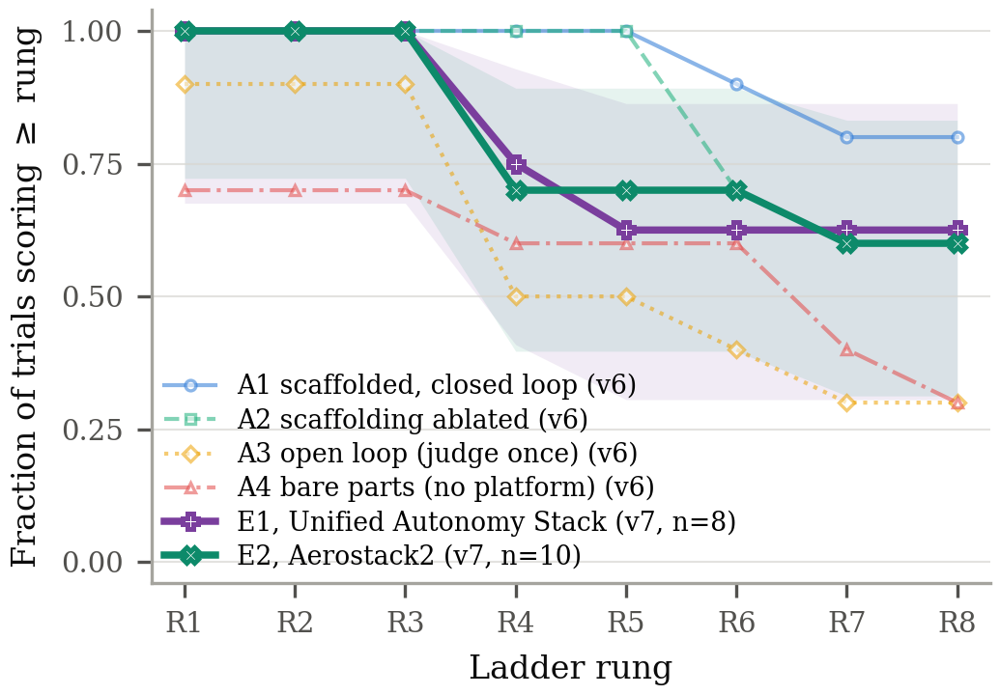

# Results Summary: Agent Proxy Study on External Stacks (UAS + Aerostack2) via OSMO

> Spec: [`../design_spec.md`](../design_spec.md) · Date: 2026-09-12 10:45 · Branch: `airstack-paper` · Commit tested: agent_study `e71611a` (runner `cdd72a8`+ for all pods launched after 15:11 EDT 09-11; config sha `bb4f5ca2…`, prompt sha `afad954d…`)

Campaign `2026-09-icra27-vic-v7-external`: the frozen v6 ladder (prompt v4,
planners, caps 20 judge calls / 4 h, judge parameters byte-identical to v6)
applied to two public aerial autonomy stacks as host-mode arms, one trial
per OSMO pod. **20/20 trials scored** between 2026-09-11 06:28 and
2026-09-12 10:28 EDT. Reported beside campaign v6; never pooled.

## (a) Judge-CLI cross-distro interop

**Setup:** Humble publisher container vs Jazzy/Humble observer containers on host networking (docker only, this box).
**Run at:** 2026-09-11 04:55–05:00 · pre-commit

| Check | Result |
|---|---|
| Jazzy CLI ↔ Humble publisher (`topic list/echo/hz`) | ✅ once a stale third-party daemon on the host was stopped |
| Root cause of initial ✗ | shared per-domain `ros2` daemon under host networking (another user's cyclonedds daemon answered) |
| Decision | pod `ros2` = persistent Humble container (`ros:humble-ros-base`) behind `/usr/local/bin/ros2`, so judge and platform share one Humble daemon |

Details: [a-judge-cli-interop/interop_notes.md](a-judge-cli-interop/interop_notes.md). **PASS.**

## (b) Runner smoke

**Setup:** `run_trial.py --config study_config_v7_external.yaml --arm E1|E2 --agent mock:noop --smoke`; A3 v6 smoke regression.
**Run at:** 2026-09-11 05:06 · agent_study `93356dd`

| Metric | Value | Pass criterion | Pass? |
|---|---|---|---|
| v7 `judge:` block vs v6 | identical (`diff` empty) | identical | ✅ |
| composed prompt sha (E1/E2) | `afad954d…` | = v6 frozen prompt | ✅ |
| E1/E2 workspaces | pinned clones + `ENVIRONMENT.md` + `provided/` + shim (`STUDY_HOST_MODE=1`) | schema-valid results.json | ✅ |
| A3 v6 smoke | config sha `3b2402f6…` unchanged | unchanged | ✅ |

Details: [b-runner-smoke/smoke_notes.md](b-runner-smoke/smoke_notes.md). **PASS.**

## (c) Pod image + OSMO pilot

**Setup:** `airlab-docker.andrew.cmu.edu/airstack/agent-study-pod:v1` (DinD, claude 2.1.265, non-root `study` user, Humble judge-CLI wrapper, auth probe); mock-agent pilot pod through the orchestrator.
**Run at:** 2026-09-11 06:22–06:24 · agent_study `4122415`

| Metric | Value | Pass criterion | Pass? |
|---|---|---|---|
| submit → RUNNING → bundle in → trial → DONE → download → cancel | 2 min end to end | complete archive on this box | ✅ |
| inner dockerd | overlay2 on `/osmo/run` (ext4), GPU visible to inner containers | overlay2 + GPU | ✅ |
| transport | rsync over ssh through `osmo workflow port-forward` (OSMO rsync is disabled on the lab deployment) | works | ✅ |

OSMO findings (rsync disabled, TTY-only exec, per-node scheduling contention, resource sizing): [c-pod-image-osmo-pilot/osmo_pilot_notes.md](c-pod-image-osmo-pilot/osmo_pilot_notes.md). **PASS.**

## (d) Provisioning

**Run at:** 2026-09-11 05:29–11:17 · bake pods

| Item | Value |
|---|---|
| UAS `make images` (13 targets) → harbor mirror | 348 min, 1–12 GB per image |
| Aerostack2 Harmonic variant (upstream dockerfile, tags pinned) | 30 min, 1.8 GB |
| Per-trial provisioning in pods | E2 117–169 s; E1 853–1078 s (~80 GB of images + 49 repos) |

Platform findings: UAS's exact-pin importer aborts on a private repo; Aerostack2's nightly image is Gazebo Fortress with a floating-tag Harmonic dockerfile. Details: [d-provisioning/provisioning_notes.md](d-provisioning/provisioning_notes.md). **PASS.**

## (e) Pilot real trial

**Setup:** E2 (Aerostack2) / claude-sonnet-5 / #1, first real pod.
**Run at:** 2026-09-11 06:28–10:49 · runner `e20b682`

| Metric | Value |
|---|---|
| In-session | R1–R6 passed by 09:05, R7 ×5 failed, 4 h cap |
| Defect found | `subprocess.run(timeout)` killed only `claude`; an in-flight agent judge run overlapped the final scoring pass (R6/R5/R4 verdicts contaminated) |
| Disposition | infra defect → archived `.pilot-orphan-contaminated`, **rerun** with fixed runner (`cdd72a8`: process-group kill + pre-scoring sweep) |

Details: [e-pilot-real-trial/pilot_notes.md](e-pilot-real-trial/pilot_notes.md). **Runner defect found and fixed before the batch; PASS as a pilot.**

## (f) Trial matrix

**Setup:** 20 ladder trials, ≤4 pods (12 overnight by lead permission; the cluster never yielded more than 5), HIGH priority, interleaved round-robin.
**Run at:** 2026-09-11 11:08 → 2026-09-12 10:28 EDT · runner `cdd72a8`–`e71611a` (per-trial `runner_commit` in results.json)

Final-state score per trial (in-session best in brackets where higher; `+n` = direct executions of judge internals besides the counted shim calls; `cap` = 4 h wall-clock kill, no usage event):

| Cell | #1 | #2 | #3 | #4 | #5 | R8 |
|---|---|---|---|---|---|---|
| E2 Aerostack2 · opus | R8 (16, 4.0 h, $26.23) | R8 (14 +2, 2.1 h, $22.86) | R8 (7, cap) | R8 [R6] (6, cap) | R8 (10, 2.6 h, $17.46) | **5/5** |
| E2 Aerostack2 · sonnet | R3 [R6] (13 +22, cap) | R6 (7, 3.9 h, $21.53) | R8 (11, 1.9 h, $17.98) | R3 [R8] (9, 1.4 h, $10.60) | R3 [R8] (7 +4, 3.4 h, $32.38) | **1/5** |
| E1 UAS · opus | R8 (14, 2.2 h, $22.57) | R8 (13 +2, 3.3 h, $21.18) | R8 (15 +1, 1.9 h, $17.50) | R8 (9 +7, 3.9 h, $27.40) | R8 (10 +9, 1.7 h, $14.74) | **5/5** |
| E1 UAS · sonnet | R3 [R6] (11, cap) | R4 [R8] (9 +3, 3.8 h, $22.91) | R8 (10, 1.4 h, $16.50) | R3 [R6] (14, cap) | R3 [R8] (8 +25, 3.5 h, $17.93) | **1/5** |

Infra dispositions (rule 4, never scored): E2 sonnet #1 attempt 1 (orphaned-judge scoring contamination, runner defect), E1 sonnet #1 attempt 1 (OSMO node NotReady after 3 h 40 m), E2 sonnet #1 rerun's runner crash before scoring (root-owned core dump in the manifest walk → fixed, scoring resumed in place with `--resume-scoring` on the intact workspace). Full per-trial record: [f-trial-matrix/matrix_status.md](f-trial-matrix/matrix_status.md).

**Interpretation:**
- **Opus reached the full ladder in 10/10 trials on both external stacks** (1.7–4.0 h agent time, $14.74–27.40), vs. 4/5 on AirStack A1 and 5/5 on A2 in v6.
- **Sonnet reached R8 in 1/5 on each stack** (vs. 4/5 on A1). 7 of the 8 sonnet sub-R8 trials had passed R6 or higher in-session (5 had passed R8), then failed the final-state re-bring-up: planner alpha left active after R7/R8 work (R4/R5 fail by construction), a hung `./takeoff`, or a tracking/clearance flake on the fresh judge route. The final-state rule is the same one v6 used; the gap is in producing a system that comes up reliably from `./bringup`, not in ever reaching the rung.
- **Rule-5 audit:** every agent read the judge code; 11/20 executed check internals directly (mostly the R1–R4 graph checks as pre-checks; three sonnet trials ran `r5_provenance.py` flights via `nohup`, 22–25 times). Counted shim calls stay the cap accounting; direct executions are reported next to them (`runner/audit_direct_harness.py`).
- Cost over the 15 trials with usage events: $291.86 + 3 later ones ≈ **$340 total**; 5 cap-killed trials lost their usage event (as in v6).

## (g) Analysis

**Setup:** `g-analysis/analysis_v7.py` (loads v6 via notebook 011's analysis.py, v7 from `runs/E*`; side by side, never pooled).
**Run at:** 2026-09-12 10:29 · 20/20 trials

Rung survival (fraction of trials scoring ≥ rung; v7 n=10 per arm):

| Arm | ≥R1 | ≥R2 | ≥R3 | ≥R4 | ≥R5 | ≥R6 | ≥R7 | ≥R8 |
|---|---|---|---|---|---|---|---|---|
| A1 AirStack scaffolded (v6) | 1.00 | 1.00 | 1.00 | 1.00 | 1.00 | 0.90 | 0.80 | 0.80 |
| A2 AirStack ablated (v6) | 1.00 | 1.00 | 1.00 | 1.00 | 1.00 | 0.70 | 0.60 | 0.60 |
| A3 open loop (v6) | 0.90 | 0.90 | 0.90 | 0.50 | 0.50 | 0.40 | 0.30 | 0.30 |
| A4 bare parts (v6) | 0.70 | 0.70 | 0.70 | 0.60 | 0.60 | 0.60 | 0.40 | 0.30 |
| **E1 Unified Autonomy Stack (v7)** | 1.00 | 1.00 | 1.00 | 0.70 | 0.60 | 0.60 | 0.60 | 0.60 |
| **E2 Aerostack2 (v7)** | 1.00 | 1.00 | 1.00 | 0.70 | 0.70 | 0.70 | 0.60 | 0.60 |

Per model (n=5): E1 opus 1.00 at every rung; E1 sonnet 1.00/1.00/1.00/0.40/0.20/0.20/0.20/0.20; E2 opus 1.00 at every rung; E2 sonnet 1.00/1.00/1.00/0.40/0.40/0.40/0.20/0.20.

`tab:agents` rows (mean ± sd; cost over trials with usage events):

| Arm | R8 | Hours | Judge calls | USD (n) |
|---|---|---|---|---|
| A1 | 8/10 | 2.1 ± 0.4 | 9.8 ± 2.6 | 17.25 ± 7.86 (10) |
| A2 | 6/10 | 2.6 ± 0.8 | 10.5 ± 4.1 | 18.11 ± 4.81 (9) |
| A3 | 3/10 | 1.4 ± 0.3 | 0 (by design) | 16.07 ± 4.46 (10) |
| A4 | 3/10 | 2.7 ± 0.7 | 13.6 ± 2.8 | 28.53 ± 9.18 (9) |
| E1 | 6/10 | 3.0 ± 1.0 | 11.3 ± 2.5 | 20.09 ± 4.17 (8) |
| E2 | 6/10 | 3.1 ± 1.0 | 10.0 ± 3.4 | 21.29 ± 6.95 (7) |

Final-state retention (final score ≥ best in-session rung; from judge logs, all closed-loop arms; A3 open-loop undefined):

| Arm | retained (pooled) | sonnet-5 | opus-5 | note |
|---|---|---|---|---|
| A1 (v6) | 8/10 | 4/5 | 4/5 | sonnet #5 R8→R5 (swap not persisted), opus #5 R7→R6 (fresh-route miss) |
| A2 (v6) | 7/10 | 2/5 | 5/5 | |
| A4 bare parts (v6) | 6/10 | 2/5 | 4/5 | |
| E1 UAS (v7) | 6/10 | 1/5 | 5/5 | 3/5 sonnet sessions passed R8 in-session, 1 shipped it |
| E2 Aerostack2 (v7) | 7/10 | 2/5 | 5/5 | 3/5 sonnet sessions passed R8 in-session, 1 shipped it |

The seven external regressions: all seven final states were left in one planner's configuration (six with alpha stopped, one with beta stopped), so the other planner's rungs fail by construction; six flew the fresh-route R7 re-flight and missed (five clearance, one goal error); two no longer took off at R6.

LaTeX rows: [g-analysis/tab_agents_external.tex](g-analysis/tab_agents_external.tex); full output incl. the in-session/final regression counts: [g-analysis/analysis_v7_output.md](g-analysis/analysis_v7_output.md). Pod environment uniform: RTX PRO 5000 Blackwell, driver 580.126.20.

**Interpretation for the paper:** both external platforms land between AirStack A1 (0.80 at R8) and its ablation A2 (0.60) — exactly 0.60 each, pooled over models — and well above bare parts (0.30). The model interaction seen on A2 (opus 5/5, sonnet 1/5) reappears on both external stacks (opus 5/5, sonnet 1/5), while A1 was the only arm where sonnet also reached 4/5. The v7 sonnet losses are dominated by final-state regressions (7/8 sub-R8 trials had passed ≥R6 in-session). Caveats to state: n=5 per cell; pods differed in CPU/memory request across trials (recorded per trial); external arms used the host-mode judge path (same as A4/bare parts) rather than the pytest harness path (A1/A2); cluster contention meant the cap of 4 concurrent pods was the effective rate.

## Overall Verdict

| Spec section | Verdict |
|---|---|
| (a) judge-CLI interop | ✅ |
| (b) runner smoke | ✅ |
| (c) pod image + OSMO pilot | ✅ |
| (d) provisioning | ✅ |
| (e) pilot real trial | ✅ (runner defect found + fixed, rerun) |
| (f) trial matrix | ✅ 20/20 scored (3 infra reruns/recoveries, all logged) |
| (g) analysis | ✅ figure + table regenerated from raw results.json |

**Known limitations:** resume-scored E2 sonnet #1 rerun has reconstructed agent bookkeeping (wall-clock cap, no usage event); the AirLab SMB results mirror never authenticated (results travelled only over the ssh tunnel); agents could read and, in 11/20 trials, execute the judge internals (same exposure as v6; audited, not prevented); pod resources varied (4 vs 8 CPU) with cluster contention; Amendment 4 is still a draft pending lead approval.
