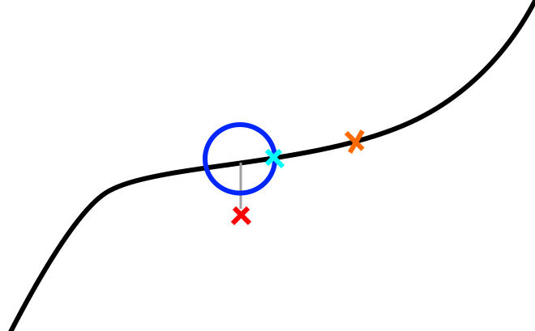

# Trajectory Controller

## Overview

The trajectory controller takes in a trajectory and publishes a tracking point, which a controller should make the drone fly to, and a look ahead point, which a planner should plan from. The trajectory controller can interpret a trajectory as a standalone complete track, like a figure eight or racetrack pattern for tuning controls, or as separate segments that should be stitched together, for example trajectories output by a local planner.

The trajectory controller tries to keep the tracking point ahead of the robot in a pure pursuit fashion. The robot's position, the red X in the figure below, is projected onto the trajectory. A sphere, shown in 2d as the cyan circle, is placed around this projected point and the intersection between the sphere and the forward point on the trajectory is used as the tracking point, the blue X. The lookahead point, the orange X, is a fixed time duration along the trajectory.

# Parameters
| 
Parameter
  | Description
|----------------------------|---------------------------------------------------------------
| `tf_prefix`                | The tf names published are prefixed with the string in this parameter. Tfs are published at the tracking point and lookahead point. There are stabilized versions, the same but with zero pitch and roll, of these two tfs that are also published.                                                                                                                                        |
| `target_frame`             | The tracking point and lookahead point are published in this frame.                                                                                                                                                                                                                                                                                                                      |
| `look_ahead_time`          | How far ahead of the tracking point the lookahead point will be in seconds.                                                                                                                                                                                                                                                                                                              |
| `min_virtual_tracking_velocity` | If the velocity on the trajectory is less than this, the tracking point will just move forward in time instead of using the sphere to keep the tracking point ahead of the drone. The units are m/s.                                                                                                                                                                                   |
| `sphere_radius`            | This is the radius of the sphere used to determine the position of the tracking point. Making it larger pushes the tracking point farther ahead.                                                                                                                                                                                                                                          |
| `search_ahead_factor`      | To search for the point on the trajectory that intersects with the sphere, the algorithm checks a certain distance ahead along the trajectory. This distance is given by `sphere_radius * search_ahead_factor`. If the trajectory zigzags a lot relative to the size of the sphere, it's possible that the algorithm wouldn't iterate far enough along the trajectory to find the point where it intersects with the sphere. If a large value for this parameter is used and the trajectory loops back on itself, it is possible that this would cause the tracking point to jump ahead and skip a portion of the trajectory. In almost all cases, this parameter shouldn't need to be changed. |
| `traj_vis_thickness`       | The thickness of the trajectory visualization markers.                                                                                                                                                                                                                                                                                                                                   |
# Services

## Trajectory Modes

There are several modes that the trajectory controller can be placed in with a service call to the `set_trajectory_mode` service:
See TrajectoryMode.srv.

| Mode                          | Description                                                                                                                             |
| ------------------------------| -------------------------------------------------------------------------------------------------------------------------|
| **TRACK**        | This interprets a trajectory subscribed on `~/trajectory_override` as a complete trajectory that the controller will follow. It is usually used for taking off, landing, and tuning controls on fixed trajectories like figure eights, racetracks, circles, etc...
| **ADD_SEGMENT**  | This interprets a trajectory subscribed on `~/trajectory_segment_to_add` as a segment of a trajectory which will get stitched onto the current trajectory at the closest point to the start of the new segment. This is usually published by a local planner. Ideally it is published at the location of the lookahead point, which is a fixed time ahead of the tracking point. This fixed time should be greater than the time it takes to plan. For example, if the lookahead point is one second ahead of the tracking point, the local planner should be always take less than one second to plan otherwise the tracking point would already be past the start of the plan. If this happens, the trajectory will fail to be stitched and will be ignored.
| **PAUSE**        |  This causes the tracking point to stop where it is.
| **REWIND**       | This makes the tracking point go backwards along the trajectory. This mode is usually used to make the drone blindly backtrack along its trajectory to get it out of a situation it is stuck in.
| **ROBOT_POSE**   | This makes the tracking point and lookahead point always be at the same position as the drone's odometry. This is useful for before takeoff, when the robot may be carried around so that the location where the takeoff starts is at the drone's position.

# Subscriptions
| 
Topic
   | Type              | Description                                                                                                                             |
| ----------------------------------| ------------------| ---------------------------------------------------------------------------------------------------------------------------|
| `~/odometry`                      | [nav_msgs/Odometry](https://docs.ros.org/en/rolling/p/nav_msgs/interfaces/msg/Odometry.html) | Odometry of the robot.
| `~/trajectory_segment_to_add`     | [airstack_msgs/TrajectoryXYZVYaw](/common/ros_packages/airstack_msgs/srv/TrajectoryMode.srv) | For **ADD_SEGMENT** mode, this is the trajectory segment to add to the current trajectory.
| `~/trajectory_override`           | [airstack_msgs/TrajectoryXYZVYaw](/common/ros_packages/airstack_msgs/srv/TrajectoryMode.srv) | For **TRACK** mode, this overrides the current trajectory and makes the robot follow this directly.

# Publications
| 
Topic
 | Type              | Description                                                                                                                             |
| -------------------------------------| ------------------| ---------------------------------------------------------------------------------------------------------------------------|
| `~/tracking_point`                   | TODO              | TODO
| `~/look_ahead`                       | TODO              | TODO
| `~/traj_drone_point`                 | TODO              | TODO
| `~/virtual_tracking_point`           | TODO              | TODO
| `~/closest_point`                    | TODO              | TODO
| `~/trajectory_completion_percentage` | TODO              | TODO
| `~/trajectory_time`                  | TODO              | TODO
| `~/tracking_error`                   | TODO              | TODO
| `~/velocity_pub`                     | TODO              | TODO
| `~/debug_markers`                    | TODO              | TODO
| `~/trajectory_vis`                   | TODO              | TODO

