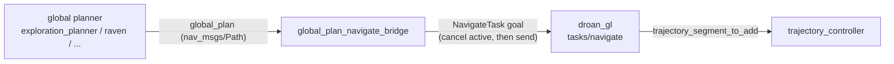

# global_plan_navigate_bridge

Adapter between a **topic-publishing global planner** and AirStack's
**task-executor local planner**. The DROAN local planner (`droan_gl`, from the
`asm_droan` module used by the `full_droan*` stacks) plans only while a
`NavigateTask` action goal is active, and it rejects a second goal while one
is running. The default MIGHTY local planner (`full_default`) instead follows
the `global_plan` topic itself and needs no adapter. The random-walk planner drives it as an action client
itself; planners that simply publish a `nav_msgs/Path` on `global_plan` — the
[exploration_planner](https://github.com/castacks/asm_exploration_planner)
and [raven](https://github.com/castacks/asm_raven) modules, or any external
planner following the interface conventions — need this bridge to make the
vehicle move.

## Architecture



Behaviour:

1. A new plan whose **pose count** or **final pose** changed (by more than
   `replan_min_change_m`) cancels the active goal and, once the cancel is
   acknowledged, sends the new plan as a `NavigateTask` goal. `droan_gl` may
   still report "task already active" for a moment after the cancel, so the
   send is retried (`send_retry_period_s`, `max_send_retries`).
2. Identical re-publications (planners typically re-send their current plan
   periodically) are ignored.
3. An empty `Path` cancels the active goal (`cancel_on_empty_plan`).
4. `~/set_enabled` (`std_srvs/SetBool`) pauses/resumes the bridge; disabling
   cancels the active goal.

## Interfaces

Declared in `launch/global_plan_navigate_bridge.launch.xml` (canonical
defaults; rewire from the stack entry file only):

| Launch arg | Default | Direction | Type |
|---|---|---|---|
| `global_plan_navigate_bridge_global_plan_topic` | `/$ROBOT_NAME/global_plan` | in | `nav_msgs/Path` |
| `global_plan_navigate_bridge_navigate_task_action` | `/$ROBOT_NAME/tasks/navigate` | client | `task_msgs/action/NavigateTask` |
| `global_plan_navigate_bridge_config` | `config/global_plan_navigate_bridge.yaml` | — | parameter file |

Service: `/$ROBOT_NAME/global_plan_navigate_bridge/set_enabled` (`std_srvs/SetBool`).

## Parameters

| Parameter | Default | Description |
|---|---|---|
| `goal_tolerance_m` | `1.0` | Passed through in every `NavigateTask` goal |
| `replan_min_change_m` | `0.5` | Final-pose displacement below which a re-published plan is treated as unchanged |
| `cancel_on_empty_plan` | `true` | An empty `Path` cancels the active goal |
| `send_retry_period_s` | `0.5` | Retry period after a rejected send |
| `max_send_retries` | `10` | Give up (drop the plan) after this many rejections |
| `enabled` | `true` | Initial state of the `set_enabled` switch |

## Usage

Include it in a DROAN-based stack whose global planner publishes plans on a
topic, right after that planner's include (the MIGHTY-based `full_exploration`
and `full_raven` stacks do not need it):

```xml
<include file="$(find-pkg-share global_plan_navigate_bridge)/launch/global_plan_navigate_bridge.launch.xml" />
```

`full_default` does not include it: its random-walk planner is its own
`NavigateTask` client and MIGHTY follows `global_plan` directly.

## Testing

Hermetic unit tests for the plan-change rule live in `test/` and run with
`airstack test -m unit` (listed in `tests/colcon_unit_test_packages.yaml`) or
`colcon test --packages-select global_plan_navigate_bridge` in the robot
container.
