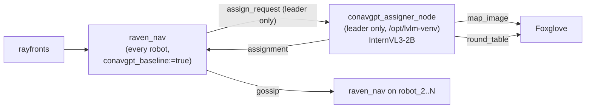

# Co-NavGPT Baseline (VLM-Assign)

Team-level frontier assignment by a vision-language model, for RAVEN.

## Overview

[Co-NavGPT](https://arxiv.org/abs/2310.07937) (Yu et al., 2023) shows a VLM the
team's shared map — numbered frontier regions, numbered robots — and asks it, in
a **single call for the whole team**, which robot should go to which region.
`conavgpt_assigner_node` is that call.

**One instance runs, on the leader robot only** (`robot_<conavgpt_leader_id>`,
default `robot_1`). Every other robot receives the answer through the gossip
protocol. A robot with no fresh assignment — out of comms, or the leader is dead
— falls back to nearest-viable-frontier and marks the round `fallback: true`.
That degradation is a measured result, not a bug.

> **Adaptation — state this wherever the baseline is reported.** The published
> method is single-target, terminates on the first find, and starts the robots
> co-located. This arm is multi-target, never terminates early, starts the
> robots apart, and is scored time-integrated
> (`COA-docs/multi_robot_baselines.md` sec. 9). That difference is the
> **VLM-Assign** arm, not Co-NavGPT as published.

The node owns *only* the VLM. Frontier extraction, clustering, coverage and the
results dump stay in `raven_nav`'s `CoNavGPTBehavior` — only frontier
*selection* is replaced. Splitting it out this way keeps `transformers` out of
`raven_nav`'s process (rayfronts pins its own), so the two never have to agree
on more than JSON.

## Architecture



Per round the node:

1. renders a top-down BEV of the team state (numbered candidate regions,
   numbered robots, confirmed targets, search-area outline),
2. builds a prompt carrying the target query, the numbered regions with their
   global-ENU coordinates and per-robot distances, and the robot positions,
3. runs InternVL3-2B on (image + text), or text alone when
   `prompt_mode: 'text'`,
4. parses STRICT JSON `{"assignments": {"1": 3, "2": 0}}` defensively,
5. publishes the assignment, the exact image it fed the model, and a
   human-readable round table,
6. appends one JSONL line to `<results_dir>/conavgpt_rounds.jsonl`.

## Interfaces

`robot` = `ROBOT_NAME` (the leader). **Every coordinate on the wire is global
ENU metres** (x = east, y = north); `raven_nav` converts to and from its local
`map` frame with its existing `_local_to_world`.

| Direction | Name | Type |
|---|---|---|
| sub | `/{robot}/conavgpt/assign_request` | `std_msgs/String` (JSON) |
| pub | `/{robot}/conavgpt/assignment` | `std_msgs/String` (JSON, latched, gossiped) |
| pub | `/{robot}/conavgpt/map_image` | `sensor_msgs/Image` (`rgb8`, the exact BEV fed to the model) |
| pub | `/{robot}/conavgpt/round_table` | `std_msgs/String` (latched) |

### `assign_request`

```json
{
  "round": 7, "ts": 1699999999.5, "leader": 1,
  "query": "person, survivor",
  "frame": "global_enu",
  "search_area": [[-100, -100], [200, -100], [200, 200], [-100, 200]],
  "robots": [{"id": 1, "x": 12, "y": -40, "z": 15, "fresh": true, "current_region": 3}],
  "regions": [{"id": 0, "x": 55, "y": 120, "z": 10, "info_gain": 42.0,
               "dist_by_robot": {"1": 55.2, "2": 91.0}}],
  "found": [{"label": "person", "x": 30, "y": 12}]
}
```

An optional `"observed": [[x, y], ...]` key is shaded on the BEV if present and
ignored if absent — the frozen request carries no observability field, so this
is the hook for one.

### `assignment`

```json
{
  "round": 7, "ts": 1699999999.9, "model": "OpenGVLab/InternVL3-2B",
  "assignments": {"1": 3, "2": 0},
  "latency_s": 4.2, "fallback": false,
  "raw": "<verbatim model text, truncated to 2000 chars>",
  "reason": ""
}
```

`assignments` maps robot id (string) to region id (int). A region id the model
returns that was not in the request is **dropped and logged**; a robot with no
valid entry falls back to nearest-frontier on `raven_nav`'s side. When *nothing*
usable comes back, `assignments` is `{}` and `fallback` is `true` with a
`reason` — the whole team then runs nearest-frontier for that round.

## Parameters

See [`config/conavgpt_baseline.yaml`](config/conavgpt_baseline.yaml).

| Name | Default | Meaning |
|---|---|---|
| `model_path` | `OpenGVLab/InternVL3-2B` | Same weights `lvlm_baseline` uses, so one cached download serves both |
| `prompt_mode` | `image+text` | `text` is the ablation that answers from coordinates alone |
| `results_dir` | `''` | Where `conavgpt_rounds.jsonl` is appended; empty disables |
| `max_new_tokens` | `256` | Room for the JSON plus whatever preamble a 2B model insists on |
| `map_px` | `768` | Rendered BEV edge; below ~512 the region numbers stop being legible after the vision encoder retiles |
| `request_timeout_s` | `60.0` | A request older than this when the worker reaches it is answered with a fallback |

## Robustness

The node answers **every** request. It never raises out of a round.

- Inference runs on a worker thread with a **single latest-wins slot**: a
  request arriving mid-inference replaces the pending one instead of queueing
  behind seconds of GPU time, and the superseded round numbers are recorded in
  the round record and the round table.
- Model still loading, no regions offered, no robots, stale request, CUDA OOM
  or any other inference failure, a PIL failure, a malformed model answer, a
  region id out of range — each produces `fallback: true` with a `reason`
  rather than an exception.
- BEV rendering degrades to **text-only prompting** if PIL raises; the prompt
  drops the `<image>` token and the sentence describing the picture, and the
  coordinates carry the round on their own.

### Parser fallback order

1. Markdown-fenced blocks (```` ```json … ``` ````), innermost content first.
2. The whole trimmed reply as JSON.
3. Every balanced `{…}` block, in order of appearance; first that parses wins.
4. Inside a parsed object: `assignments` → `assignment` → `robots` → `result` →
   `answer`, as either a `{robot: region}` dict or a list of
   `{"robot": n, "region": m}` records; failing all of those, a bare
   `{"1": 3}` mapping (a very common 2B output).
5. Regex salvage over the raw text for `robot N -> region M` / `"N": M` /
   `N = M`, accepted **only** for robot ids the request actually named — which
   also covers unquoted integer keys and truncated JSON.
6. Nothing usable → `assignments: {}`, `fallback: true`, `reason` set.

Per-entry filtering then drops non-numeric pairs, robot ids not in the request
and region ids not offered; every drop is logged and lands in the round record.
If every entry is dropped, the round is a fallback.

## Results

One JSON line per round appended to `<results_dir>/conavgpt_rounds.jsonl`
(request, assignment, latency, parse info, superseded rounds, raw text), flushed
per round because the mission runner ends a run by killing the process.
`results_dir` is set at spawn to `/root/.cache/raven_results`, the same
directory every other method dumps to. This is *not* a parallel results path:
`raven_nav` records each new assignment into its existing `_intent_events`
channel, so `compile_results` and `compare_to_groundtruth` keep working
unchanged.

## How it runs in a mission

`CONAVGPT_BASELINE=true` in the mission `env:` selects the baseline.
`semantic_search_task` then runs the normal rayfronts + `raven_nav` flow with
`conavgpt_baseline:=true` on every robot, and **additionally** spawns this node
on the leader only:

```
/opt/lvlm-venv/bin/python -m conavgpt_baseline.conavgpt_assigner_node --ros-args ...
```

falling back to `ros2 run conavgpt_baseline conavgpt_assigner_node` where the
venv is absent. The venv (`transformers`, `bitsandbytes`, `accelerate`) is built
in `Dockerfile.robot` and is `--system-site-packages`, so it reuses the system
`torch`, `numpy`, `rclpy` and `cv_bridge`. It is killed in the same cleanup path
as rayfronts and `raven_nav`.

## Standalone run

```bash
docker exec airstack-robot-desktop-1 bash -c \
  "sws && ros2 launch conavgpt_baseline conavgpt_baseline.launch.xml"
# then hand it a round:
docker exec airstack-robot-desktop-1 bash -c \
  "sws && ros2 topic pub --once /robot_1/conavgpt/assign_request std_msgs/String \
   'data: {\"round\":1,\"query\":\"person\",\"robots\":[{\"id\":1,\"x\":0,\"y\":0}],\"regions\":[{\"id\":0,\"x\":50,\"y\":50}]}'"
```

## Tests

`test/test_conavgpt_assigner.py` covers the prompt builder, the response parser,
the BEV projection and the renderer with plain `pytest` — **no ROS, no GPU**.
The heavy imports in `conavgpt_assigner_node.py` are guarded precisely so this
stays possible.

```bash
cd robot/ros_ws/src/global/planners/conavgpt_baseline && python3 -m pytest test/ -q
```

## Notes

- InternVL3's preprocessing helpers (`build_transform`, `dynamic_preprocess`,
  `split_model`, `load_image`) are duplicated from `lvlm_baseline` rather than
  imported: there they are methods on an rclpy `Node` subclass, so importing
  them would pull `rclpy`, `task_msgs` and `coordination_msgs` in at module
  import and cost this node its standalone testability. The bodies are
  identical, so both baselines feed the model the same pixels.
- Generation is greedy (`do_sample=False`). The answer is a fixed JSON form;
  sampling only invents ways to break it.
- `latency_s` is wall-clock (the honest cost of the VLM call). `ts` is the node
  clock, so it is directly comparable with `raven_nav`'s
  `conavgpt_assignment_ttl_s`.
