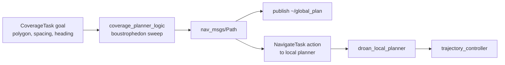

# Coverage Planner

A 2D boustrophedon ("lawn-mower") global planner for systematic area surveys. Given a polygonal coverage area, a line spacing, and a heading direction, the planner generates a waypoint path that sweeps the polygon in back-and-forth passes and delegates execution to the local planner via `NavigateTask`.

## Overview

Area coverage is a common mission for aerial surveys (mapping, photogrammetry, agricultural sensing, search patterns). This module implements the classic boustrophedon decomposition for convex or mildly non-convex simple polygons:

1. Rotate the polygon so sweep lines are axis-aligned.
2. Slice at regular `line_spacing_m` intervals perpendicular to the sweep direction.
3. Intersect each slice with the polygon edges to get pass segments.
4. Concatenate segments in alternating (left→right, right→left) order to form a continuous path.
5. Rotate the resulting waypoints back into the world frame and assign altitude + yaw.



## Algorithm Details

### Polygon handling

- Input polygon is given as a `geometry_msgs/Polygon` (list of `Point32`). Only the `x`/`y` coordinates are used; altitude is picked separately from the goal.
- The polygon is treated as closed (last vertex implicitly connects back to the first). Winding order does not matter.
- Non-convex but **simple** (non-self-intersecting) polygons are handled: each sweep row intersects the polygon in pairs of edges, producing one or more pass segments per row.
- Degenerate goals (< 3 vertices, zero area, or non-positive line spacing) are rejected at goal-acceptance time.

### Sweep row spacing

The first sweep is placed half a `line_spacing_m` inside the polygon, and rows are emitted until half a spacing before the opposite boundary. This ensures the swept strips fully cover the area with no uncovered strip at the edges.

### Start-side selection

When `start_from_nearest` is true, the planner compares the robot's current (x, y) to the first- and last-row entry points and reverses the entire sweep if the last corner is closer — minimising deadhead flight to the start of the survey.

### Boundary inset

`default_boundary_inset_m` shrinks the polygon inward before sweeping (per-edge offset via inward normals). Useful for keeping the drone a safe distance from the nominal boundary. A value of `0.0` disables inset and defers obstacle margin entirely to the local planner.

### Altitude

`CoverageTask.action` specifies altitude AGL (above ground level). This planner currently treats the `min_altitude_agl` / `max_altitude_agl` range as world-z and uses the midpoint. True AGL conversion will be wired in once a terrain-elevation source is available in the global layer.

---

## Task Executor

This node is a **task executor**: it runs as a ROS 2 action server and is activated on demand via a `CoverageTask` goal. It does not plan continuously — planning happens once per goal.

**Action server:** `/{robot_name}/tasks/coverage`
**Type:** `task_msgs/action/CoverageTask`

### Cascade

```text
behavior_executive  →  CoverageTask  →  coverage_planner
                                            ↓
                                  NavigateTask (/{robot_name}/tasks/navigate)
                                            ↓
                                     droan_local_planner
                                            ↓
                                    trajectory_controller
```

### Goal parameters

| Field | Type | Description |
| ----- | ---- | ----------- |
| `coverage_area` | `geometry_msgs/Polygon` | Polygon to cover (≥ 3 vertices, x/y used) |
| `min_altitude_agl` | float32 | Minimum flight altitude (m AGL) |
| `max_altitude_agl` | float32 | Maximum flight altitude (m AGL) — midpoint is used |
| `min_flight_speed` | float32 | Minimum flight speed (m/s) — passed through for future use |
| `max_flight_speed` | float32 | Maximum flight speed (m/s) — passed through for future use |
| `line_spacing_m` | float32 | Perpendicular distance between sweep lines (m); ≤ 0 falls back to the config default |
| `heading_deg` | float32 | Direction of sweep passes (degrees, CCW from +X) |

### Feedback (published ~1 Hz)

| Field | Type | Description |
| ----- | ---- | ----------- |
| `status` | string | `"surveying"` while the local planner is active, `"complete"` otherwise |
| `progress` | float32 | Fraction of waypoints passed (0.0–1.0) |
| `coverage_percentage` | float32 | `progress * 100` |
| `current_position` | `geometry_msgs/Point` | Latest odometry position |

### Result

| Field | Type | Description |
| ----- | ---- | ----------- |
| `success` | bool | True when the local planner reports the final waypoint reached |
| `message` | string | Human-readable status (`"Coverage complete"`, `"Task cancelled"`, …) |
| `coverage_percentage` | float32 | Coverage at termination |

### CLI test

```bash
# 40 m × 40 m square survey at 5 m AGL with 5 m spacing, heading east
ros2 action send_goal /robot_1/tasks/coverage task_msgs/action/CoverageTask \
  '{coverage_area: {points: [
      {x: -20.0, y: -20.0, z: 0.0},
      {x:  20.0, y: -20.0, z: 0.0},
      {x:  20.0, y:  20.0, z: 0.0},
      {x: -20.0, y:  20.0, z: 0.0}]},
    min_altitude_agl: 5.0, max_altitude_agl: 5.0,
    min_flight_speed: 1.0, max_flight_speed: 3.0,
    line_spacing_m: 5.0, heading_deg: 0.0}' \
  --feedback
```

Ctrl-C during the goal sends a cancel; the node returns `success=false`, `message="Task cancelled"`.

---

## Parameters

All defaults live in `config/coverage_planner_config.yaml`.

| Parameter | Default | Description |
| --------- | ------- | ----------- |
| `world_frame_id` | `map` | `frame_id` stamped onto the published path |
| `pub_global_plan_topic` | `~/global_plan` | Where the generated path is published |
| `pub_path_viz_topic` | `~/coverage_path_viz` | LINE_STRIP marker of the path (RViz) |
| `pub_coverage_area_viz_topic` | `~/coverage_area_viz` | Polygon marker (RViz) |
| `sub_odometry_topic` | `odometry` | Odometry input for start-side selection & feedback |
| `default_altitude_m` | `5.0` | Fallback altitude when `CoverageTask.max_altitude_agl == 0` |
| `default_line_spacing_m` | `5.0` | Fallback line spacing when goal's `line_spacing_m ≤ 0` |
| `default_boundary_inset_m` | `0.0` | Safety inset applied to the polygon before sweeping (m) |
| `waypoint_tolerance_m` | `2.0` | `goal_tolerance_m` passed to the downstream `NavigateTask` |
| `publish_visualizations` | `true` | Publish RViz markers for the generated path |

## Subscriptions

| Topic | Type | Description |
| ----- | ---- | ----------- |
| `odometry` | `nav_msgs/Odometry` | Current robot state (used for start selection & feedback) |

## Publications

| Topic | Type | Description |
| ----- | ---- | ----------- |
| `~/global_plan` | `nav_msgs/Path` | Generated coverage path (also sent as a `NavigateTask` goal) |
| `~/coverage_path_viz` | `visualization_msgs/Marker` | RViz line strip of the path |
| `~/coverage_area_viz` | `visualization_msgs/Marker` | RViz polygon marker for the coverage area |

## Actions

| Name | Direction | Type | Purpose |
| ---- | --------- | ---- | ------- |
| `~/coverage_task` | server | `task_msgs/action/CoverageTask` | Accepts survey goals from behavior layer |
| `navigate_task` | client | `task_msgs/action/NavigateTask` | Delegates waypoint tracking to local planner |

---

## Limitations & Future Work

- **Obstacle awareness:** the current implementation does not consult the occupancy map when generating the sweep path. Collision avoidance along the coverage path is delegated entirely to the local planner (`droan_local_planner`). An optional VDB-map collision check can be added analogous to `random_walk_planner` for ensuring waypoint validity up-front.
- **Non-convex polygons:** simple non-convex polygons are handled via the pair-intersection fallback, but the result may not be optimal. A full boustrophedon cell decomposition (BCD) would produce better coverage for complex polygons.
- **Altitude AGL conversion:** the CoverageTask action specifies altitude relative to ground; this planner currently treats it as world-z. Terrain-aware altitude is a TODO once a ground-height source is plumbed into the global layer.
- **Speed limits:** `min_flight_speed` / `max_flight_speed` from the goal are accepted but not yet applied to the trajectory. The local planner / trajectory controller determines speed.

## Reference

Classical boustrophedon decomposition: Choset, H. "Coverage of known spaces: the boustrophedon cellular decomposition." *Autonomous Robots* 9 (2000).
