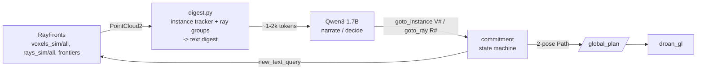

# llm_nav — LLM-at-the-decision-level planner over RayFronts

A single-agent semantic search planner where a **local LLM (Qwen3-1.7B) is the
decision maker and RayFronts is its perception**. Unlike raven_nav — which
needs hand-authored per-scene background queries and hand-tuned score/cluster
thresholds — llm_nav takes **only the target text** (e.g. `"house"`); the map
content is exposed to the LLM as text and *it* judges what things are and
where to go.

## How it works



1. **Label bank as standing queries.** On startup the node registers the
   target + a ~25-label bank (`config/llm_nav.yaml`) with RayFronts via
   `new_text_query`. RayFronts runs with `compute_prob=False` (raw cos-sims),
   so scores are **vocabulary-independent** — the root cause of raven's
   per-scene threshold fragility (softmax over the query set) is removed.
2. **Digest** (`digest.py`): voxels are argmax-labeled and clustered per
   object label (26-connected components on the 0.5 m grid); clusters are
   tracked across ticks so instance IDs (`V1, V2, …`) are stable. Rays are
   grouped by (30° azimuth sector, top-1 label) into leads (`R1, R2, …`), and
   each lead is geometrically associated to the instance its line passes near
   ("points at V3") or marked as pointing beyond the mapped area. Rendered as
   ~1-2k tokens of text with top-3 labels + scores, sizes in meters, and
   bearings from the robot.
3. **LLM** (`llm_client.py`): two prompt modes, both strict-JSON with one
   retry-on-invalid.
   - `decide` (event-driven, when uncommitted): pick `goto_instance V#` or
     `goto_ray R#` + narrate ("seeing").
   - `narrate` (every `narrate_period_s` while flying): describe the map;
     no action offered — the lock is enforced by prompt AND code.
4. **Commitment** (`llm_nav_node.py`): the pick is locked until completed
   (**instance + label** — finish what you pick). A ray commitment *refines*
   onto an instance of the committed label that appears near its line, then
   completes on arrival (`reach_m`). A no-progress watchdog aborts and
   blacklists the instance/direction. Completed instances go to the visited
   registry (never re-picked, still shown), published as discoveries.

There are **no detection thresholds** — `floor_cos`, `min_instance_voxels`
etc. are presentation filters; the LLM judges instances from size + labels +
scores + context.

## Interfaces

| Direction | Topic | Type | Notes |
|---|---|---|---|
| sub | `{rf}/voxels_sim/all` | PointCloud2 | `x,y,z,sim_0..` (RDF→FLU) |
| sub | `{rf}/rays_sim/all` | PointCloud2 | `x,y,z,theta,phi,sim_*` |
| sub | `{rf}/frontiers` | PointCloud2 | unexplored summary |
| sub | `/{robot}/odometry` | Odometry | remapped to `odometry_conversion/odometry` |
| sub | `/{robot}/raven_nav/search_area` | PolygonStamped | latched, from semantic_search_task |
| pub | `{rf}/new_text_query` | String | target + label bank |
| pub | `/{robot}/global_plan` | Path | 2 poses, frame `map` (droan_gl follows) |
| pub | `/{robot}/navigation_mode` | String | `initializing/deciding/committed_*` (never `complete`) |
| pub | `/{robot}/llm_nav/llm_narration` | String | what the LLM is seeing |
| pub | `/{robot}/llm_nav/llm_decision` | String | JSON decision |
| pub | `/{robot}/llm_nav/digest` | String | latest map digest |
| pub | `/{robot}/raven_nav/discoveries` | String | visited instances JSON (task-node compat) |

`{rf}` = `/robot_{ROS_DOMAIN_ID}/rayfronts/msg_serv`.

## Logging — everything the LLM does

JSONL at `{results_dir}/llm_nav_{robot}_events.jsonl` (results_dir =
`/root/.cache/raven_results` when spawned by the task): `llm_call` (full
prompt + raw response + latency), `llm_parsed` / `llm_parse_error`,
`digest_built` (full digest text), `commitment_set/refined/complete/timeout`,
`instance_visited`, plus `fn_call` records (name, args, duration) for every
digest/waypoint function via the `@log_call` decorator. Raw stdout is teed to
`/tmp/llm_nav_{robot}.log` by semantic_search_task.

## Running

**Via semantic_search_task (default path).** `LLM_NAV` defaults to **true**:
the task spawns rayfronts (with `compute_prob:=False`) and then llm_nav inside
`/opt/lvlm-venv` (transformers + bitsandbytes, 8-bit). raven runs only with
`LLM_NAV=false`; `LVLM_BASELINE=true` still takes precedence.
`background_queries` is not required in llm_nav mode.

```bash
# one-time model cache (shared /root/.cache mount)
docker exec airstack-lbp-robot-desktop-1 /opt/lvlm-venv/bin/python -c \
  "from huggingface_hub import snapshot_download; snapshot_download('Qwen/Qwen3-1.7B')"

# single-robot RetroNeighborhood PoC goal (search_area already robot-local):
ros2 action send_goal /robot_1/tasks/semantic_search task_msgs/action/SemanticSearchTask \
  "{query: 'house', background_queries: '', search_area: {points: [{x: -150.0, y: -110.0, z: 0.0}, {x: -150.0, y: 70.0, z: 0.0}, {x: 170.0, y: 70.0, z: 0.0}, {x: 170.0, y: -110.0, z: 0.0}]}, min_altitude_agl: 10.0, max_altitude_agl: 20.0, min_flight_speed: 0.5, max_flight_speed: 1.0, confidence_threshold: 0.95, score_threshold: -1.0, voxel_score_threshold: -1.0, voxel_min_confidence: -1.0, voxel_min_cluster_size: -1, bundle_len: -1, max_instances: 0, debug: false}" --feedback
```

Watch a run:

```bash
ros2 topic echo /robot_1/llm_nav/llm_narration     # what the LLM sees
ros2 topic echo /robot_1/llm_nav/digest --once     # what the LLM is shown
tail -f /tmp/llm_nav_robot_1.log                   # raw node output
tail -f /root/.cache/raven_results/llm_nav_robot_1_events.jsonl
```

**Standalone:** `ros2 launch llm_nav llm_nav.launch.xml` (rayfronts must
already be running with queries registered).

## Configuration

See `config/llm_nav.yaml` — model, cadences (`digest_period_s`,
`narrate_period_s`), presentation knobs (`floor_cos`, `min_instance_voxels`,
digest caps), commitment geometry (`ray_commit_dist_m`, `standoff_m`,
`reach_m`, watchdog), and the label bank. When spawned by the task, `target`,
altitudes and `results_dir` are overridden per goal.

## Known limits (PoC)

- Never publishes `navigation_mode: complete` → the task ends on cancel/
  timeout (same as the LVLM baseline).
- No raven-style results dump → `compile_results`/GT scoring is skipped in
  llm_nav mode (the JSONL trace is the record; score offline with
  `osmo/analyze_visited.py`).
- Single robot only — no gossip/coordination.
