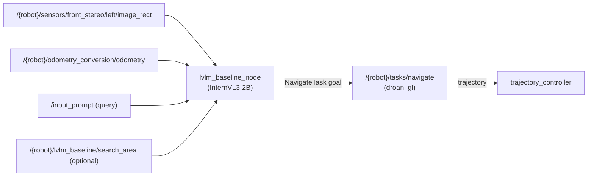

# LVLM Baseline

FPV + LVLM navigation baseline for RAVEN, integrated into the robot container.

## Overview

`lvlm_baseline` is a per-robot ROS 2 node that drives the drone using only its
first-person-view (FPV) camera and an [InternVL3-2B](https://huggingface.co/OpenGVLab/InternVL3-2B)
vision-language model. Each planning tick it:

1. samples the recent FPV frames,
2. asks the LVLM, given the target query, to pick one of
   `{move forward, turn left, turn right}`,
3. turns that action into a waypoint in the robot's local `map` frame, and
4. **sends the waypoint to the robot's real global planner (`droan_gl`) as a
   `NavigateTask` action goal** — so the actual planner flies there with
   obstacle avoidance, instead of the drone blindly following a raw path.

This is the standalone FPV+LVLM baseline (a navigation alternative to the full
RAVEN coordination and the frontier-only baseline). It runs **inside the
robot-desktop container** — no separate DDS-interop container — and is
namespaced by `ROBOT_NAME`, so it runs unchanged on `robot_1 .. robot_N`.

## Architecture



## Interfaces

| Direction | Name | Type |
|---|---|---|
| sub | `/{robot}/sensors/front_stereo/left/image_rect` | `sensor_msgs/Image` (BEST_EFFORT) |
| sub | `/{robot}/odometry_conversion/odometry` | `nav_msgs/Odometry` (BEST_EFFORT) |
| sub | `/input_prompt` | `std_msgs/String` (comma-separated target objects) |
| sub | `/{robot}/lvlm_baseline/search_area` | `geometry_msgs/PolygonStamped` (optional waypoint clamp) |
| sub | `/{robot}/interface/mavros/global_position/raw/fix` | `sensor_msgs/NavSatFix` (own boot ENU) |
| sub | `/gossip/peers` | `coordination_msgs/PeerProfile` (peers' position + waypoint) |
| pub | `/{robot}/global_plan` | `nav_msgs/Path` (waypoint, so gossip broadcasts it to peers + Foxglove) |
| action client | `/{robot}/tasks/navigate` | `task_msgs/action/NavigateTask` |

### Multi-robot awareness

The node consumes the gossip protocol (same as `raven_nav`): every robot broadcasts
its GPS position and current waypoint on `/gossip/peers`. Using its own boot-GPS
ENU anchor, the node converts each peer's pose into its local `map` frame and adds
a section to the InternVL3 prompt — its own position plus each peer's position and
waypoint — so the model can spread the team out instead of chasing the same area.
It publishes its own chosen waypoint to `/{robot}/global_plan` so the gossip node
fills `PeerProfile.waypoint` for the other robots.

## Parameters

See [`config/lvlm_baseline.yaml`](config/lvlm_baseline.yaml). Key ones:
`model_path`, `target_objects`, `min_altitude_agl`, `max_altitude_agl`,
`forward_dist_m`, `turn_angle_rad`, `goal_tolerance_m`, `camera_pitch_rad`,
`nav_goal_timeout_s`.

## How it runs in a mission

The osmo missions select this baseline with `LVLM_BASELINE=true` in the mission
`env:`. The per-robot `semantic_search_task` action server then spawns
`lvlm_baseline_node` (instead of RayFronts + `raven_nav`), forwards the
`semantic_search` goal's `query` as `target_objects`, and publishes the
`search_area` polygon — exactly mirroring how the frontier baseline is selected
with `FRONTIER_ONLY_BASELINE=true`. See
[`osmo/missions/lvlm_baseline.yaml`](../../../../../../osmo/missions/lvlm_baseline.yaml).

## Standalone run (single robot)

```bash
docker exec airstack-robot-desktop-1 bash -c \
  "sws && ros2 launch lvlm_baseline lvlm_baseline.launch.xml"
# then publish a target:
docker exec airstack-robot-desktop-1 bash -c \
  "sws && ros2 topic pub --once /input_prompt std_msgs/String 'data: house'"
```

## Notes

- InternVL3-2B (8-bit) downloads on first run and is cached in the persistent
  `/root/.cache` mount; subsequent runs load from cache.
- The model loads on a background thread, so the node is responsive while
  loading; navigation begins once the model is ready and a query is set.
- The LVLM-specific deps (`transformers==4.57.6`, `bitsandbytes`, `accelerate`)
  live in an isolated venv at `/opt/lvlm-venv` (built in `Dockerfile.robot`,
  `runtime-rayfronts` stage) so they can't perturb rayfronts' system
  `transformers`. The venv is `--system-site-packages`, so it reuses the system
  `torch`, `numpy` (1.26 — `cv_bridge` needs `<2`), `rclpy`, and `cv_bridge`.
  `semantic_search_task` launches the node with `/opt/lvlm-venv/bin/python -m
  lvlm_baseline.lvlm_baseline_node` (falling back to `ros2 run` if the venv is
  absent).
