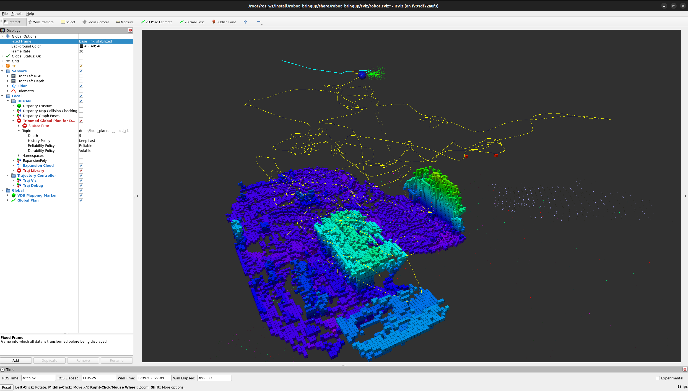

# Random Walk Global Planner Baseline

The Random Walk Planner serves as a baseline global planner for stress testing system autonomy. Unlike more informed and intelligent planners, the Random Walk Planner generates a series of random trajectories to evaluate system robustness. Using the map published by VDB, the planner will generate and publish multiple linked straight-line trajectories, checking for collisions along these paths.


The blue line is the global plan generated by the random walk. The yellow line shows the past trajectory followed by the local planner when pursuing the previous random global plans.

## Functionality

Upon activation by the behavior tree, the Random Walk Planner will:

1. Generate a specified number of straight-line path segments.
2. Continuously monitor the robot's progress along the published path.
3. Once the robot completes the current path, a new set of paths will be generated.

This loop continues, allowing the system to explore various trajectories and stress test the overall autonomy stack.

## Parameters

| Parameter | Description |
| --------- | ----------- |
| `num_paths_to_generate` | Number of straight-line paths to concatenate into a complete trajectory. |
| `max_start_to_goal_dist_m` | Maximum distance (m) from start to goal for each straight-line segment. |
| `checking_point_cnt` | Number of points along each segment to check for collisions. |
| `max_z_change_m` | Maximum allowed change in height (z-axis) between start and goal points. |
| `collision_padding_m` | Extra padding (m) around a voxel when checking for collisions. |
| `path_end_threshold_m` | Distance threshold (m) for considering the current path completed. |
| `max_yaw_change_degrees` | Maximum allowed yaw change between consecutive segments. |
| `robot_frame_id` | Frame name for the robot base, used for transform lookups. |

## Task Executor

This node is a **task executor**: it runs as a ROS 2 action server and is activated on demand via an `ExplorationTask` goal. It does not plan continuously — planning only happens while a goal is active.

**Action server:** `/{robot_name}/tasks/exploration`  
**Type:** `task_msgs/action/ExplorationTask`

### Cascade

Random walk delegates navigation to the local planner via a second action:

```
behavior_executive  →  ExplorationTask  →  random_walk_planner
                                               ↓
                                        NavigateTask (/{robot_name}/tasks/navigate)
                                               ↓
                                          droan_gl (local planner)
                                               ↓
                                       trajectory_controller
```

### Goal parameters
| Field | Type | Description |
|-------|------|-------------|
| `search_bounds` | geometry_msgs/Polygon | Bounding polygon for search (empty = unbounded) |
| `min_altitude_agl` | float32 | Minimum flight altitude above ground (m) |
| `max_altitude_agl` | float32 | Maximum flight altitude above ground (m) |
| `min_flight_speed` | float32 | Minimum flight speed (m/s) |
| `max_flight_speed` | float32 | Maximum flight speed (m/s) |
| `time_limit_sec` | float32 | Maximum task duration in seconds (0 = no limit) |

### Feedback (published ~1 Hz)
| Field | Type | Description |
|-------|------|-------------|
| `status` | string | `"planning"` or `"navigating"` |
| `progress` | float32 | Elapsed / time_limit (0 if no time limit) |
| `current_position` | geometry_msgs/Point | Current robot position |

### Result
| Field | Type | Description |
|-------|------|-------------|
| `success` | bool | True if time limit reached normally; false if cancelled or error |
| `message` | string | Human-readable completion reason |

### CLI test
```bash
# Send a 30-second unbounded exploration goal with feedback
ros2 action send_goal /robot_1/tasks/exploration task_msgs/action/ExplorationTask \
  '{min_altitude_agl: 3.0, max_altitude_agl: 8.0, min_flight_speed: 1.0, max_flight_speed: 3.0, time_limit_sec: 30.0}' \
  --feedback

# Ctrl-C cancels the goal; the node returns success=false, message="Task cancelled"
```

## Subscriptions
| Topic | Type | Description |
|-------|------|-------------|
| `vdb_map_visualization` | visualization_msgs/Marker | Occupancy map from VDB mapping |
| `odometry` | nav_msgs/Odometry | Robot state estimate |

## Publications
| Topic | Type | Description |
|-------|------|-------------|
| `~/global_plan` | nav_msgs/Path | Generated path (also sent as NavigateTask goal) |
| `~/goal_point_viz` | visualization_msgs/Marker | Goal point visualization |
| `~/traj_viz` | visualization_msgs/Marker | Trajectory visualization |


