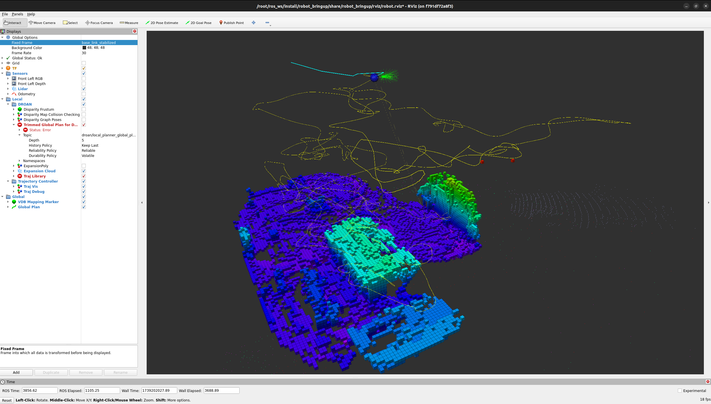

# Random Walk Global Planner Baseline

The Random Walk Planner serves as a baseline global planner for stress testing system autonomy. Unlike more informed and intelligent planners, the Random Walk Planner generates a series of random trajectories to evaluate system robustness. Using the map published by VDB, the planner will generate and publish multiple linked straight-line trajectories, checking for collisions along these paths.


The blue line is the global plan generated by the random walk. The yellow line shows the past trajectory followed by the local planner when pursuing the previous random global plans.

## Functionality

Upon activation by an `ExplorationTask` goal, the Random Walk Planner will:

1. Prepare and submit the first valid collision-checked segment promptly, within a ten-second wall-time startup budget.
2. Continuously monitor the robot's progress along the published path.
3. Once the robot completes the current path, generate up to the configured number of linked segments within the remaining active budget.

This loop continues, allowing the system to explore various trajectories and stress test the overall autonomy stack.

## Parameters

| Parameter | Description |
| --------- | ----------- |
| `num_paths_to_generate` | Maximum paths to concatenate during replanning; startup dispatches the first valid segment. |
| `max_start_to_goal_dist_m` | Maximum distance (m) from start to goal for each straight-line segment. |
| `checking_point_cnt` | Number of points along each segment to check for collisions. |
| `max_z_change_m` | Maximum allowed change in height (z-axis) between start and goal points. |
| `collision_padding_m` | Extra padding (m) around a voxel when checking for collisions. |
| `path_end_threshold_m` | Distance threshold (m) for considering the current path completed. |
| `max_yaw_change_degrees` | Maximum allowed yaw change between consecutive segments. |
| `robot_frame_id` | Frame name for the robot base, used for transform lookups. |

## Task Executor

This node is a **task executor**: it runs as a ROS 2 action server and is activated on demand via an `ExplorationTask` goal. It does not plan continuously — planning only happens while a goal is active.

**Action server:** `/{robot_name}/tasks/exploration`  
**Type:** `task_msgs/action/ExplorationTask`

### Cascade

Random walk delegates navigation to the local planner via a second action:

```
GCS operator  →  ExplorationTask  →  random_walk_planner
                                         ↓
                                  NavigateTask (/{robot_name}/tasks/navigate)
                                         ↓
                                    droan_gl (local planner)
                                         ↓
                                 trajectory_controller
```

### Goal parameters
| Field | Type | Description |
|-------|------|-------------|
| `search_bounds` | geometry_msgs/Polygon | Bounding polygon for search (empty = unbounded) |
| `min_altitude_agl` | float32 | Minimum flight altitude above ground (m) |
| `max_altitude_agl` | float32 | Maximum flight altitude above ground (m) |
| `min_flight_speed` | float32 | Minimum flight speed (m/s) |
| `max_flight_speed` | float32 | Maximum flight speed (m/s) |
| `time_limit_sec` | float32 | Active simulator-time horizon from the first accepted exploration navigation; preparation has a separate 10-second wall-time budget (0 = no active limit). |

### Feedback (published ~1 Hz)
| Field | Type | Description |
|-------|------|-------------|
| `status` | string | Preparing, navigating, or replanning within the active horizon |
| `progress` | float32 | Elapsed / time_limit (0 if no time limit) |
| `current_position` | geometry_msgs/Point | Current robot position |

### Result
| Field | Type | Description |
|-------|------|-------------|
| `success` | bool | True only after the active horizon, observed horizontal progress, and terminal nested-navigation settlement; false on cancellation, preparation expiry, clock rollback, or error |
| `message` | string | Human-readable completion reason |

Preparation includes any approach to the search polygon. The active timer starts
once at the first accepted exploration `NavigateTask`, not at goal submission or
route generation, and never resets during replanning. Feedback reports zero
progress during preparation. Path-search calls use fractional steady-clock
deadlines, with cancellation/deadline checks between segments and before dispatch;
expiry does not authorize publishing a partial unchecked path. Calls and scheduling
can slightly overrun a deadline; this is not a hard-real-time guarantee. A frozen
simulator clock needs the caller's independent wall-time timeout.

Altitude bounds use the supported map-zero-ground convention and are applied
before collision checking. Requested flight-speed bounds are not yet wired into
the local planner. Horizontal progress must reach `min(0.5m, 0.1 * time_limit_sec)`;
hovering alone is not successful exploration. Nested navigation must settle before
exploration returns and a following action may take ownership.

### CLI test
```bash
# Send a 30-second unbounded exploration goal with feedback
ros2 action send_goal /robot_1/tasks/exploration task_msgs/action/ExplorationTask \
  '{min_altitude_agl: 3.0, max_altitude_agl: 8.0, min_flight_speed: 1.0, max_flight_speed: 3.0, time_limit_sec: 30.0}' \
  --feedback

# Ctrl-C cancels the goal; the node returns success=false, message="Task canceled"
```

## Subscriptions
| Topic | Type | Description |
|-------|------|-------------|
| `vdb_map_visualization` | visualization_msgs/Marker | Occupancy map from VDB mapping |
| `odometry` | nav_msgs/Odometry | Robot state estimate |

## Publications
| Topic | Type | Description |
|-------|------|-------------|
| `~/global_plan` | nav_msgs/Path | Generated path (also sent as NavigateTask goal) |
| `~/goal_point_viz` | visualization_msgs/Marker | Goal point visualization |
| `~/traj_viz` | visualization_msgs/Marker | Trajectory visualization |


