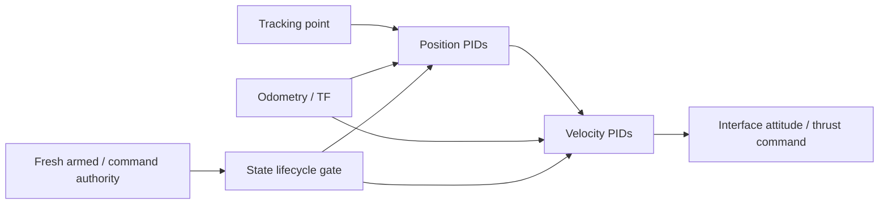

# PID controller

Cascaded position/velocity feedback tracks a trajectory tracking point against
odometry and emits roll/pitch/yaw-rate/thrust commands. Runs onboard; dependencies:
rclcpp, std_msgs, nav_msgs, airstack_msgs/common, mav_msgs, pid_controller_msgs,
TF2. Gains live in `config/pid_controller.yaml`.



## Lifecycle and saturation

Both armed and command-authority inputs must be true and fresh for closed-loop
control. Receipt freshness uses steady time; odometry/tracking source stamps must
also be recent in the ROS clock. `state_timeout_s` defaults to0.5s, finite/positive.
Activation requires newer odometry. The first valid computation has zero dt for
integration/derivative; subsequent samples integrate. Inactivity, missing/expired
data, TF failure, tracking gap and nonpositive ROS dt clear history.
Conditional anti-windup rejects increments worsening complete output saturation
(P+D+FF+constant+I), but permits unwind. The existing `reset_integrators` input
clears all six integrals and error/derivative/timing history. Observing interface
state provides PX4 lifecycle reset independently of ArduPilot-only publications.

Inactive/invalid tracking callbacks publish zero roll/pitch/yaw rate and clamped
configured `vz_constant` thrust (currently0.71), without target feedback or retained
integral. This retains command prestream; it is an **unqualified compatibility
baseline, not safe/neutral hover thrust**. If tracking callbacks stop, commands
stop; the node is not an independent vehicle failsafe. Task abort while still
armed/OFFBOARD is not itself a lifecycle reset; containment needs separate testing.

## Interfaces/configuration

Launch `pid_controller.launch.xml` within the robot namespace. Stack entries may
override these arguments; node topic parameters default to relative names for
isolated use.

| Launch argument | Type / canonical endpoint |
| --- | --- |
| `pid_controller_odometry_topic` | nav_msgs/Odometry; `/<robot>/odometry_conversion/odometry` |
| `pid_controller_tracking_point_topic` | airstack_msgs/Odometry; `/<robot>/trajectory_controller/tracking_point` |
| `pid_controller_is_armed_topic` | std_msgs/Bool; `/<robot>/interface/is_armed` |
| `pid_controller_has_control_topic` | std_msgs/Bool; `/<robot>/interface/has_control` |
| `pid_controller_command_topic` | mav_msgs/RollPitchYawrateThrust; `/<robot>/interface/cmd_roll_pitch_yawrate_thrust` |

Other parameters: `target_frame`, `max_roll_pitch`, and per-axis
`{x,y,z,vx,vy,vz}_{p,i,d,ff,d_alpha,min,max,constant}`. PIDInfo topics expose terms
under the control namespace. Existing gains/limits are unchanged by this repair.

## Admission diagnostics

Relative `admission_diagnostic` (`std_msgs/String`, best-effort depth10) publishes
JSON `schema="pid-admission/v1"` after each tracking callback's command/idle output.
This is observational, not a safety input, watchdog or guaranteed recorder delivery.
`sequence` is monotonic per process; `phase` is `pre_tf`, `tf`, `post_tf` or `active`.
`active` means this callback was admitted, not that the vehicle is safely airborne.
`reason_mask` is zero on admission; ORed bits retain simultaneous failures:

| Bit value | Reason |
|---|---|
|1 /2|DISARMED /NO_CONTROL|
|4 /8|ARMED_RECEIPT_INVALID /CONTROL_RECEIPT_INVALID|
|16 /32|ODOM_MISSING /ODOM_BEFORE_ACTIVATION|
|64 /128|ODOM_RECEIPT_EXPIRED /TRACKING_RECEIPT_EXPIRED|
|256 /512|TRACKING_FUTURE /TRACKING_STALE|
|1024 /2048|ODOM_FUTURE /ODOM_STALE|
|4096 /8192|TRACKING_TF_FAILED /ODOM_TF_FAILED|

One coherent ROS/steady snapshot per decision phase records `ros_now_ns`, both
source header stamps and steady receipt ages (armed/control/odometry/tracking).
Absent odometry header is-1; unknown/nonfinite ages are JSON null. Source age must
remain between0 and `state_timeout_s`, inclusive; future input still fails closed.
TF-failure snapshots also include any contemporaneous non-TF guard failures.
`tracking_gap_s` measures time since the preceding tracking callback; current
tracking receipt age starts at0 and is mainly useful after a blocking TF lookup.
`history_reset_mask` records only **pre-callback** reset triggers:1inactive authority,
2prior inactive,4tracking gap. It is not a counter of all resets; TF/post-TF resets
are represented by phase/reason bits. No callback means no diagnostic heartbeat.

The diagnostics and armed-aware interface authority fix are source-only candidates
in the current workflow; neither is deployed to its live robot yet. Grounded
deployment must verify these binaries explicitly before expecting live diagnostics.

## Tests/deployment

Inside the robot container:

```bash
colcon build --packages-select pid_controller --cmake-args -DBUILD_TESTING=ON
colcon test --packages-select pid_controller --ctest-args -R 'test_control_state|isolated_lifecycle|isolated_clock_order'
```

The gtest exercises production math/reset/clock/authority helpers. Synthetic ROS
tests require empty domain197 and `/rrm_pid_test` topics; no MAVROS, robot interface
or arming service is launched. Package tests do not qualify transport, prestream
thrust or flight. Build in separate colcon bases to preserve a running deployment.
The clock-order harness publishes only on emptydomain197, testing30ms future
tracking/odometry, clock catch-up/backward jump and clean reactivation. JSON reason
snapshots come from the tested callback, unlike retrospective receipt association.
Rebuild/relaunch is needed to deploy source/launch changes. Observed wiring must be
regenerated after deployment, not hand-edited.
