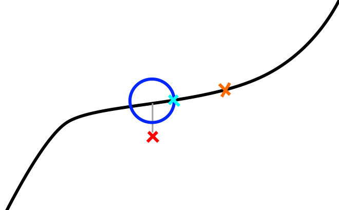
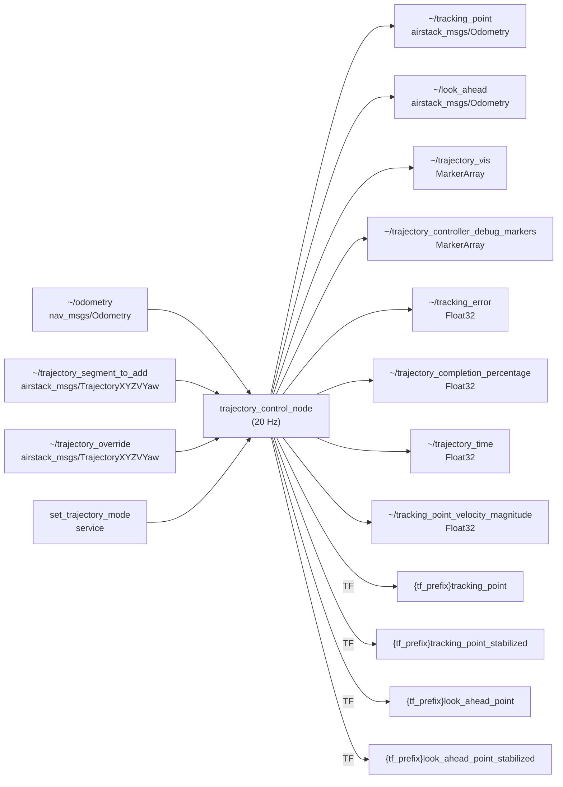

# Trajectory Controller

## Overview

The trajectory controller takes in a trajectory and publishes a **tracking point** — which a low-level controller uses as the immediate pose target — and a **look-ahead point** — which a local planner uses as its planning start position. The controller can handle two distinct trajectory use cases:

- **Fixed trajectories** (figure eights, racetracks, circles) used for controls tuning or scripted maneuvers.
- **Stitched segments** output continuously by a local planner, where new segments are appended to the live trajectory.

The trajectory controller tries to keep the tracking point ahead of the robot in a **pure pursuit** fashion. The robot's position (red X in the figure below) is projected onto the trajectory. A sphere (cyan circle in 2D) is placed around this projected point and the intersection between the sphere and the forward portion of the trajectory is used as the tracking point (blue X). The lookahead point (orange X) is a fixed time duration further along the trajectory.



## Control Architecture

**The trajectory controller is not itself a feedback controller.** It is a pure-pursuit trajectory manager: it advances a reference point along a pre-computed trajectory and publishes that point. Feedback control (closing the loop between the drone's actual state and the reference) is done by a separate downstream node.

The full chain from trajectory to actuator commands is:

```
Trajectory Controller          PID Controller              Flight Computer
─────────────────────          ──────────────              ───────────────
Pure-pursuit advance     →     Cascaded PID        →      roll/pitch/yaw-rate/
of virtual_time                (position loop +           thrust commands
                               velocity loop)             → MAVROS → hardware
~/tracking_point  ─────────►  ~/tracking_point
                               ~/odometry
```

### PID Controller (`pid_controller` node)

The `pid_controller` subscribes to `~/tracking_point` and runs a **cascaded (nested) PID**:

1. **Outer loop — position PID** (x, y, z independently):
   - Error = tracking-point position − drone position
   - Output = desired velocity (vx, vy, vz)
   - Each axis has independent P, I, D, feed-forward, and output-clamp parameters.

2. **Inner loop — velocity PID** (vx, vy, vz independently):
   - Error = desired velocity − measured velocity
   - Output mapped to attitude/thrust commands:
     - `pitch` ← vx PID output
     - `roll` ← −vy PID output
     - `thrust` ← vz PID output
     - `yaw_rate` ← taken directly from the tracking point's yaw

3. Publishes `mav_msgs/RollPitchYawrateThrust` to the flight computer.

Each PID includes an **exponential moving-average filter** on the derivative term (controlled by `_d_alpha`) and **integral windup clamping** against the configured output limits.

### Attitude Controller (`attitude_controller` node)

An alternative higher-fidelity controller is available in `attitude_controller`. It uses a PD position/velocity loop augmented with an **Extended Kalman Filter (EKF)** for disturbance estimation and compensation. The EKF estimates external forces (e.g. wind) acting on the drone; these estimates are fed forward to cancel the disturbance before the PD feedback acts on the residual error. Gains are grouped as `kp*` (proportional), `kd*` (derivative), `ki*` (integral, in both body and ground frames), and `kf*` (feed-forward scaling).

## Algorithm

### Core Concepts

The controller maintains a **virtual time** — a scalar representing how far along the trajectory the tracking point currently is. Each timer callback advances virtual time and recomputes the tracking point position.

```
virtual_time  →  tracking point pose  →  published to ~/tracking_point
              +  look_ahead_time       →  published to ~/look_ahead
```

### Timer Callback (20 Hz)

On each tick the controller:

1. **Computes tracking error** — Euclidean distance from the robot to the current virtual tracking point. Published as a diagnostic.

2. **Advances virtual time** using one of two sub-modes depending on the current trajectory velocity at the virtual point:

    1. **Sphere-intersection mode** (normal case when velocity ≥ `min_virtual_tracking_velocity`):
        - Searches the trajectory in the range `[virtual_time, prev_vtp_time + look_ahead_time]` for the closest waypoint to the robot. This is the **projected point**.
        - Casts a sphere of radius `sphere_radius` (or `velocity × velocity_sphere_radius_multiplier` when that param is positive) around the projected point.
        - Calls `get_waypoint_sphere_intersection` to walk forward up to `sphere_radius × search_ahead_factor` along the trajectory from the projected point and find where the sphere boundary intersects the trajectory. This intersection becomes the new **virtual tracking waypoint**.
        - `virtual_time` is set to the projected point's time; the tracking point is placed at the sphere intersection time.
    2. **Time-advancement mode** (slow/stopped case when velocity < `min_virtual_tracking_velocity`):
        - Virtual time is advanced by `time_multiplier × elapsed_time`. This prevents the sphere intersection from stalling when the trajectory has zero or near-zero velocity (e.g., at trajectory endpoints).

3. **Resolves the virtual tracking point** — Queries the trajectory at `virtual_time + current_virtual_ahead_time` and converts the resulting waypoint to an `airstack_msgs/Odometry` message (pose, velocity, acceleration, jerk).

4. **Resolves the look-ahead point** — Queries the trajectory at `virtual_time + look_ahead_time` (or `virtual_time - look_ahead_time` in REWIND mode).

5. **Applies mode overrides** — Zeroes velocity/acceleration/jerk fields as required by the current mode (end of trajectory, PAUSE, ROBOT_POSE, slow-speed clamp).

6. **Broadcasts TF frames** for the tracking point and look-ahead point (plus stabilized versions with pitch/roll zeroed).

7. **Publishes** tracking point, look-ahead, diagnostics, and visualization markers.

### Trajectory Stitching (ADD_SEGMENT mode)

When the local planner publishes a new segment, it is merged into the live trajectory at the closest match point to the segment's start, near `virtual_time`. Ideally the local planner starts each segment from the lookahead point. The lookahead must be far enough ahead (at least as long as the planner's planning cycle) that the tracking point has not yet passed the start of the new segment when it arrives.

```
current trajectory:  ────────●──────────────────────────────────→
                              ↑ virtual_time
new segment:                        ●═════════════════════════════→
                                    ↑ segment start ≈ lookahead point

merged result:       ────────●──────●═════════════════════════════→
```

### REWIND Mode

When entering REWIND, the controller:
1. Reverses the internal trajectory representation.
2. Remaps `virtual_time` to the reversed timeline.
3. Skips forward past any zero/low-velocity section at the current position (`rewind_skip_max_velocity`, `rewind_skip_max_distance`) to avoid getting stuck.
4. Sets `time_multiplier = -1` and gradually ramps it back up (through `transition_dt`) to produce a smooth velocity reversal.

When exiting REWIND back to ADD_SEGMENT, the trajectory is reversed again and time is remapped so the robot continues forward from its current position.

### Velocity-Scaled Sphere Radius

If `velocity_sphere_radius_multiplier > 0`, the sphere radius scales with current trajectory velocity: `radius = velocity × velocity_sphere_radius_multiplier`. This makes the controller more responsive at low speeds and gives more look-ahead at high speeds. When the parameter is ≤ 0 (default), the fixed `sphere_radius` is used.

## Architecture



## Parameters

| <div style="width:280px">Parameter</div> | Default | Description |
|---|---|---|
| `tf_prefix` | `""` | Prefix for published TF frame names (e.g. `"uav1/"` for multi-robot). |
| `target_frame` | `"world"` | Frame in which the tracking point and lookahead point are expressed. Odometry is transformed into this frame on receipt. |
| `execute_target` | `50.0` | Target control loop rate (Hz). The timer actually runs at 20 Hz; this affects `transition_dt` calculations. |
| `look_ahead_time` | `1.0` | Fixed time offset (seconds) ahead of the tracking point at which the lookahead point is placed. Should be larger than the local planner's planning cycle time. |
| `virtual_tracking_ahead_time` | `0.5` | Additional time offset added to the virtual tracking point lookup. |
| `min_virtual_tracking_velocity` | `0.1` | Velocity threshold (m/s) below which the controller switches from sphere-intersection mode to time-advancement mode. Also suppresses output velocity/acceleration when the trajectory is effectively stopped. |
| `sphere_radius` | `1.0` | Radius (m) of the sphere used to advance the tracking point in sphere-intersection mode. Larger values push the tracking point further ahead, increasing effective look-ahead distance. |
| `velocity_sphere_radius_multiplier` | `-1.0` | If positive, overrides `sphere_radius` with `velocity × this_value`, giving a velocity-proportional look-ahead. Set ≤ 0 to use fixed `sphere_radius`. |
| `search_ahead_factor` | `1.5` | The algorithm searches `sphere_radius × search_ahead_factor` metres ahead from the projected point to find the sphere intersection. Increase only if the trajectory zigzags sharply relative to `sphere_radius`. |
| `tracking_point_distance_limit` | `10.5` | (Declared but not currently used in main logic; reserved for future clamping.) |
| `velocity_look_ahead_time` | `0.9` | Time offset used when computing the velocity look-ahead. |
| `ff_min_velocity` | `0.0` | Feed-forward minimum velocity threshold. |
| `transition_velocity_scale` | `1.0` | Scales how quickly `time_multiplier` ramps from −1 → +1 during REWIND ↔ ADD_SEGMENT transitions. Higher values give faster transitions. |
| `traj_vis_thickness` | `0.03` | Thickness (m) of trajectory visualization markers in RViz. |
| `rewind_skip_max_velocity` | `0.1` | When entering REWIND, waypoints with velocity below this threshold (m/s) near the current position are skipped to avoid the controller getting stuck at a slow/stopped section. |
| `rewind_skip_max_distance` | `0.1` | Maximum arc-length (m) to skip forward when entering REWIND. |

## Services

### `~/set_trajectory_mode` — `airstack_msgs/srv/TrajectoryMode`

Switches the controller between operating modes. Returns `success: true` on all valid mode transitions.

| Mode constant | Value | Description |
|---|---|---|
| `ROBOT_POSE` | 1 | Tracking and lookahead points are set to the robot's current odometry pose (zero velocity). Used before takeoff while the robot may be moved manually. Clears the stored trajectory. |
| `TRACK` | 2 | Interprets messages on `~/trajectory_override` as a complete trajectory to follow from the beginning. Clears any previous trajectory. Suitable for takeoff, landing, and fixed maneuvers. |
| `ADD_SEGMENT` | 3 | Appends messages on `~/trajectory_segment_to_add` onto the live trajectory at the point closest to the segment start. Used during autonomous flight with a continuously replanning local planner. |
| `PAUSE` | 0 | Freezes the tracking point at its current position (virtual time stops advancing). The robot's low-level controller will hold position at the frozen tracking point. |
| `REWIND` | 4 | Reverses playback along the trajectory. The drone backtracks along its recent path, useful for recovering from stuck situations. |

**Transition notes:**
- `REWIND → ADD_SEGMENT`: Trajectory is reversed again and virtual time is remapped. The controller ramps velocity smoothly from backward to forward.
- Any mode → `ROBOT_POSE` or `TRACK`: Trajectory is cleared.
- `PAUSE` → `ADD_SEGMENT`: Resumes from the current position without clearing the trajectory.

## Subscriptions

| <div style="width:260px">Topic</div> | Type | QoS | Description |
|---|---|---|---|
| `~/odometry` | [`nav_msgs/Odometry`](https://docs.ros.org/en/rolling/p/nav_msgs/interfaces/msg/Odometry.html) | `BestEffort`, depth 1 | Robot state. Transformed into `target_frame` on receipt. Matches MAVROS publisher QoS. |
| `~/trajectory_segment_to_add` | `airstack_msgs/msg/TrajectoryXYZVYaw` | Reliable, depth 1 | Trajectory segment to stitch onto the current trajectory (ADD_SEGMENT mode). Typically the local planner output starting at the current lookahead point. |
| `~/trajectory_override` | `airstack_msgs/msg/TrajectoryXYZVYaw` | Reliable, depth 1 | Complete trajectory replacing the current one (TRACK mode). |

The `TrajectoryXYZVYaw` message contains a `WaypointXYZVYaw[]` array where each waypoint carries position (x, y, z), scalar speed `v`, and `yaw`. The trajectory library computes timing and derivatives from these waypoints.

## Publications

| <div style="width:280px">Topic</div> | Type | Description |
|---|---|---|
| `~/tracking_point` | `airstack_msgs/msg/Odometry` | The current virtual tracking point: pose, velocity, acceleration, and jerk along the trajectory. The low-level controller drives the drone toward this point. |
| `~/look_ahead` | `airstack_msgs/msg/Odometry` | The look-ahead point: pose and derivatives a fixed `look_ahead_time` seconds ahead of the tracking point. The local planner starts each new trajectory segment from this point. |
| `~/traj_drone_point` | `airstack_msgs/msg/Odometry` | The projected drone point: pose at `virtual_time` on the trajectory (before the sphere-intersection look-ahead is applied). |
| `~/projected_drone_pose` | `geometry_msgs/msg/PoseStamped` | The 3D pose of the closest trajectory waypoint to the robot, as a lightweight `PoseStamped`. |
| `~/virtual_tracking_point` | `airstack_msgs/msg/Odometry` | Alias/debug copy of the tracking point. |
| `~/closest_point` | `airstack_msgs/msg/Odometry` | The globally closest point on the entire trajectory to the robot. (Currently disabled in code; reserved for future use.) |
| `~/trajectory_completion_percentage` | `std_msgs/msg/Float32` | Percentage of the trajectory completed: `virtual_time / duration × 100`. |
| `~/trajectory_time` | `std_msgs/msg/Float32` | Current trajectory time in seconds. In REWIND mode this counts down from the trajectory duration. |
| `~/tracking_error` | `std_msgs/msg/Float32` | Euclidean distance (m) from the robot's current position to the virtual tracking point. |
| `~/tracking_point_velocity_magnitude` | `std_msgs/msg/Float32` | Speed (m/s) of the tracking point as it moves along the trajectory. |
| `~/trajectory_vis` | `visualization_msgs/msg/MarkerArray` | Trajectory path rendered as colored line-strip markers in RViz. Thickness controlled by `traj_vis_thickness`. |
| `~/trajectory_controller_debug_markers` | `visualization_msgs/msg/MarkerArray` | Debug spheres and markers: the sphere around the projected point (cyan), the intersection point (green), and the search end point (blue). |

## TF Frames

Four TF frames are broadcast on every tick, all in `target_frame`:

| Frame | Description |
|---|---|
| `{tf_prefix}tracking_point` | Full 6-DOF pose of the tracking point (includes pitch and roll from the trajectory). |
| `{tf_prefix}tracking_point_stabilized` | Tracking point with pitch and roll zeroed — suitable for camera or gimbal frames. |
| `{tf_prefix}look_ahead_point` | Full 6-DOF pose of the look-ahead point. |
| `{tf_prefix}look_ahead_point_stabilized` | Look-ahead point with pitch and roll zeroed. |
