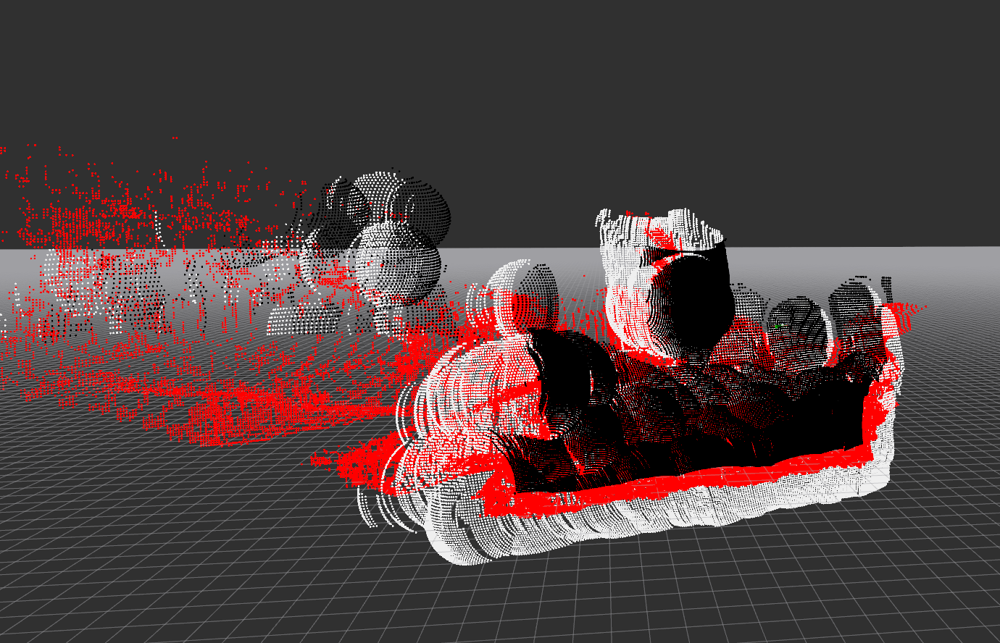
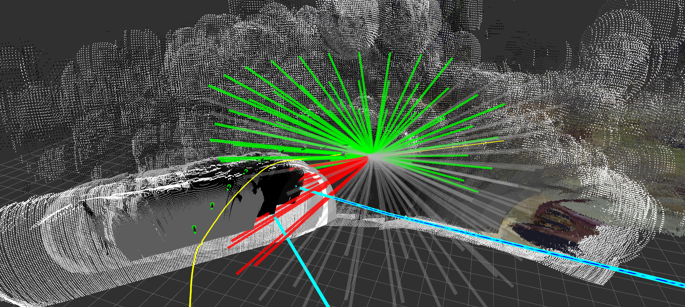

# DROAN GL Local Planner

## Overview

DROAN GL is a GPU-accelerated local planner for obstacle avoidance using stereo disparity. It implements the [DROAN](https://www.ri.cmu.edu/app/uploads/2018/01/root.pdf) (Disparity-space Representation for Obstacle Avoidance and Navigation) algorithm with a key improvement: obstacles are expanded using the true sphere shape rather than the camera-facing bounding box approximation used in the original paper, which can be done efficiently on the GPU via OpenGL shaders.



*Red = raw disparity, black = foreground expansion, white = background expansion.*



*Green = collision-free trajectories, red = in collision, gray = entering unseen space. Cyan/blue lines = global plan used for scoring. Green arrows = camera poses stored in the disparity graph.*

## How It Works

### 1. Disparity Expansion (GPU)

On each stereo disparity frame, the GL interface renders the disparity point cloud onto the GPU, then runs expansion shaders that inflate each obstacle point outward by `expansion_radius` meters as a true sphere. This produces two expanded images:

- **Foreground expansion** — obstacles pushed toward the camera (conservative near bound)
- **Background expansion** — obstacles pushed away from the camera (conservative far bound)

### 2. Disparity Graph

Expanded disparity frames are not used one at a time. Instead, the node maintains a rolling **disparity graph**: a fixed-size list of (pose, foreground expansion, background expansion) tuples representing past observations. A new entry is added to the graph whenever the drone has moved more than `graph_distance_threshold` meters or rotated more than `graph_angle_threshold` degrees since the last entry. The graph holds up to `graph_nodes` entries; the oldest entry is evicted when the list is full.

This graph is the obstacle representation used for collision checking — it gives the planner a wider spatial memory of obstacles than any single frame could provide.

### 3. Trajectory Evaluation (2.5 Hz)

A timer fires at 2.5 Hz to plan the next local trajectory. Planning is relative to the **look-ahead point** published by the trajectory controller, which is always slightly ahead of the drone's current tracking point.

The library has 120 yaw/pitch candidates plus vertical up/down candidates with
desired velocity `(0, 0, ±0.5)` m/s and the same 2 m/s speed limit. All 122 use
the same integration, collision checking, prefix reservation and scoring. Vertical
desired velocity does not imply immediately vertical motion from a moving initial
state, or permission to enter unobserved space.

Vertical coverage alone does not guarantee goal arrival: checked-space admission,
stopping references, and observed physical task completion remain separate checks.

For each candidate trajectory in the library:

1. Every waypoint along the trajectory is projected into the camera frame of each disparity graph node.
2. The GPU counts how many graph nodes see the waypoint as **seen** (obstacle-free), **unseen** (outside camera FOV), or **in collision** (inside expanded obstacle).
3. Only a contiguous checked prefix is eligible: samples must be finite, have nonnegative speed, remain inside the active altitude corridor, have more than one seen observation, and not have more collisions than seen observations. A partially checked horizon normally retains a 0.5 m setback from its first rejected sample; unchecked islands are never joined. An originally singleton **vertical** goal at the crossed upper/lower corridor plane can instead terminate at an existing checked sample when the last checked point is within 0.5 m of that goal and closer than the candidate start. Eligibility is bound once from the task's MAP physical start: XY displacement ≤0.05 m and absolute Z displacement > twice XY displacement plus 1e-6 m. A horizontal task does not gain eligibility as it approaches its goal; route replacement clears it. The crossing sample must pass every non-altitude check, and is never published. Unknown, colliding, invalid, opposite-plane or distant-goal crossings retain the setback. This is intentional goal termination, not permission to leave the altitude corridor.
4. For an originally single-waypoint task, a prefix that approaches within 0.5 m of the MAP-frame goal may end at its nearest existing checked sample. This avoids penalizing a useful forward candidate solely because its full horizon overshoots a short goal. Multi-waypoint tasks do not use this cutoff, and a replacement `global_plan` clears it. The stopping ramp is applied once, after trimming; no unchecked points or increased speeds are introduced.

The 0.5 m capture radius is a candidate-selection trigger, **not** the task completion tolerance. Completion uses observed robot odometry and the requested `goal_tolerance_m`.

### 4. Trajectory Scoring

Safe trajectories are scored against the global plan:

```text
cost = deviation_from_plan - forward_progress_along_plan
```

Lower cost is better. The selected trajectory minimizes lateral deviation from the global plan while maximizing forward progress along it. The best trajectory is published as a `TrajectoryXYZVYaw` segment to the trajectory controller.

### 5. Rewind Monitoring

Two stuck conditions trigger a rewind (reversal along the past trajectory):

| Condition | Parameter | Rewind duration |
| --------- | --------- | --------------- |
| All trajectories in collision for too long | `all_in_collision_duration_threshold` | `all_in_collision_rewind_duration` |
| Robot stationary for too long | `stationary_history_duration`, `stationary_distance_threshold` | `stationary_rewind_duration` or until `stationary_rewind_distance` is covered |

---

## Task Executor

This node is a **task executor**: it runs as a ROS 2 action server and accepts a `NavigateTask` goal. The planning timer also runs outside active tasks; active tasks supply the navigation altitude corridor and goal-specific checks.

**Action server:** `/{robot_name}/tasks/navigate`
**Type:** `task_msgs/action/NavigateTask`

### Cascade

```text
random_walk_planner  →  NavigateTask  →  droan_gl
                                             ↓
                                  trajectory_segment_to_add
                                             ↓
                                   trajectory_controller
```

### Goal parameters

| Field | Type | Description |
| ----- | ---- | ----------- |
| `global_plan` | nav_msgs/Path | Path to follow; last pose is the goal |
| `goal_tolerance_m` | float32 | Distance from goal pose to consider task complete (m) |

### Feedback (published ~1 Hz)

| Field | Type | Description |
| ----- | ---- | ----------- |
| `status` | string | `"navigating"` |
| `distance_to_goal` | float32 | 3D Euclidean distance to goal pose (m) |
| `current_position` | geometry_msgs/Point | Observed robot odometry position, not the trajectory tracking reference |

### Result

| Field | Type | Description |
| ----- | ---- | ----------- |
| `success` | bool | True if goal pose reached within tolerance; false if canceled or error |
| `message` | string | `"Goal reached"`, `"Canceled"`, or `"Node shutting down"` |

### Trajectory controller mode

On goal acceptance the node calls the `set_trajectory_mode` service with mode `ADD_SEGMENT`, enabling the trajectory controller to extend the trajectory buffer as new segments arrive. On goal completion or cancellation it restores mode `TRACK`.

Navigation initialization requires a finite MAP look-ahead anchor with simulation
source age and steady-clock receipt age both in `[0, 0.5]` seconds. An unavailable
anchor aborts with `Fresh MAP commanded start unavailable`, followed by its exact
reason (`missing`, `frame`, `source_future`, `source_stale`, `receipt_future`,
`receipt_stale`, or nonfinite data) and sampled ages/timestamps. The accepted-anchor
log confirms this check only, not complete route initialization or physical arrival.
Recorder topic freshness alone does not establish callback ordering inside the node.

### CLI test

```bash
# Navigate to a specific pose (requires a populated global plan topic)
ros2 action send_goal /robot_1/tasks/navigate task_msgs/action/NavigateTask \
  '{global_plan: {header: {frame_id: "map"}, poses: [{pose: {position: {x: 10.0, y: 0.0, z: 3.0}}}]}, goal_tolerance_m: 1.0}' \
  --feedback
```

---

## Parameters

| Parameter | Default | Description |
| --------- | ------- | ----------- |
| `target_frame` | `"map"` | Frame for collision checking and visualization |
| `look_ahead_frame` | `"look_ahead_point_stabilized"` | Frame used as trajectory planning origin |
| `rewind_info_frame` | `"base_link_stabilized"` | Frame for rewind status text marker |
| `visualize` | `true` | Publish expanded disparity pointcloud (high CPU cost when enabled) |
| `expansion_radius` | — | Sphere radius (m) for obstacle expansion |
| `seen_radius` | — | Radius (m) around drone treated as observed/safe |
| `ht` | — | Trajectory horizon (seconds) |
| `dt` | — | Trajectory time step (seconds) |
| `downsample_scale` | — | Disparity image downsample factor before GPU processing |
| `graph_nodes` | — | Max number of disparity observations stored for collision checking |
| `graph_distance_threshold` | — | Min distance (m) travelled before storing a new observation |
| `graph_angle_threshold` | — | Min yaw change (degrees) before storing a new observation |
| `all_in_collision_duration_threshold` | — | Seconds all trajectories must be in collision to trigger rewind |
| `all_in_collision_rewind_duration` | — | Duration (s) of rewind when all-in-collision condition fires |
| `stationary_history_duration` | — | Observation window (s) for stationary detection |
| `stationary_distance_threshold` | — | Max movement (m) over the window to be considered stationary |
| `stationary_rewind_distance` | — | Target rewind distance (m) for stationary rewind |
| `stationary_rewind_duration` | — | Max rewind duration (s) for stationary rewind |

---

## Subscriptions

| Topic | Type | Description |
| ----- | ---- | ----------- |
| `disparity` | stereo_msgs/DisparityImage | Stereo disparity image |
| `camera_info` | sensor_msgs/CameraInfo | Camera intrinsics for disparity unprojection |
| `look_ahead` | airstack_msgs/Odometry | Look-ahead point from trajectory controller (trajectory planning origin) |
| `tracking_point` | airstack_msgs/Odometry | Trajectory tracking reference (for stuck detection) |
| `robot_odometry` | nav_msgs/Odometry | Observed robot position for task feedback, completion, and initial altitude corridor |
| `global_plan` | nav_msgs/Path | Global path for trajectory scoring (also set via NavigateTask goal) |
| `reset_stuck` | std_msgs/Empty | Manually clear stuck detection history |
| `clear_map` | std_msgs/Empty | Clear stuck detection history (GL map clearing not yet implemented) |

## Publications

| Topic | Type | Description |
| ----- | ---- | ----------- |
| `trajectory_segment_to_add` | airstack_msgs/TrajectoryXYZVYaw | Best local trajectory segment |
| `selection_diagnostic` | std_msgs/String | Subscriber-enabled `droan-selection/v1` JSON during active tasks: frame/origin/corridor, candidate rejection and prefix/crop counts, scores, selected index, cycle time. At most 256 candidates are serialized; check `total_candidates` for truncation. Diagnostic only, not an actuation or clearance certificate. |
| `foreground_expanded` | sensor_msgs/Image | GPU-expanded foreground disparity (visualization) |
| `background_expanded` | sensor_msgs/Image | GPU-expanded background disparity (visualization) |
| `fg_bg_cloud` | sensor_msgs/PointCloud2 | Expanded obstacle pointcloud (visualization) |
| `traj_debug` | visualization_msgs/MarkerArray | Trajectory library with collision status coloring |
| `graph_vis` | visualization_msgs/MarkerArray | Disparity graph camera pose arrows |
| `local_planner_global_plan_vis` | visualization_msgs/MarkerArray | Global plan segment used for scoring |
| `stuck` | std_msgs/Bool | True when rewind is active |
| `rewind_info` | visualization_msgs/MarkerArray | Rewind status text markers |
