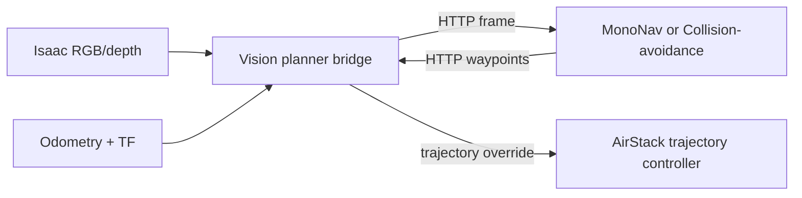

# External Vision Planner Bridge

This ROS 2 package connects AirStack to external GPU planner workers. It currently
supports the sibling MonoNav and Collision-avoidance repositories while retaining the
original `mononav_bridge` package name for branch compatibility.

The node samples the front camera, optional simulator depth, calibration, odometry, and
the `map -> camera` optical transform. A compact HTTP interface exposes the latest
synchronized sample and accepts map-frame waypoint trajectories. External dependencies
therefore remain in planner-specific containers instead of the AirStack robot image.



## Interfaces

- Inputs: `image`, `depth_image` (optional), `camera_info`, `odometry`
- Outputs: `trajectory_segment`, `trajectory_override`
  (`airstack_msgs/TrajectoryXYZVYaw`)
- Visualization: `trajectory_markers` (`visualization_msgs/MarkerArray`)
- Diagnostics: `status` (`std_msgs/String`)
- Service client: `set_trajectory_mode` (`airstack_msgs/TrajectoryMode`)
- HTTP: `GET /health`, `GET /frame`, `POST /trajectory`, `POST /pause`

Flight execution is disabled by default. When `execute_commands` is false, received
paths are visualized but not forwarded to the trajectory controller.

## Configuration

| Parameter | Default | Purpose |
|---|---:|---|
| `planner_name` | `external_planner` | Name used in health, logs, and markers |
| `server_address` | `0.0.0.0` | HTTP bind address |
| `server_port` | `8765` | HTTP port; only one bridge can own it |
| `target_frame` | `map` | Frame for camera poses and returned trajectories |
| `max_frame_rate` | `3.0` | Maximum JPEG/depth sample rate in Hz before launch overrides; this does not change the flight-controller rate |
| `jpeg_quality` | `90` | RGB transport quality |
| `execute_commands` | `false` | Permit worker trajectories to reach the controller |
| `anchor_trajectory_to_odometry` | `true` | Remove camera/body translation at the first waypoint |

`GET /frame` returns metadata followed by JPEG RGB and optional compressed float32
depth. `POST /trajectory` accepts `command_index`, `velocity`, `execute`, `replace`,
and 2–200 `[x, y, z, yaw]` waypoints. `POST /pause` requests AirStack trajectory pause.

Use the generic launch for either planner:

```bash
ros2 launch mononav_bridge vision_planner_bridge.launch.xml \
  vision_planner_name:=collision_avoidance \
  vision_planner_namespace:=collision_avoidance \
  vision_planner_max_frame_rate:=3.0 \
  vision_planner_execute_commands:=false
```

The legacy launch remains available and is equivalent to selecting MonoNav. Its
bridge-rate argument is independent from the generic launch argument, although both
currently default to `3.0` Hz:

```bash
ros2 launch mononav_bridge mononav_bridge.launch.xml \
  mononav_bridge_max_frame_rate:=3.0 \
  mononav_bridge_execute_commands:=false
```

Run only one bridge on the default TCP port (`8765`) and only one worker with execution
enabled. Detailed Docker installation and demo commands live in each planner's README.

## Build and test

```bash
docker exec airstack-robot-desktop-1 bash -lc \
  'bws --packages-select mononav_bridge && \
   python3 -m unittest discover \
   -s src/local/planners/mononav_bridge/test -v'
```
