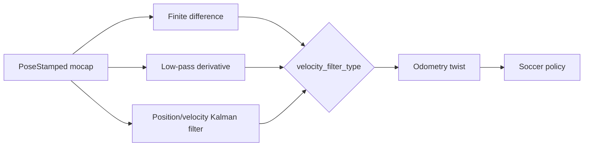

# SVG Ground Control

Central multi-drone ground controller for mocap flight with a **CBF
collision safety filter** (velocity-CBF with hybrid Dykstra projection,
ported from `~/drone_soccer` where it is MuJoCo-validated against the
Starling 2 Max airframe).

> **Commands:** see [experiment.md](experiment.md) — the maintained,
> copy-pasteable command reference for sim and hardware.

## Architecture

```
 OptiTrack Motive ──▶ natnet_ros2 ──▶ /{name}/pose   (hardware only)
                                          │
                          ┌───────────────▼────────────────────────────┐
                          │ mocap_bridge → /{name}/fmu/visual_odometry │
                          └────────────────────────────────────────────┘
                          ┌────────────────────────────────────────────┐
 /{name}/odometry_        │ swarm_commander  (20 Hz)                   │
 conversion/odometry ──▶  │  scenario nominal | per-drone teleop       │
 /svg/{name}/teleop ───▶  │  → cbf_filter.filter_velocities()  [REAL]  │
                          │  → /{name}/.../velocity_command            │
                          │  services: takeoff / start / hold / land   │
                          └────────────────────────────────────────────┘
                                   │ per-drone robot_interface
                          sim: MAVROS          real: px4_interface (uXRCE-DDS)
```

Sim and hardware differ **only in the topic templates** in the config YAML
(`config/swarm_sim.yaml` vs `config/swarm_real.yaml`).

## Ball mocap velocity filtering

`mocap_bridge` can publish a filtered world-frame velocity with each rigid
body's pose on `/{name}/mocap_odometry`. The PX4 direct external-vision path
remains pose-only; these velocities are for the soccer policy, logging, and
debugging.



The supported `velocity_filter_type` values are:

| Value | Behavior | Typical use |
|---|---|---|
| `finite_difference` | Unfiltered position difference | Noise baseline only |
| `low_pass` | First-order filter over the derivative | Simple, predictable smoothing |
| `kalman` | Six-state constant-velocity filter updated by position | Recommended for ball mocap |

Important parameters:

| Parameter | Default | Tuning effect |
|---|---:|---|
| `velocity_filter_type` | `low_pass` | Selects the bridge estimator; the SoccerBall hardware configs override this to `kalman`. |
| `velocity_low_pass_cutoff_hz` | `0.0` | Positive values enable a rate-independent cutoff; lower is smoother but slower. At `0`, `velocity_filter_alpha` is used. |
| `velocity_filter_alpha` | `0.4` | Legacy low-pass weight; lower is smoother. |
| `velocity_kalman_position_stddev_m` | `0.005` | Expected mocap noise; increasing it smooths more. |
| `velocity_kalman_acceleration_stddev_mps2` | `10.0` | Expected ball acceleration; increasing it responds faster to kicks but passes more noise. |
| `velocity_kalman_initial_velocity_stddev_mps` | `2.0` | Initial velocity uncertainty. |
| `velocity_filter_max_dt_s` | `0.5` | A longer sample gap resets the estimate to zero. |

Tune the Kalman estimator in a rolling Matplotlib window:

```bash
ros2 run svg_ground_control plot_mocap_velocity --ros-args \
  -p pose_topic:=/SoccerBall/pose \
  -p history_s:=15.0 \
  -p velocity_kalman_position_stddev_m:=0.004 \
  -p velocity_kalman_acceleration_stddev_mps2:=0.1 \
  -p velocity_kalman_initial_velocity_stddev_mps:=1.7
```

The blue curve is the Kalman estimate computed from the mocap pose samples.
Sliders tune its position measurement noise, acceleration process noise, and
initial velocity uncertainty in real time. Changing a slider restarts the plot
estimate; it does not modify the running `mocap_bridge`. Use **Reset sliders**
to restore the startup values. Close the window or press `Ctrl-C` to exit. The
The production bridge publishes the tuned estimate on
`/SoccerBall/mocap_odometry`. The `policy_commander`,
`drone_soccer_depl/inference_soccer_pos_sp`, and legacy `pos_sp_soccer`
deployment paths consume or prefer that shared ball state. Their drone state
remains sourced from PX4 odometry, including the onboard EKF's velocity
estimate.

## Scenarios (`scenario:=` launch arg)

Ported from drone_soccer plus goal-tracking and a squeeze profile:

- `hover` — hold configured positions
- `goal` — each drone seeks a per-drone goal you set live via
  `/svg/{name}/goal_command` (PoseStamped) + `/svg/{name}/speed_command`
  (Float32); backs the single- and multi-drone tracking tests
- `random_walk` — fixed-speed drift with wall bounces
- `random_goals` — random goal seeking, resampled on arrival
- `head_on` — two facing groups swap sides repeatedly
- `antipodal` — sphere-to-antipode crossings through the center
- `squeeze` — **3-drone CBF showcase** ([config/squeeze_3drone.yaml](config/squeeze_3drone.yaml)):
  two holders goal-track explicit posts; the intruder shuttles through the
  gap; the holders must yield and return. Order: `[holder, holder, intruder]`.

`teleop_drones` (comma-separated string) lists operator-driven, **CBF-exempt**
drones (the moving obstacles) — empty = fully autonomous. `external_drones`
are tracked for the filter but never commanded (e.g. RC-flown). Drive a
teleop drone with `ros2 run svg_ground_control keyboard_teleop --ros-args -p
drone:=drone_3` (one instance per teleop drone).

## Hybrid sim/real, geofence, RViz

- **Per-drone sim/real routing** (`drone_modes: "real,real,sim"`): each drone's
  commands route to MAVROS (`/{name}/interface/…`, sim) or px4_interface
  (`/{name}/fmu/…`, hardware), all under one CBF. See
  [config/hybrid_squeeze.yaml](config/hybrid_squeeze.yaml).
- **Geofence**: `fence_enabled` + `fence_min`/`fence_max`; any airborne drone
  leaving the box latches a swarm-wide freeze until `~/reset_fence`.
- **RViz**: all drones' world positions on `/svg/viz/markers`
  (`rviz2 -d $(ros2 pkg prefix svg_ground_control)/share/svg_ground_control/config/svg_drones.rviz`).

Full how-to for all of the above: **[experiment.md](experiment.md)**.

## CBF filter

`svg_ground_control/cbf_filter.py` is a verbatim port of
`drone_soccer/cbf.py`: pairwise barrier `h = ||p_i−p_j||² − (2r)²`,
constraint `ḣ + αh ≥ 0` (linear in velocities), least-squares projection via
parallel Dykstra + Gauss-Seidel polish, constraint pruning, and an emergency
push-apart fallback when the QP is infeasible. Tests:
[test/test_cbf.py](test/test_cbf.py) (kinematic suite from drone_soccer),
[test/test_scenarios.py](test/test_scenarios.py) (includes a kinematic
squeeze rollout), and [test/functional_squeeze_test.py](test/functional_squeeze_test.py)
(closed-loop ROS test against fake drones — barrier held at exactly 2r).

## PPO policy deploy (drone_soccer)

Inference-only: `policy_commander` loads an SB3 `.zip`, builds the 18-dim
observation from PX4 odometry plus ball mocap, and publishes PX4
`TrajectorySetpoint` and `OffboardControlMode` messages directly to
`/{name}/fmu/in/trajectory_setpoint` and
`/{name}/fmu/in/offboard_control_mode`. The policy's full 3D waypoint is used.
The resulting absolute waypoint is clamped to `[-3, 3] m` in ENU X/Y and to
the configured altitude bounds.
Install in the robot container:

```bash
pip install --break-system-packages -r /root/AirStack/robot/ros_ws/src/svg_ground_control/requirements-policy.txt
bws --packages-select svg_ground_control
```

The read-only `/root/drone_soccer` mount is included in the robot container's
`PYTHONPATH`, so an editable install is neither needed nor writable.

See [experiment.md](experiment.md) (topic table) and
[QUICK_REFERENCE §4](../../../../.codex/skills/yutong-fly-starling/QUICK_REFERENCE.md)
for disarmed checks and flight sequence.

## Safety notes

- Teleop drones are CBF-exempt by design — the autonomous drones do the
  dodging. The operator (you) is the safety authority for the obstacle.
- This stack bypasses `drone_safety_monitor`; PX4 failsafes and the RC kill
  switch are the safety net. Configure them before flying.
- Stale odometry (> `state_timeout_s`) → zero-velocity command; stale teleop
  input → zero. `~/hold` is the panic button.
- `CBF emergency push-apart engaged` in the log means the QP went infeasible
  (drones inside each other's safety spheres) — land and investigate.
