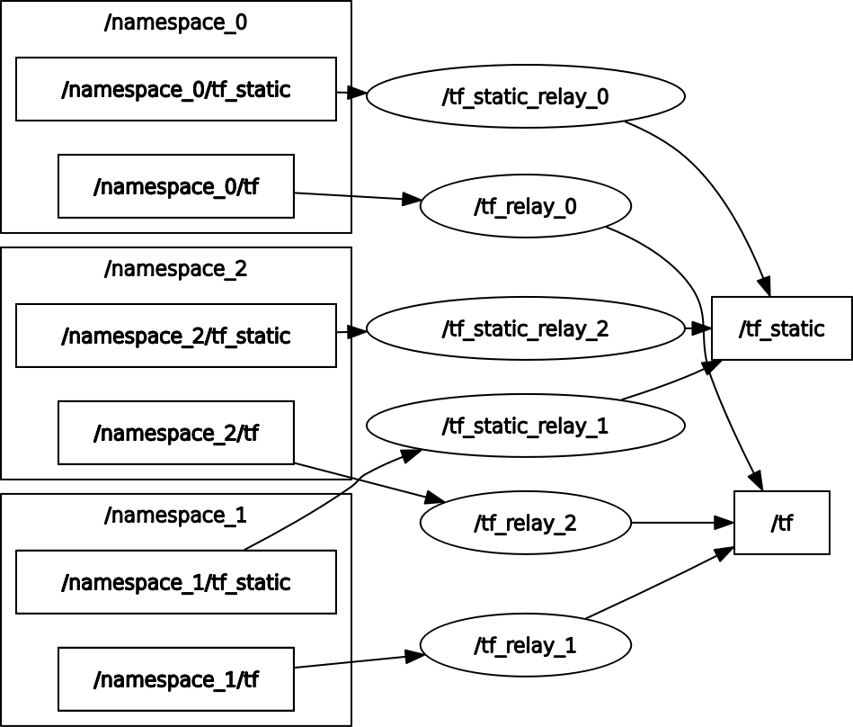

## ROS2 Node to relay `namespaced tf` to global `tf`

This node is necessary to run multiple robots in a global frame, this node subscribes to each namespaced `tf` topic, gets the transforms and appends the namespace as the `frame_prefix`, then publishes it to the global `/tf` topic. 

##### Note:``frame_prefix=namespace`` 

## Usage
By default, uses the environment variable `$ROBOT_NAME` to set the namespace.
````
ros2 launch tf_relay tf_relay.launch.xml
````

Change the namespace:
````
ros2 launch tf_relay tf_relay.launch.xml namespace:=hello
````


