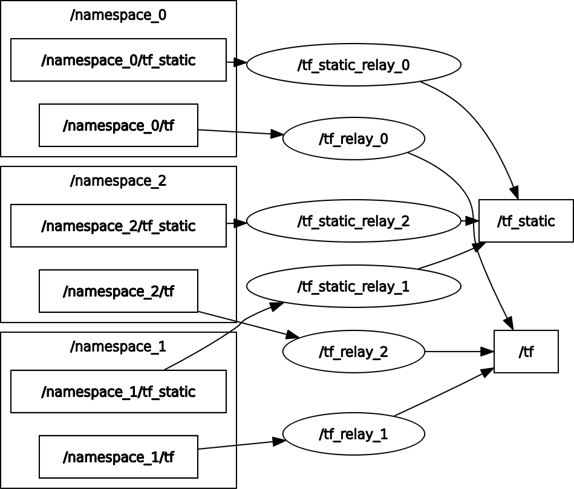

## ROS2 Node to relay `namespaced tf` to global `tf`

This node is necessary to run multiple turtlebot4's in a global frame, this node subscribes to each namespaced `tf` topic, gets the transforms and appends the namespace as the `frame_prefix`, then publishes it to the global `/tf` topic. 

##### Note:``frame_prefix=namespace`` 

## Usage
###### By default the number of robots `agents=4` and `namespace=agent`
````
ros2 run tf_relay relay
````
###### Change number of robots and namespace
For example: 
``namespace = turtlebot4``
``number of robots = 10``

````
ros2 run tf_relay relay 'turtlebot4' 10
````


