# Make an Extension To Spawn Primitives

In this document you learn how to create an Extension inside of your Application. Extensions are what make up Kit Applications. This tutorial is ideal for those who are beginners to Kit.

## Learning Objectives

- Create an Extension
- Use Kit Commands in your Application
- Make a functional Button
- Update the Extension's title and description
- Dock the Extension Window

# Prerequisites

- Cloned [Kit App Template](https://github.com/NVIDIA-Omniverse/kit-app-template/tree/main)
- Created a [Kit Base Editor](https://github.com/NVIDIA-Omniverse/kit-app-template/tree/main/templates/apps/kit_base_editor)

## Step 1: Create an Extension

Kit Applications is made up of all kinds of Extensions that were created by developers. In this section, you create an Extension and learn how the code gets reflected back in your Application.

### Step 1.1: Open the Terminal

In VSCode **open** a new terminal window, if one is not already open.


### Step 1.2: Create New Extension

In the terminal, run the `template new` command.

**Linux:**
```bash
./repo.sh template new
```

**Windows:**
```powershell
.\repo.bat template new
```

Follow the prompt instructions, Use the arrow keys to move and Enter to select/continue:
- **? Select with arrow keys what you want to create:** Extension
- **? Select with arrow keys your desired template:**: Python UI Extension
- **? Enter name of extension [name-spaced, lowercase, alphanumeric]:**: my.spawn_prims.ext
- **? Enter extension_display_name:**: Spawn Primitives
- **? Enter version:**: 0.1.0

### Step 1.3 Add the New Extension to the Application

In VSCode, **go to** `source > apps > [YOUR KIT BASE EDITOR APP].kit`, **scroll** to the `[dependencies]` section.


At the bottom of the `[dependencies]` section, add the following line:

``` json
"my.spawn_prims.ext" = {} 
```

**Save** the `.kit` file.


### Step 1.3: Run a Build

After a new extension has been added to the .kit file, the application should be rebuilt to ensure extensions are populated to the build directory.

In the terminal, **run** the `build` command.

**Linux:**
```bash
./repo.sh build
```

**Windows:**
```powershell
.\repo.bat build
```

### Step 1.4: Launch the Application

In the terminal, **run** the `launch` command.

**Linux:**
```bash
./repo.sh launch
```
**Windows:**
```powershell
.\repo.bat launch
```

**? Select with arrow keys which App would you like to launch:** [Select the desired editor application]

***NOTE:* The initial startup may take 5 to 8 minutes as shaders compile for the first time. After initial shader compilation, startup time will reduce dramatically**

Upon launching your Application, a new window appears in your Application, called "Spawn Primitives":

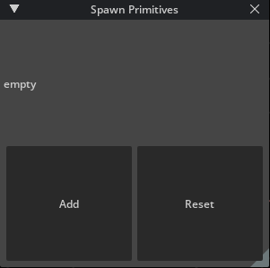

If you click **Add** in *Spawn Primitives*, the `empty` text changes to `count: 1`, indicating that the button was clicked. Pressing **Add** again increases the number for count. Pressing **Reset** will reset it back to `empty`:

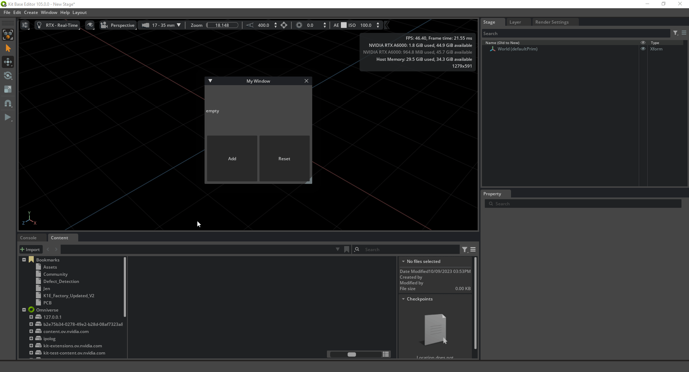

You use this button later to spawn a primitive.

**DO NOT** close out of the Application.

## Step 2: Update Your Extension's Interface

Currently, your window is called "My Window", and there are two buttons that says, "Add" and "Reset". In this step, you make some changes to better reflect the purpose of your Extension.

### Step 2.1: Navigate to `extension.py`

In Visual Studio Code, navigate to `source\extensions\my.spawn_prims.ext\my\spawn_prims\ext\extension.py` to find the following source code:

``` python
import omni.ext
import omni.ui as ui


# Functions and vars are available to other extension as usual in python: `example.python_ext.some_public_function(x)`
def some_public_function(x: int):
    print("[my.spawn_prims.ext] some_public_function was called with x: ", x)
    return x ** x


# Any class derived from `omni.ext.IExt` in top level module (defined in `python.modules` of `extension.toml`) will be
# instantiated when extension gets enabled and `on_startup(ext_id)` will be called. Later when extension gets disabled
# on_shutdown() is called.
class MySpawn_primsExtExtension(omni.ext.IExt):
    # ext_id is current extension id. It can be used with extension manager to query additional information, like where
    # this extension is located on filesystem.
    def on_startup(self, ext_id):
        print("[my.spawn_prims.ext] my spawn_prims ext startup")

        self._count = 0

        self._window = ui.Window("My Window", width=300, height=300)
        with self._window.frame:
            with ui.VStack():
                label = ui.Label("")


                def on_click():
                    self._count += 1
                    label.text = f"count: {self._count}"

                def on_reset():
                    self._count = 0
                    label.text = "empty"

                on_reset()

                with ui.HStack():
                    ui.Button("Add", clicked_fn=on_click)
                    ui.Button("Reset", clicked_fn=on_reset)

    def on_shutdown(self):
        print("[my.spawn_prims.ext] my spawn_prims ext shutdown")

```

Next, change some values to better reflect what your Extension does.

### Step 2.2: Update the Window Title

Initialize `ui.Window` with the title "Spawn Primitives", instead of "My window":

``` python
self._window = ui.Window("Spawn Primitives", width=300, height=300)
```

### Step 2.3: Remove the Label and Reset Functionality

Remove the following lines and add `pass` inside `on_click()`

``` python
def on_startup(self, ext_id):
    print("[my.spawn_prims.ext] my spawn_prims ext startup")

    self._count = 0 # DELETE THIS LINE

    self._window = ui.Window("Spawn Primitives", width=300, height=300)
    with self._window.frame:
        with ui.VStack():
            label = ui.Label("") # DELETE THIS LINE


            def on_click():
                pass # ADD THIS LINE
                self._count += 1 # DELETE THIS LINE
                label.text = f"count: {self._count}" # DELETE THIS LINE

            def on_reset(): # DELETE THIS LINE
                self._count = 0 # DELETE THIS LINE
                label.text = "empty" # DELETE THIS LINE

            on_reset() # DELETE THIS LINE

            with ui.HStack():
                ui.Button("Add", clicked_fn=on_click)
                ui.Button("Reset", clicked_fn=on_reset) # DELETE THIS LINE
```

What your code should look like after removing the lines:
``` python
def on_startup(self, ext_id):
    print("[my.spawn_prims.ext] my spawn_prims ext startup")

    self._window = ui.Window("Spawn Primitives", width=300, height=300)
    with self._window.frame:
        with ui.VStack():

            def on_click():
                pass

            with ui.HStack():
                ui.Button("Add", clicked_fn=on_click)
```


### Step 2.4: Update the Button Text

Update the `Button` text to "Spawn Cube".

``` python
ui.Button("Spawn Cube", clicked_fn=on_click)
```

### Step 2.5: Review Your Changes

After making the above changes, your code should read as follows:

``` python
import omni.ext
import omni.ui as ui


# Functions and vars are available to other extension as usual in python: `example.python_ext.some_public_function(x)`
def some_public_function(x: int):
    print("[my.spawn_prims.ext] some_public_function was called with x: ", x)
    return x ** x


# Any class derived from `omni.ext.IExt` in top level module (defined in `python.modules` of `extension.toml`) will be
# instantiated when extension gets enabled and `on_startup(ext_id)` will be called. Later when extension gets disabled
# on_shutdown() is called.
class MySpawn_primsExtExtension(omni.ext.IExt):
    # ext_id is current extension id. It can be used with extension manager to query additional information, like where
    # this extension is located on filesystem.
    def on_startup(self, ext_id):
        print("[my.spawn_prims.ext] my spawn_prims ext startup")

        self._window = ui.Window("Spawn Primitives", width=300, height=300)
        with self._window.frame:
            with ui.VStack():

                def on_click():
                    pass

                with ui.HStack():
                    ui.Button("Spawn Cube", clicked_fn=on_click)

    def on_shutdown(self):
        print("[my.spawn_prims.ext] my spawn_prims ext shutdown")

```

Save the file, and return to your Application. There, you'll see your new window with a large button saying "Spawn Cube".

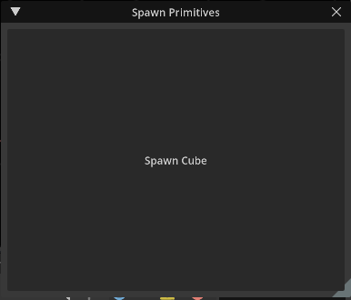

### Step 3: Dock the Extension Window

Kit Applications allows you to move Extensions and dock them in any location. To do so, click and drag your window to the desired location.

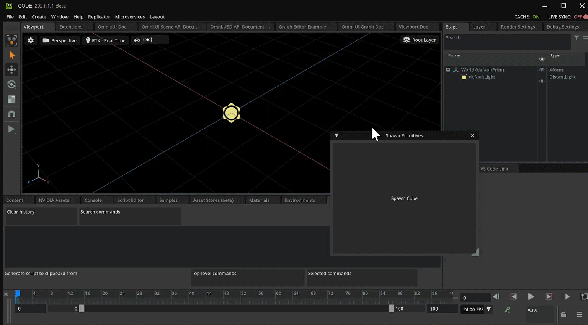

## Step 4: Prepare Your Commands Window

Commands are actions that take place inside your Application. A simple command could be creating an object or changing a color. Commands are composed of a `do` and an `undo` feature. To read more about what commands are and how to create custom commands, read our [documentation](https://docs.omniverse.nvidia.com/kit/docs/omni.kit.commands/latest/Overview.html).

Kit Applications allows users and developers to see what commands are being executed as they work in the application. You can find this information in the *Commands* window:

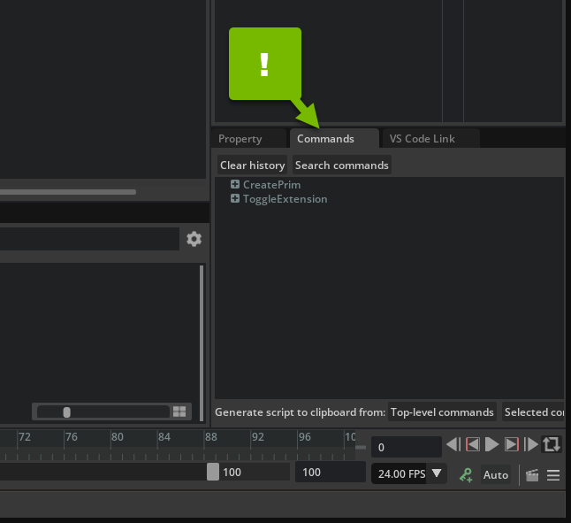

You'll use this window to quickly build out command-based functionality.


### Step 4.1: Add the Commands Window to your Application

Close your Application.

In your `.kit` file, under the [dependencies] section, **add** the following line:

``` json
"omni.kit.window.commands" = {} # Commands Extension Window 
```

**Relaunch** your Application using the `launch` command.

**Linux:**
```bash
./repo.sh launch
```
**Windows:**
```powershell
.\repo.bat launch
```

> **Note:** If you don't see the *Commands* window, go to **Window > Commands** 

### Step 4.2: Move Your Commands Window

Move the Commands window to get a better view, or dock it somewhere convenient:

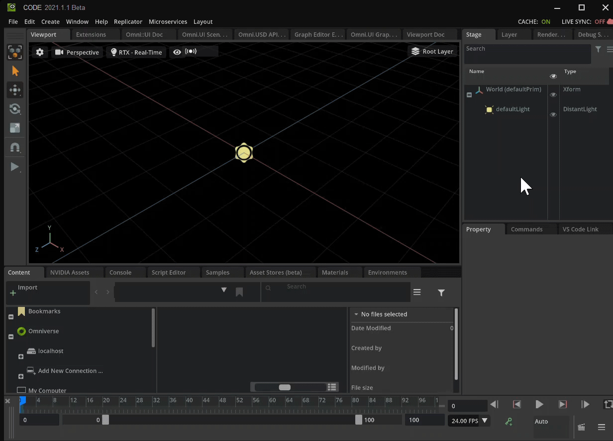

### Step 4.3: Clear Old Commands

Select the **Clear History** button in the *Commands* window. This makes it easier to see what action takes place when you try to create a cube:


### Step 5: Getting the Command Code

Now that you have the necessary tools, you learn how you can grab one of these commands and use it in the extension. Specifically, you use it create a cube. There are different ways you can create the cube, but for this example, you use **Create** menu in the top bar.

### Step 5.1: Create a Cube

Click **Create > Mesh > Cube** from the top bar:


If the *Create Menu* is not avaliable, go to *Stage Window* and **Right Click > Create > Mesh > Cube**

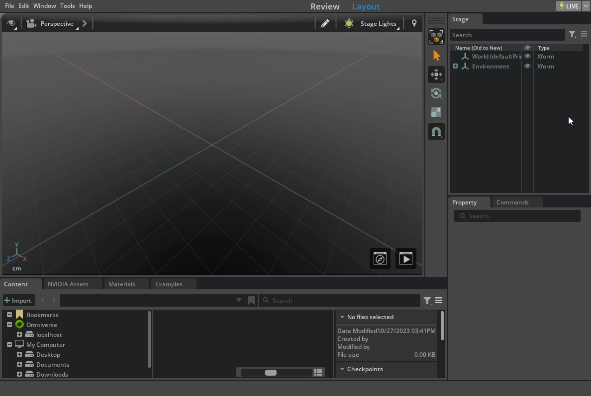

In the *Viewport*, you'll see your new cube. In the *Commands Window*, you'll see a new command.

> **Note:** If you cannot see the Cube try adding a light to the stage. **Create > Light > Distant Light**

### Step 5.2: Copy the Create Mesh Command

Select the new line **CreateMeshPrimWithDefaultXform** in the Command Window, then click **Selected Commands** to copy the command to the clipboard:

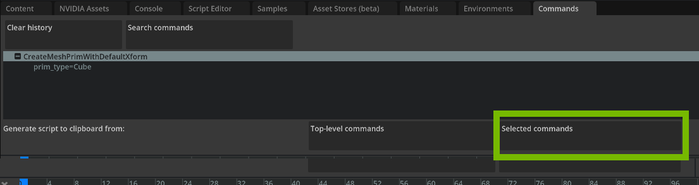

### Step 5.3: Use the Command in Your Extension

Paste the copied command into `on_click()`. The whole file looks like this:

``` python
import omni.ext
import omni.ui as ui

# Functions and vars are available to other extension as usual in python: `example.python_ext.some_public_function(x)`
def some_public_function(x: int):
    print("[my.spawn_prims.ext] some_public_function was called with x: ", x)
    return x ** x

# Any class derived from `omni.ext.IExt` in top level module (defined in `python.modules` of `extension.toml`) will be
# instantiated when extension gets enabled and `on_startup(ext_id)` will be called. Later when extension gets disabled
# on_shutdown() is called.
class MySpawn_primsExtExtension(omni.ext.IExt):
    # ext_id is current extension id. It can be used with extension manager to query additional information, like where
    # this extension is located on filesystem.
    def on_startup(self, ext_id):
        print("[my.spawn_prims.ext] my spawn_prims ext startup")

        self._window = ui.Window("Spawn Primitives", width=300, height=300)
        with self._window.frame:
            with ui.VStack():

                def on_click():
                    import omni.kit.commands

                    omni.kit.commands.execute('CreateMeshPrimWithDefaultXform',
                        prim_type='Cube',
                        above_ground=True)
                    

                with ui.HStack():
                    ui.Button("Spawn Cube", clicked_fn=on_click)

    def on_shutdown(self):
        print("[my.spawn_prims.ext] my spawn_prims ext shutdown")

```

You added a new import and a command that creates a cube.

### Step 5.4: Group Your Imports

Move the import statement to the top of the module with the other imports:

```python
import omni.ext
import omni.ui as ui
import omni.kit.commands
```

### Step 5.5: Relocate Create Command

Place `omni.kit.commands.execute()` inside the `on_click()` definition and remove `pass`.

``` python
def on_click():
    omni.kit.commands.execute('CreateMeshPrimWithDefaultXform',
        prim_type='Cube',
        above_ground=True)
```

### Step 5.6: Review and Save

Ensure your code matches ours:

``` python
import omni.ext
import omni.ui as ui
import omni.kit.commands


# Functions and vars are available to other extension as usual in python: `example.python_ext.some_public_function(x)`
def some_public_function(x: int):
    print("[my.spawn_prims.ext] some_public_function was called with x: ", x)
    return x ** x


# Any class derived from `omni.ext.IExt` in top level module (defined in `python.modules` of `extension.toml`) will be
# instantiated when extension gets enabled and `on_startup(ext_id)` will be called. Later when extension gets disabled
# on_shutdown() is called.
class MySpawn_primsExtExtension(omni.ext.IExt):
    # ext_id is current extension id. It can be used with extension manager to query additional information, like where
    # this extension is located on filesystem.
    def on_startup(self, ext_id):
        print("[my.spawn_prims.ext] my spawn_prims ext startup")

        self._window = ui.Window("Spawn Primitives", width=300, height=300)
        with self._window.frame:
            with ui.VStack():

                def on_click():
                    omni.kit.commands.execute('CreateMeshPrimWithDefaultXform',
                        prim_type='Cube',
                        above_ground=True)

                with ui.HStack():
                    ui.Button("Spawn Cube", clicked_fn=on_click)

    def on_shutdown(self):
        print("[my.spawn_prims.ext] my spawn_prims ext shutdown")
```

Save your code, and switch back to your Application.

### Step 6: Test Your Work

In your Application, test your extension by clicking **Spawn Cube**. You should see that a new Cube prim is created with each button press.


Excellent, you now know how to spawn a cube using a function. What's more, you didn't have to reference anything as your Application was kind enough to deliver everything you needed.

Continuing on and via same methods, construct a second button that spawns a cone in the same interface.

## Step 7: Spawn a Cone

In this step, you create a new button that spawns a cone.
### Step 7.1: Add a Button

Create a new button below the spawn cube button to spawn a cone:

```python
def on_startup(self, ext_id):
    print("[omni.example.spawn_prims] MyExtension startup")

    self._window = ui.Window("Spawn Primitives", width=300, height=300)
    with self._window.frame:
        with ui.VStack():

            def on_click():
                omni.kit.commands.execute('CreateMeshPrimWithDefaultXform',
                    prim_type='Cube',
                    above_ground=True)

            ui.Button("Spawn Cube", clicked_fn=on_click)
            ui.Button("Spawn Cone", clicked_fn=on_click)
```

### Step 7.2: Save and Review

Save the file, switch back to your Application, and test your new button:


Notice that both buttons use the same function and, therefore, both spawn a `Cube`, despite their labels.

### Step 7.3: Create a Cone from the Menu

Using the same *Create* menu in your Application, create a Cone (**Create > Mesh > Cone**).

### Step 7.4: Copy the Commands to your Extension

Copy the command in the *Commands* tab with the **Selected Commands** button.

### Step 7.5: Implement Your New Button

Paste the command into `extensions.py` like you did before:

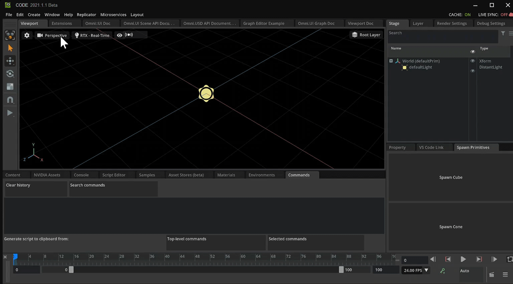


``` python
def on_click():
    #Create a Cube
    omni.kit.commands.execute('CreateMeshPrimWithDefaultXform',
        prim_type='Cube',
        above_ground=True)

    #Create a Cone
    omni.kit.commands.execute('CreateMeshPrimWithDefaultXform',
        prim_type='Cone',
        above_ground=True)
```

Notice the command is the same, and only the `prim_type` is different:

- To spawn a cube, you pass `'Cube'`
- To spawn a cone, you pass `'Cone'`

### Step 7.6: Accept a Prim Type in `on_click()`

Add a `prim_type` argument to `on_click()`:

``` python
def on_click(prim_type):
```

With this value, you can delete the second `omni.kit.commands.execute()` call. Next, you'll use `prim_type` to determine what shape to create.

### Step 7.7: Use the Prim Type in `on_click()`

Replace `prim_type='Cube'` with `prim_type=prim_type`:

``` python
omni.kit.commands.execute('CreateMeshPrimWithDefaultXform',
    prim_type=prim_type,
    above_ground=True)
```

`on_click()` should now look like this:

``` python
def on_click(prim_type):
    omni.kit.commands.execute('CreateMeshPrimWithDefaultXform',
        prim_type=prim_type,
        above_ground=True)
```

### Step 7.8: Pass the Prim Type to `on_click()`

Update the `clicked_fn` for both UI Buttons to pass the `prim_type`:

``` python
ui.Button("Spawn Cube", clicked_fn=on_click("Cube"))
ui.Button("Spawn Cone", clicked_fn=on_click("Cone"))
```

### Step 7.9: Save and Test

Save the file, and test the updates to your *Spawn Primitives* Extension:

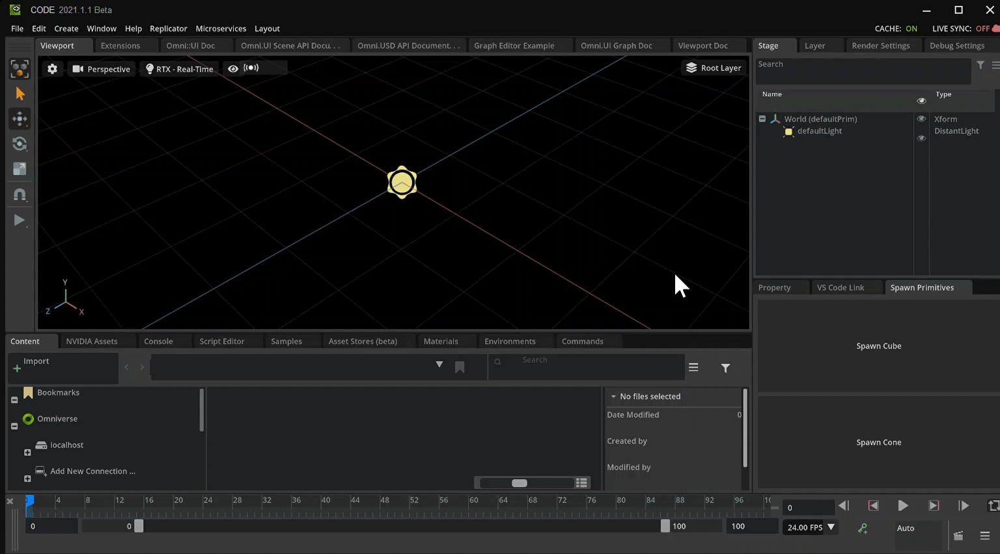

## Step 8: Conclusion

Great job! You've successfully created a second button that spawns a second mesh, all within the same Extension. This, of course, can be expanded upon.

> **Optional Challenge:** Add a button for every mesh type on your own.
>
> 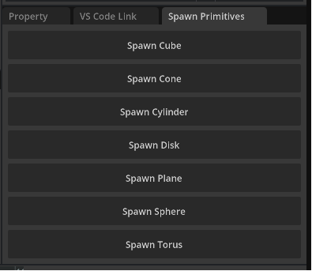
>
> Below you can find a completed "cheat sheet" if you need help or just want to copy it for your own use.
>
> <details>
>     <summary><b>Click to show the final code</b></summary>
>
> ```
> import omni.ext
> import omni.ui as ui
> import omni.kit.commands
>
> # Functions and vars are available to other extension as usual in python: `example.python_ext some_public_function(x)`
> def some_public_function(x: int):
>    print("[my.spawn_prims.ext] some_public_function was called with x: ", x)
>    return x ** x
>
> # Any class derived from `omni.ext.IExt` in top level module (defined in `python.modules` of `extension.toml`) will be
> # instantiated when extension gets enabled and `on_startup(ext_id)` will be called. Later when extension gets disabled
> # on_shutdown() is called.
> class MyExtension(omni.ext.IExt):
>     # ext_id is current extension id. It can be used with extension manager to query additional information, like where
>     # this extension is located on filesystem.
>     def on_startup(self, ext_id):
>         print("[omni.example.spawn_prims] MyExtension startup")
>
>         self._window = ui.Window("Spawn Primitives", width=300, height=300)
>         with self._window.frame:
>             with ui.VStack():
>
>                 def on_click(prim_type):
>                     omni.kit.commands.execute('CreateMeshPrimWithDefaultXform',
>                         prim_type=prim_type,
>                         above_ground=True)
>
>                 ui.Button("Spawn Cube", clicked_fn=on_click("Cube"))
>                 ui.Button("Spawn Cone", clicked_fn=on_click("Cone"))
>                 ui.Button("Spawn Cylinder", clicked_fn=on_click("Cylinder"))
>                 ui.Button("Spawn Disk", clicked_fn=on_click("Disk"))
>                 ui.Button("Spawn Plane", clicked_fn=on_click("Plane"))
>                 ui.Button("Spawn Sphere", clicked_fn=on_click("Sphere"))
>                 ui.Button("Spawn Torus", clicked_fn=on_click("Torus"))
>
>     def on_shutdown(self):
>         print("[omni.example.spawn_prims] MyExtension shutdown")
> ```
>
> </details>