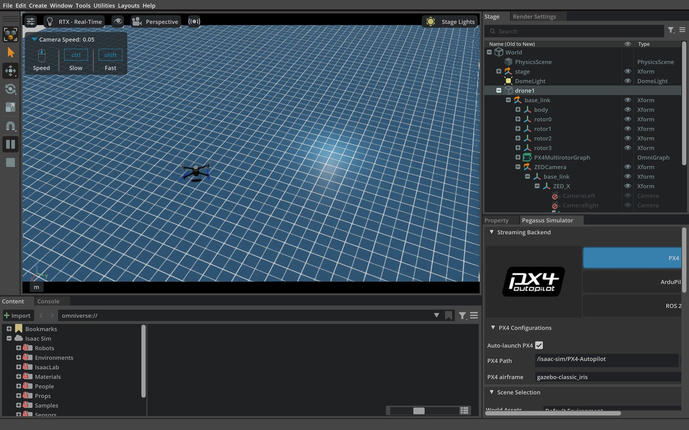
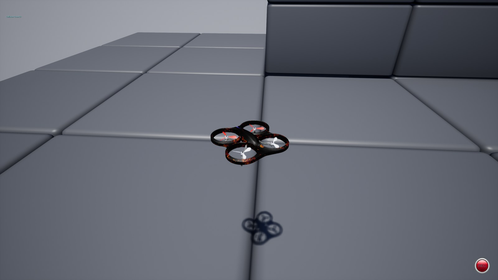
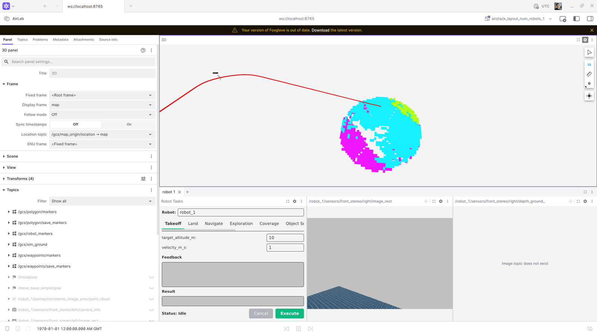

# Testing (`tests/`)

AirStack's **pytest** tree under `tests/` has these roles:

1. **`tests/system/`** — Docker stack tests (sim + robot + GCS): liveliness, sensor Hz, takeoff/hover/land, image/workspace builds.
2. **Unit tests** — Fast hermetic tests (`unit` mark) whose **source is co-located** with each ROS 2 package at `<package>/test/`. [`colcon_unit_test_packages.yaml`](colcon_unit_test_packages.yaml) lists which packages have unit tests, and `pytest tests/` collects them from there.
3. **`tests/integration/`** — Cross-component tests (`integration` mark) that wire the robot container to a host-side component, without a sim or GPU.
4. **`tests/meta/`** — Contract tests (`unit` mark) that pin the modular-AirStack CLI/docs/stack contracts (see [`tests/meta/README.md`](meta/README.md)).

Pytest hooks and the shared fixtures live in `tests/conftest.py`; reusable helpers are split by concern into the [`tests/harness/`](harness/) package (re-exported through `conftest`). Use `airstack test -m unit -v` for hermetic tests only, or the marks below for the full stack.

<iframe width="1120" height="630" src="https://www.youtube.com/embed/EzgGHnYDI_k?si=vpqER-TXud5XEMUX" title="YouTube video player" frameborder="0" allow="accelerometer; autoplay; clipboard-write; encrypted-media; gyroscope; picture-in-picture; web-share" referrerpolicy="strict-origin-when-cross-origin" allowfullscreen></iframe>

---

## Test Suite Structure

### System tests (`tests/system/`)

| Module | Mark | What it tests | Hardware required |
|--------|------|---------------|-------------------|
| [`system/test_build_docker.py`](system/test_build_docker.py) | `build_docker` | Docker image builds (robot-desktop, gcs, isaac-sim, ms-airsim); records image sizes | Docker daemon |
| [`system/test_build_packages.py`](system/test_build_packages.py) | `build_packages` | `colcon build` inside each container (robot, GCS, ms-airsim ROS workspace) | Docker daemon |
| [`system/test_wiring_snapshot.py`](system/test_wiring_snapshot.py) | `wiring` | Observed wiring snapshot of the running ROS graph (via [`wiring_snapshot.py`](wiring_snapshot.py)), drift-checked against the stack's committed `stacks/<name>/wiring.md`; writes the observed snapshot to `<run_dir>/wiring/` | Docker daemon, GPU, sim license |
| [`system/test_liveliness.py`](system/test_liveliness.py) | `liveliness` | Stack bring-up: container Running state, ``/clock`` readiness, tmux panes, sentinel ROS 2 nodes, compute snapshot, infra-only ``test_stable`` (tmux + nodes + compute) | Docker daemon, GPU, sim license |
| [`system/test_sensors.py`](system/test_sensors.py) | `sensors` | After liveliness in collection order: sim + robot stereo/depth Hz (**Isaac:** batched ``ros2 topic hz`` to avoid bridge overload; **ms-airsim:** single batch), filtered LiDAR via ``echo --once`` + cloud sanity (isaacsim), sim RTF, ``test_sensor_streams_stable`` | Docker daemon, GPU, sim license |
| [`system/test_takeoff_hover_land.py`](system/test_takeoff_hover_land.py) | `takeoff_hover_land` | End-to-end flight: PX4 readiness gate, takeoff to 10 m, hover stability, land — one chain per (sim, num_robots, iteration, velocity) | Docker daemon, GPU, sim license |
| [`system/test_fixed_trajectory.py`](system/test_fixed_trajectory.py) | `autonomy` | Fixed-pattern trajectory evaluation: takeoff, execute a trajectory (Circle, Figure8, Racetrack, Line), record path deviation metrics, land — one chain per (sim, num_robots, iteration, trajectory_type) | Docker daemon, GPU, sim license |
| [`system/test_waypoint_flight.py`](system/test_waypoint_flight.py) | `waypoint_flight` | Ordered-waypoint navigation: takeoff, send a waypoint route to `NavigateTask`, judge the odometry track with the standalone [`waypoint_checker.py`](waypoint_checker.py), land — one chain per (sim, num_robots, iteration) | Docker daemon, GPU, sim license |

### Unit tests (co-located)

Hermetic tests use `@pytest.mark.unit` (see [`pytest.ini`](pytest.ini)).

Test source lives alongside its ROS 2 package at
`robot/ros_ws/src/<layer>/<package>/test/test_*.py` (the ROS 2 / colcon convention).
[`colcon_unit_test_packages.yaml`](colcon_unit_test_packages.yaml) lists which packages
have unit tests; `conftest.py` resolves each to its `test/` dir and collects the
non-linter `test_*.py` files under `--import-mode=importlib`, tagging each `unit`. To add
a package's unit tests, list it in that YAML. Both `airstack test -m unit` and
`colcon test --packages-select <pkg>` run the same source (colcon also runs the ament
linters + C++ gtests).

Example: `robot/ros_ws/src/sensors/lidar_point_cloud_filter/test/test_validation_core.py`
tests the numpy-only range validation rules in
`robot/ros_ws/src/sensors/lidar_point_cloud_filter/lidar_point_cloud_filter/validation_core.py`
(also used by `scripts/validate_lidar_filter_clouds.py` inside the robot container).

See [Unit Testing Guide](../docs/development/intermediate/testing/unit_testing.md)
and the `add-unit-tests` agent skill for full details.

### Meta / contract tests (`tests/meta/`)

Fast contract tests (`unit` mark, no Docker) that pin the RFC #379/#380 CLI,
docs, and stack contracts so refactors cannot silently break them — see
[`tests/meta/README.md`](meta/README.md). One line each:

| File | Pins |
|------|------|
| [`meta/test_bridge_contract.py`](meta/test_bridge_contract.py) | Split-stack `bridge.yaml` → generated DDS-router config (`tools/gen_dds_router.py`), incl. the no-control-setpoint bridge hard gate |
| [`meta/test_collection_contract.py`](meta/test_collection_contract.py) | Pytest collection rules: co-located unit-test injection, path narrowing, rejection of repo-root collection |
| [`meta/test_docker_layer_plan_contract.py`](meta/test_docker_layer_plan_contract.py) | Module Docker layer composition plan (`modules.lock` → layered image build) |
| [`meta/test_docs_catalog_contract.py`](meta/test_docs_catalog_contract.py) | Generated `docs/modules/` catalog: determinism, drift `--check`, nav entries exist, deploy workflows fetch module docs |
| [`meta/test_doctor_contract.py`](meta/test_doctor_contract.py) | `airstack doctor` checks: observe-and-report semantics and the two hard gates |
| [`meta/test_fleet_contract.py`](meta/test_fleet_contract.py) | Fleet file schema/validation, per-robot compose generation, fleet resolver |
| [`meta/test_launch_intent_contract.py`](meta/test_launch_intent_contract.py) | `airstack up` intent flags → derived env-var sets (profiles, URDF, sim script) |
| [`meta/test_launch_single_locus.py`](meta/test_launch_single_locus.py) | Repo-wide launch lint: wiring lives in exactly one locus (stack entry files), allowlist in [`meta/launch_lint_allowlist.txt`](meta/launch_lint_allowlist.txt) |
| [`meta/test_metrics_reporting_contract.py`](meta/test_metrics_reporting_contract.py) | `parse_metrics.py` campaign comparability and regression semantics |
| [`meta/test_module_manifest_contract.py`](meta/test_module_manifest_contract.py) | `module.yaml` manifest schema + validator behavior |
| [`meta/test_module_overlay_contract.py`](meta/test_module_overlay_contract.py) | Module workspace overlay (sync/clone/overlay/remove artifacts) |
| [`meta/test_stack_layout_contract.py`](meta/test_stack_layout_contract.py) | Stack folder anatomy: entry launch files, `modules.repos`, no dispatcher inside entries |
| [`meta/test_wiring_snapshot_contract.py`](meta/test_wiring_snapshot_contract.py) | The wiring-snapshot tool itself: snapshot format, normalization, drift detection |

### Integration tests (`tests/integration/`)

Cross-component tests (`integration` mark) that wire a few real components together — the
robot autonomy container plus a host-side component — **without** a sim or GPU. The
shared `robot_autonomy_stack` fixture (in `conftest.py`) reuses a running `robot-desktop`
container or brings one up automatically (like `build_packages`), then tears it down.
Collection order runs integration after `build_packages` and before the sim tiers.

Marks can be combined with pytest logic:
`-m unit`, `-m "build_docker or build_packages"`, `-m integration`, `-m liveliness`, `-m sensors`, `-m takeoff_hover_land`, `-m autonomy`, `-m waypoint_flight`, or e.g. `-m "liveliness or sensors"` (see **Bring-up scope** below).

### Bring-up scope (`airstack_env`)

`airstack_env` is **class-scoped** and parametrized per `(sim, num_robots, iteration)`. Each test **class** that uses it (`TestLiveliness`, `TestSensors`, `TestTakeoffHoverLand`, `TestFixedTrajectory`, …) performs its **own** ``airstack up`` / ``airstack down`` for that parametrization. Selecting both classes (for example, ``-m "liveliness or sensors"``) runs **two** full stack cycles per tuple (liveliness class, then sensors class). Collection order (see ``conftest.py``) runs **liveliness before sensors** when both are selected. To save wall time, run ``-m liveliness`` or ``-m sensors`` alone when one suite is enough.

---

## Test Infrastructure

[`conftest.py`](conftest.py) holds the pytest hooks and the `airstack_env` / `robot_autonomy_stack` fixtures. The reusable helpers are split by concern into the [`tests/harness/`](harness/) package and re-exported through `conftest`, so `from conftest import <name>` (and `from harness import <name>`) both work:

| Module | Contents |
|--------|----------|
| [`harness/session.py`](harness/session.py) | Session-scoped state (results dir, current item, last cmd output) + shared `logger` |
| [`harness/discovery.py`](harness/discovery.py) | Unit-test discovery driven by `colcon_unit_test_packages.yaml` (`AIRSTACK_ROOT`, `repo_path`, `unit_test_files`, …) |
| [`harness/commands.py`](harness/commands.py) | Subprocess / `docker exec` / `ros2` helpers with per-test output capture (`airstack_cmd`, `docker_exec`, `ros2_exec`, `read_log_tail`) |
| [`harness/containers.py`](harness/containers.py) | Container discovery, compute-usage sampling, image checks (`find_container`, `wait_for_container`, `sample_compute_usage`, `missing_images`) |
| [`harness/metrics.py`](harness/metrics.py) | `MetricsRecorder`, `get_metrics`, `current_test_id` (writes `metrics.json`) |
| [`harness/run_meta.py`](harness/run_meta.py) | `run_meta.json` outcome metadata: pytest exit status, campaign fingerprint, completed-vs-infrastructure outcomes |
| [`harness/test_ids.py`](harness/test_ids.py) | Test-id parsing/formatting shared by metrics recording and reporting |
| [`harness/sim.py`](harness/sim.py) | `SIM_CONFIG` sim targets + ros2 topic sampling (`sample_hz`, `parallel_sample_hz`, `wait_for_first_message`) |
| [`harness/collection.py`](harness/collection.py) | Cross-module test ordering + parametrize-id rewrite (`modify_items`) |

### `airstack_env` fixture

Parametrized over `(sim, num_robots, iteration)` tuples derived from CLI flags. For each combination it:

1. Calls `airstack up` with the appropriate `COMPOSE_PROFILES`, `NUM_ROBOTS`, and headless flags
2. Records `airstack_up_duration_s` to `metrics.json`
3. Yields an `env` dict used by liveliness and sensor tests
4. Tears down with `airstack down` and records `airstack_down_duration_s`

### Isaac Sim and the `sensors` mark

**LiDAR in pytest:** [`conftest.py`](conftest.py) sets
`ENABLE_LIDAR=true` in `SIM_CONFIG["isaacsim"]["extra_env"]` so the multi-drone
Pegasus script (`example_multi_px4_pegasus_launch_script.py`) attaches RTX LiDAR
the same way the single-drone script always does. Without that flag the multi
script would not spawn LiDAR OmniGraphs.

**Topic checks** live in [`sensor_probes.py`](sensor_probes.py)
and are driven by [`system/test_sensors.py`](system/test_sensors.py):

| Path | What we measure | How |
|------|-----------------|-----|
| Sim → `/clock`, stereo images, stereo depth | Publish rate | ``ros2 topic hz`` on the sim container: ``/clock`` alone, then **chunks of two** ``image_rect`` topics, then **chunks of two** depth topics (``ISAACSIM_HZ_CHUNK_SIZE`` in ``sensor_probes.py``). |
| Robot → same topic names (bridge) | Publish rate | Same **two-at-a-time** chunking on the robot container for Isaac. ms-airsim: one batch of four topics. |
| Robot → filtered ``.../ouster/point_cloud`` | Stream alive | ``ros2 topic echo --once`` per robot (not Hz — large ``PointCloud2``). |
| LiDAR geometry | Near-range vs ``near_range_m`` | ``robot/ros_ws/src/sensors/lidar_point_cloud_filter/scripts/validate_lidar_filter_clouds.py`` (raw vs filtered). |

Sim **RTF** (real-time factor from ``/clock``) is also in the `sensors` suite.
**`test_sensor_streams_stable`** repeats sim + robot stereo + LiDAR probes every
`--stable-interval` for `--stable-duration` and records time-series to
`metrics.json` (stereo/depth as ``*.hz_samples``; LiDAR echo-once as ``*.received_samples``).

### `MetricsRecorder`

Writes custom metrics to `tests/results/<timestamp>/metrics.json` after each `record()` call. Keys follow the pattern `test_node_id → metric_key → {value, unit, direction}`. Time-series data (Hz samples, compute snapshots) are stored as `{key}_samples` lists and expanded into scalar aggregates (mean, min, max, start_mean, end_mean) by `parse_metrics.py`.

### Output files

Every test run produces a timestamped directory containing `summary.txt`,
`results.xml`, `run_meta.json`, and `metrics.json` (plus a `wiring/` subdirectory
when the `wiring` mark runs) — there is **no** `logs/` subdirectory and no
per-test log files are written under the run directory.

```
tests/results/
└── 2025-04-21_14-30-00/
    ├── summary.txt        # Human-readable key metrics — open this first
    ├── results.xml        # JUnit XML — test durations and pass/fail status
    ├── run_meta.json      # Completion/outcome and campaign fingerprint
    ├── metrics.json       # Custom metrics (image sizes, Hz, compute, timing)
    └── wiring/            # (wiring mark only) observed_<stack>.md graph snapshots
```

Live test output goes to the terminal (pytest `log_cli`). On failure, assertion
messages include the tail of the last subprocess output (the in-memory
`read_log_tail` of the relevant `docker` / `ros2` subprocess) — no per-test log
files are written under the run directory.

---

## Running Tests

### `airstack test` (primary interface)

`airstack test` is the standard way to run tests. It builds the containerized
test runner from `tests/docker/`, mounts the repo read-only, and forwards all
arguments directly to pytest. No local Python environment needed.

```bash
# From the repo root (AirStack must be set up: airstack setup):

# Unit tests only — no GPU, no full Docker stack (numpy-only + pure Python)
airstack test -m unit -v

# Build tests only — fast, no GPU needed
airstack test -m "build_docker or build_packages" -v

# Liveliness run — ms-airsim, 1 robot, 1 iteration, 60 s stability window
airstack test -m liveliness \
  --sim msairsim \
  --num-robots 1 \
  --stress-iterations 1 \
  --stable-duration 60 \
  -v

# Takeoff/hover/land run — three velocities
airstack test -m takeoff_hover_land \
  --sim msairsim \
  --num-robots 1 \
  --stress-iterations 1 \
  --takeoff-velocities 0.5,1,2 \
  -v

# Sensor topic rates + LiDAR
airstack test -m sensors \
  --sim isaacsim \
  --num-robots 1 \
  --stress-iterations 1 \
  --stable-duration 60 \
  -v

# Show GUI windows (for local visual inspection)
airstack test -m liveliness --gui -v
```

`airstack test` calls `xhost +` automatically so GUI-mode sim containers
can reach the host X server; it is a no-op when `DISPLAY` is not set.

### Prerequisites

- Docker daemon running with your user in the `docker` group
- NVIDIA drivers + `nvidia-container-toolkit` for liveliness, sensors, takeoff_hover_land, and autonomy tests
- `airstack setup` completed (adds `airstack` to `PATH`)

### Direct pytest (for development / debugging)

Run pytest directly when you need faster iteration (no container rebuild) or
want to attach a debugger. Requires a local Python environment.

```bash
export AIRSTACK_ROOT=$(pwd)
pip install -r tests/requirements.txt

# Build tests only
pytest tests/ -m "build_docker or build_packages" -v

# Liveliness run
pytest tests/ -m liveliness \
  --sim msairsim \
  --num-robots 1 \
  --stress-iterations 1 \
  --stable-duration 60 \
  -v

# Sensor streams (after liveliness in default collection order)
pytest tests/ -m sensors \
  --sim isaacsim \
  --num-robots 1 \
  --stress-iterations 1 \
  -v
```

### CLI option reference

| Option | Default | Description |
|--------|---------|-------------|
| `--sim` | `isaacsim` | Comma-separated sim targets (`msairsim` opt-in) |
| `--num-robots` | `1,3` | Comma-separated robot counts |
| `--stack` | _(none)_ | Stack folder under `stacks/` to launch (sets `AIRSTACK_STACK_DIR`); default dispatch is `stacks/full_default`. The `wiring` mark drift-checks against `stacks/<name>/wiring.md` |
| `--fleet` | _(none)_ | Fleet preset under `config/fleets/` (sets `FLEET_CONFIG_FILE`); derives `NUM_ROBOTS` from the fleet's robot count, overriding `--num-robots` |
| `--stress-iterations` | `1` | Up/down cycles per (sim, num_robots) config |
| `--stable-duration` | `120` | Seconds ``test_stable`` / ``test_sensor_streams_stable`` poll for |
| `--stable-interval` | `10` | Seconds between polls in those stability tests |
| `--gui` | off | Show simulator GUI (disables headless mode) |
| `--takeoff-velocities` | `0.5` | Takeoff/land speeds in m/s (e.g. `0.5,1,2` to sweep) |

---

## Autonomy Tests (`system/test_takeoff_hover_land.py`)

`TestTakeoffHoverLand` runs a **4-phase flight chain** for every combination of
`(sim, num_robots, iteration, velocity)`. The drone returns to the ground after
each velocity so the next velocity starts from a clean state.

### Phase order

| Phase | Test | What happens |
| ----- | ---- | ------------ |
| 1 | `test_px4_ready` | Waits for MAVROS + PX4 EKF ready; once per env |
| 2 | `test_takeoff` | Sends TakeoffTask; asserts altitude within 10 % |
| 3 | `test_hover` | Captures odom for 10 s; asserts altitude drift < 0.5 m |
| 4 | `test_landing` | Sends LandTask; asserts final altitude < 0.5 m |

If any phase other than `test_hover` fails, the remaining phases for that env
are skipped (the chain guard prevents a stuck-in-air drone from blocking later
velocity sweeps). A hover failure does **not** skip landing, so the drone always
returns to the ground.

### Recorded metrics

| Metric key | Unit | Description |
| ---------- | ---- | ----------- |
| `ready_duration_sys_s` | s | Wall-clock time from test start until PX4 ready |
| `takeoff_duration_sim_s` | s | Sim-time from first motion to 95 % of target |
| `land_duration_sim_s` | s | Sim time from 80 % peak descent to < 0.5 m |
| `velocity_rmse_m_sim_s` | m/s | RMSE of dz/dt vs commanded velocity during climb/descent |
| `altitude_error_m` | m | Signed steady-state error at takeoff success (+ = high) |
| `overshoot_m` | m | Unsigned transient overshoot above target |
| `hover_altitude_mean_error_m` | m | Mean altitude drift during hover |
| `hover_position_stddev_m` | m | 3-D position jitter (sqrt of summed axis variances) |
| `final_altitude_m` | m | Altitude at landing action completion |
| `odometry_error_mean_m` | m | Mean 3-D position error vs ground-truth odom |
| `odometry_error_max_m` | m | Peak 3-D error vs ground-truth odom |
| `odometry_altitude_bias_m` | m | Signed z-axis bias vs ground-truth odom |

Metrics are recorded per robot as `robot_N.<key>` and written to
`tests/results/<timestamp>/metrics.json`.

### Running takeoff_hover_land tests

```bash
# Sweep velocities 0.5, 1, 2 m/s; 1 robot; ms-airsim
airstack test -m takeoff_hover_land \
  --sim msairsim \
  --num-robots 1 \
  --stress-iterations 1 \
  --takeoff-velocities 0.5,1,2 \
  -v

# Single velocity, Isaac Sim, 3 robots
airstack test -m takeoff_hover_land \
  --sim isaacsim \
  --num-robots 3 \
  --stress-iterations 1 \
  --takeoff-velocities 1 \
  -v
```

---

## Fixed Trajectory Tests (`system/test_fixed_trajectory.py`)

!!! note "Detailed guide"
    For the full end-to-end testing guide — architecture, the fixed-trajectory benchmark, metrics, CLI reference, comparing trackers, and baselines — see **[End-to-End Testing](../docs/development/intermediate/testing/end_to_end_testing.md)**.

`TestFixedTrajectory` runs a **4-phase flight chain** for every combination of
`(sim, num_robots, iteration, trajectory_type)`. For each trajectory type the drone
takes off, executes the pattern, then lands — regardless of whether the trajectory
phase passes or fails (a trajectory failure does not skip landing).

Supported trajectory types: `Circle`, `Figure8`, `Racetrack`, `Line` (same patterns as
the `fixed_trajectory_task` ROS 2 action server in `trajectory_controller`).

### Phase order

| Phase | Test | What happens |
| ----- | ---- | ------------ |
| 1 | `test_px4_ready` | Waits for MAVROS + PX4 EKF ready; once per env |
| 2 | `test_takeoff` | Takeoff to 10 m at 1 m/s; asserts altitude within 10 % |
| 3 | `test_fixed_trajectory` | Sends `FixedTrajectoryTask`; captures odom; asserts cross-track error |
| 4 | `test_landing` | Sends `LandTask`; asserts final altitude < 0.5 m |

A failure in `test_fixed_trajectory` does **not** poison the chain — `test_landing` always
runs so the drone returns to the ground before the next trajectory type starts.

### Recorded metrics

| Metric key | Unit | Description |
| ---------- | ---- | ----------- |
| `ready_duration_sys_s` | s | Wall-clock time from test start until PX4 ready |
| `takeoff_duration_sim_s` | s | Sim-time from first motion to 95 % of target altitude |
| `altitude_error_m` | m | Signed steady-state altitude error after takeoff |
| `overshoot_m` | m | Unsigned transient overshoot above target |
| `trajectory_success` | — | 1.0 if action returned `success: true`, 0.0 otherwise (`higher_is_better`) |
| `trajectory_execution_time_sim_s` | s | Sim-time elapsed from action dispatch to completion |
| `cross_track_error_mean_m` | m | Mean 2-D lateral distance from nearest ideal-path point |
| `cross_track_error_max_m` | m | Worst-case lateral deviation |
| `path_rmse_m` | m | 2-D RMSE against the ideal path |
| `final_altitude_m` | m | Altitude at landing action completion |
| `land_duration_sim_s` | s | Sim-time from 80 % peak descent to < 0.5 m |


Metrics reported in one .txt file called summary.txt which automatically populates once your run completes 

### Default trajectory parameters

| Type | Parameters |
| ---- | ---------- |
| Circle | radius=10 m, velocity=2 m/s |
| Figure8 | length=15 m, width=8 m, height=0 m, velocity=2 m/s, max_acceleration=1 m/s² |
| Racetrack | length=30 m, width=10 m, height=0 m, velocity=3 m/s, turn_velocity=1.5 m/s, max_acceleration=1 m/s² |
| Line | length=20 m, height=0 m, velocity=2 m/s, max_acceleration=1 m/s² |

### Running fixed trajectory tests

```bash
# All four trajectory types; ms-airsim; 1 robot
airstack test -m autonomy \
  --sim msairsim \
  --num-robots 1 \
  --stress-iterations 1 \
  --trajectory-types Circle,Figure8,Racetrack,Line \
  -v

# Circle only (quick check of the known failure case)
airstack test -m autonomy \
  --sim msairsim \
  --num-robots 1 \
  --stress-iterations 1 \
  --trajectory-types Circle \
  -v
```

### CLI option reference (trajectory-specific)

| Option | Default | Description |
|--------|---------|-------------|
| `--trajectory-types` | `Circle,Figure8,Racetrack,Line` | Comma-separated trajectory types to sweep |

---

## Waypoint Flight Tests (`system/test_waypoint_flight.py`)

`TestWaypointFlight` runs a **4-phase flight chain** per `(sim, num_robots,
iteration)`: after takeoff it sends an ordered waypoint route to the local
planner's `NavigateTask` action (`/robot_N/tasks/navigate`) as a **dense**
`nav_msgs/Path` (interpolated at 1 m from the current pose through the
waypoints, mirroring real global-planner output), captures odometry
throughout, then lands.

| Isaac Sim | ms-airsim (Blocks) |
| --------- | ------------------ |
|  |  |


*Foxglove (GCS dashboard) during the route: planned path and expanded
obstacle voxels in the 3D panel, Robot Tasks panel, live stereo feed.*

Pass/fail is judged by the standalone
[`waypoint_checker.py`](waypoint_checker.py): the odometry track must pass
within `--waypoint-tolerance` of **every waypoint in order**, each within
`--waypoint-timeout` seconds (odometry clock) of the previous arrival, and
additionally end within `--goal-tolerance` of the final waypoint. The
criterion is defined purely on the odometry track — not the action result —
so swapping the global or local planner leaves the judgment unchanged. This
makes the test the standard acceptance check after integrating or swapping a
planner module.

Waypoints are specified **relative to the robot pose at dispatch** (x forward
along the initial heading, z up from dispatch altitude), so routes are
spawn-point and simulator agnostic. The default route is an open 30 m square
flown 10 m above takeoff altitude (~20 m AGL) so it clears scene clutter in
both default scenes (Isaac open plane, AirSim Blocks) — this test judges
route-following, not obstacle avoidance.

**Tolerance calibration** (validated against stock Isaac Sim flight): the
stack's navigation contract is *reach the goal precisely, follow the route
corridor loosely*. Stock `droan_gl` scores candidate trajectories with
`cost = deviation - path_distance`, which cuts corners (~4–7 m observed), so
the intermediate tolerance is loose (15 m) while the final goal is tight
(2.5 m = NavigateTask's 1.5 m goal tolerance + tracking lag). `NavigateTask`
succeeds on the **tracking point**, which leads the drone by up to the
look-ahead distance, so the test keeps capturing after the action returns
until the drone is stationary (max 30 s). Two route-design rules follow:
routes must **end away from the start** (the action succeeds instantly on a
closed loop), and legs should be **≥ 2× the intermediate tolerance** so the
corridor check can discriminate route-following from goal-beelining.

### Phase order

| Phase | Test | What happens |
| ----- | ---- | ------------ |
| 1 | `test_px4_ready` | Waits for MAVROS connected + odometry publishing; per env |
| 2 | `test_takeoff` | Takeoff to 10 m at 1 m/s; asserts altitude within 10 % |
| 3 | `test_waypoint_route` | Sends `NavigateTask`; captures odom; asserts checker verdict |
| 4 | `test_landing` | Sends `LandTask`; asserts final altitude < 0.5 m |

A `test_waypoint_route` failure does **not** poison the chain — `test_landing`
always runs so the drone returns to the ground.

### Recorded metrics

| Metric key | Unit | Description |
| ---------- | ---- | ----------- |
| `ready_duration_sys_s` | s | Wall-clock time from test start until PX4 ready |
| `waypoint_success` | — | 1.0 if the checker passed the whole route |
| `waypoints_reached` | — | Waypoints reached in order (`higher_is_better`) |
| `navigate_action_success` | — | 1.0 if the action returned `success: true` |
| `route_time_sim_s` | s | Odometry-clock time over the captured route |
| `worst_closest_approach_m` | m | Largest closest-approach distance over all waypoints |
| `final_goal_error_m` | m | Closest approach to the final waypoint (asserted ≤ `--goal-tolerance`) |

### The standalone checker

[`waypoint_checker.py`](waypoint_checker.py) is stdlib-only and judges any
odometry CSV against a route, independent of the AirStack harness — useful
for judging waypoint flight on other ROS 2 systems or in agent-evaluation
settings:

```bash
ros2 topic echo --csv /robot_1/interface/mavros/local_position/odom > odom.csv
python3 tests/waypoint_checker.py --odom-csv odom.csv \
  --waypoints "10,0,10; 10,10,10; 0,10,10" --tolerance 1.5 --budget 120
```

It prints a JSON verdict (per-waypoint reached/closest-approach/elapsed) and
exits 0 on pass, 1 on fail. Note the CLI takes waypoints in the **odometry
frame** (the pytest wrapper does the relative-to-world transform).

### Running waypoint flight tests

```bash
# Default 10 m square route; ms-airsim; 1 robot
airstack test -m waypoint_flight \
  --sim msairsim \
  --num-robots 1 \
  --stress-iterations 1 \
  -v

# Custom route with an altitude change, Isaac Sim
airstack test -m waypoint_flight \
  --sim isaacsim \
  --num-robots 1 \
  --waypoints "30,0,0; 30,30,5; 0,30,5" \
  --goal-tolerance 2.0 \
  -v
```

### CLI option reference (waypoint-specific)

| Option | Default | Description |
| ------ | ------- | ----------- |
| `--waypoints` | `30,0,10; 30,30,10; 0,30,10` | Ordered route `x,y,z; ...` relative to dispatch pose; must end away from start |
| `--waypoint-tolerance` | `15` | Pass distance (m) to each intermediate waypoint (corridor check) |
| `--goal-tolerance` | `2.5` | Pass distance (m) to the final waypoint |
| `--waypoint-timeout` | `120` | Per-waypoint time budget (s, odometry clock) |

---

## Metrics Reporting (`parse_metrics.py`)

[`parse_metrics.py`](parse_metrics.py) reads `results.xml` and `metrics.json` from a run directory and produces a markdown report. It has two modes:

### Single-run report

```bash
python tests/parse_metrics.py \
  --current tests/results/2025-04-21_14-30-00/
```

Prints a markdown table of all recorded metrics. Always exits 0.

### Diff / regression check

```bash
python tests/parse_metrics.py \
  --current  tests/results/2025-04-21_14-30-00/ \
  --baseline tests/results/2025-04-20_09-00-00/ \
  --threshold 20          # optional: regression if change% exceeds this (default 20)
  --output   report.md    # optional: also write to file
```

Prints a side-by-side comparison. Exits **1** if any metric regresses beyond the threshold; exits 0 otherwise.

For a completed test campaign, the report has three sections per test module:

- **Metrics** — flat table of scalar metrics (test name, metric key, value/baseline, change%)
- **Sim publishing rates** — pivot table of topic Hz aggregates from the `sensors` mark (`mean`, `start_mean`, `end_mean`, `min`, `max`; sim + robot topics)
- **Compute usage** — pivot table of CPU/memory/GPU metrics per container

Regressions are flagged with :red_circle:, improvements with :green_circle:.
Collection errors, command/internal errors, zero-test runs, and jobs that stop before
pytest finalizes are labeled **not comparable**. Their pass-rate and regression tables
are suppressed so an infrastructure failure cannot appear as 0% policy performance.
`run_meta.json` records the pytest exit status and simulation tests selected/completed.

---

## CI/CD Integration

!!! note "Full pipeline guide"
    For the end-to-end picture — architecture diagrams, job lifecycle, trigger
    reference, what each mark catches, and how to fold CI into your development
    loop — see **[CI/CD Pipeline on OSMO](../docs/development/intermediate/testing/ci_cd.md)**.

### CI workflows

[`.github/workflows/unit-tests.yml`](../.github/workflows/unit-tests.yml)
runs all Python unit and harness-contract tests on `ubuntu-latest` whenever a PR is
opened, updated, or reopened against `main` or `develop`.

[`.github/workflows/system-tests.yml`](../.github/workflows/system-tests.yml) runs on:

- **Same-repository pull requests** when opened, updated, or reopened — automatically
  runs `build_packages` on OSMO (no GPU-intensive simulation campaign on every push)
- **`/pytest` PR comments** from maintainers — runs the requested registered marks
- **Manual dispatch** (`workflow_dispatch`) — fully configurable for liveliness runs and metric comparisons

#### Manual dispatch inputs

| Input | Default | Description |
|-------|---------|-------------|
| `marks` | `liveliness or takeoff_hover_land` | pytest marks expression |
| `sim` | `isaacsim` | Sim targets |
| `num_robots` | `1` | Robot counts |
| `stress_iterations` | `1` | Iterations per config |
| `stable_duration` | `120` | Stability polling seconds |
| `baseline_run_id` | _(blank)_ | Run ID for comparison; blank = latest `main` run |

#### Jobs

**`run-tests`** runs on a freshly-spawned ephemeral OSMO pod (`[self-hosted, airstack-ephemeral]`). The pod is submitted per-job by the orchestrator described below and destroyed once the job completes. It installs dependencies, runs pytest, and uploads `tests/results/` as an artifact named `test-results-<sha>-<run_id>` with 90-day retention.

**`report`** runs on `ubuntu-latest` after `run-tests` (even if it failed). It:

1. Downloads the current artifact
2. Downloads a baseline artifact (from the base branch for PRs, from `main` for manual runs, or from the specified `baseline_run_id`)
3. Runs `parse_metrics.py` in diff mode only when both artifacts have the same complete simulation campaign fingerprint; otherwise reports the current run without comparison
4. Posts the markdown report as a PR comment (PR runs) or to the job summary (all runs)
5. Fails with `::error::` only for a comparable metric regression; invalid/incomplete campaigns are reported as infrastructure outcomes

#### Required third-party action

The workflow uses [`dawidd6/action-download-artifact@v6`](https://github.com/dawidd6/action-download-artifact) to download artifacts from other workflow runs by branch name. This is a community action and must be trusted in your repository's Actions settings if you use a restricted allowed-actions policy.

---

## CI/CD Orchestrator (OSMO-backed ephemeral runners)

AirStack's tests require a GPU, Docker, and a clean filesystem per run, so they execute on **truly ephemeral [NVIDIA OSMO](https://nvidia.github.io/OSMO/) pods** submitted per-job by an orchestrator. Each test job gets a fresh GPU pod that is destroyed once the job completes — no Docker layer carryover, no leaked containers, no shared host state. (This replaced an OpenStack-Nova backend; the GitHub side and the per-job-destroy model are unchanged.)

### Architecture

```
┌──────────────────────────────────────────────────────────────┐
│  Orchestrator VM  (airstack-ci-cd-orchestrator)              │
│   • polls GitHub for queued workflow_jobs                    │
│   • mints single-use JIT runner tokens                       │
│   • submits / reaps ephemeral OSMO workflows via osmo CLI    │
│   • holds the GitHub PAT and OSMO service-account token      │
└────────────┬───────────────────────────────────┬─────────────┘
             │                                   │
             ▼                                   ▼
┌──────────────────────────────┐   ┌────────────────────────────────┐
│ Ephemeral worker (per job)   │   │ GitHub Actions queue           │
│ Prebaked airstack-ci-runner  │   │  workflow_job  status=queued   │
│ image: Docker + nvidia CTK + │   │  labels: [self-hosted,         │
│ GH runner. Privileged pod    │   │           airstack-ephemeral]  │
│ starts dockerd, runs ONE     │   └────────────────────────────────┘
│ job (JIT), then the pod      │
│ is destroyed.                │
└──────────────────────────────┘
```

### Why this instead of a long-lived self-hosted runner

| Concern | Mitigation |
|---------|------------|
| Cross-job state pollution (Docker cache, dangling networks, leftover artifacts) | Each job runs on a fresh OSMO pod, destroyed within ~30 s of job completion. |
| Fork PRs executing arbitrary code | Workflow's `if: github.event.pull_request.head.repo.full_name == github.repository` — fork PRs skipped. |
| Runner runs privileged (root) for docker-in-docker | The pod is privileged (needed to run `airstack up`/compose), but it is single-use, scoped to the dedicated CI pool, and only same-repo code ever reaches it. |
| Docker socket gives root-equivalent access | Bounded to a single one-shot pod. The orchestrator host doesn't expose Docker at all. |
| Long-lived PAT on the runner host | The PAT lives only on the orchestrator. Workers receive a single-use **JIT runner config** — a base64 token bound to one runner registration. |
| Persistent creds tied to a personal account | Orchestrator authenticates with a shared, non-personal **OSMO service-account token** (revocable, scoped to the CI pool), not an individual's login. |

### Setup

The orchestrator service code, OSMO runner-workflow template, runner image, systemd unit, and full setup runbook live in [`.github/orchestrator/`](../.github/orchestrator/). See [`.github/orchestrator/README.md`](ci-cd-orchestrator.md) for:

- obtaining the OSMO service-account token and a dedicated CI GPU pool (with privileged mode enabled)
- building and pushing the runner image (`runner.Dockerfile`)
- staging the GitHub PAT and the OSMO token
- running `setup.sh` on the orchestrator host (installs the `osmo` CLI)
- filling in osmo_url / pool / platform / runner_image / resources in `/etc/airstack-orchestrator/config.yaml`
- enabling and verifying the `airstack-orchestrator.service` systemd unit

### Runner labels

The workflow file requests `runs-on: [self-hosted, airstack-ephemeral]`. The orchestrator polls for queued jobs whose labels are a superset of `runner_labels` in its config, mints a JIT config registering the ephemeral runner under those same labels, and spawns the worker. To route jobs to a different pool (e.g. CPU-only workers) in the future, add a second label set in config and adjust the workflow's `runs-on`.
