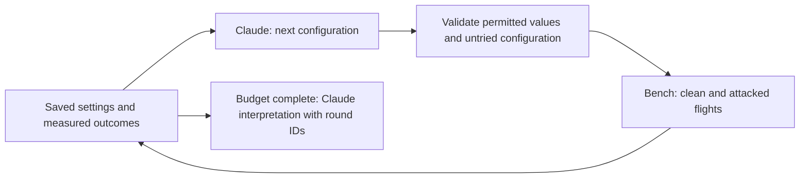

# Claude Team agent for WS2

Claude selects exact test configurations and writes an evidence-linked final
interpretation. The bench validates configurations, controls the simulator,
computes metrics, classifies outcomes and retains replayable results.
All current prompts and generated text are English. See [EVALUATION.md](EVALUATION.md)
for the expanded scene/noise/light space and equal-budget policy comparison.



## Login and no-flight verification

Requires Python 3.10+, the bench's existing PyYAML dependencies, and official
Claude Code. Development tested Claude Code 2.1.261. No extra Python SDK or
credential-file reader is needed.

In your terminal, use the Claude account invited to the lab Team:

```bash
claude auth login --claudeai
python3 tools/ws2_bench/claude_check.py
python3 tools/ws2_bench/claude_check.py --smoke
```

The default command checks login only. `--smoke` makes two small live requests:
one configuration and one interpretation of explicitly synthetic data. It never
starts containers, simulation or flights. Synthetic output is kept under
`robot/ros_ws/ws2_runtime/claude_checks/`; never present it as flight evidence.

The bench invokes `claude -p` with JSON schema output, disabled tools/MCP,
safe mode, an empty working directory and no persistent conversation. Claude
Code manages OAuth itself. Do not paste tokens into source, YAML or chat.
Conflicting API-key/provider environment variables are rejected to avoid
silently using separate API billing. Team plan limits still apply.

Official references, checked 2026-10-06:

- [Claude authentication](https://code.claude.com/docs/en/authentication)
- [CLI reference](https://code.claude.com/docs/en/cli-reference)
- [Subscription SDK usage](https://support.claude.com/en/articles/15036540-use-the-claude-agent-sdk-with-your-claude-plan)
  — read the update at the top; the superseded monthly-credit text below is not current.

Optional process-level settings (no secrets):

```bash
export WS2_CLAUDE_MODEL=sonnet
export WS2_CLAUDE_TIMEOUT_S=180
export WS2_AGENT_PROVIDER=claude
```

The requested alias and actual resolved model are recorded with usage per
request. For comparisons across days, set the same full model ID for every
campaign; aliases can move. CLI cost estimates are not billing invoices.

## Campaigns on a configured simulator installation

Run flight commands only in the checkout mounted by the simulator/robot
containers, with its models/assets/runtime available. This integration lives on
`eungchang/adv-ws2`; LLM-free modes remain available on that same branch. The basic
version is preserved by tag `ws2-basic-2026-09-22`. The episode runner checks
source/runtime bind mounts and rejects mismatches before starting containers.

```bash
python3 tools/ws2_bench/agent_campaign.py \
  --policy agent_search --provider claude --planner mononav --budget 8 \
  --action-space expanded \
  --output robot/ros_ws/ws2_runtime/campaigns/claude_mononav_01
```

Expanded mode generates new coordinates from a seed and bounded spatial
constraints. For the older saved-layout mode, use `--action-space saved` plus
`--qualified-layout easy:2` (repeatable); that example is not a clean-success
guarantee. One campaign evaluates one planner.
Budget 8 means four clean/attacked pairs; initial clean validation and
infrastructure retries are accounted separately. Model missions/speeds stay unchanged.

In the updated dashboard choose target, **LLM-guided tests**, **Claude · Team
login**, choose the expanded or saved condition space, then set the flight budget. Final Claude
interpretation is shown separately from the deterministic metric report.
Gemini remains available in the saved-layout mode through **Gemini / compatible
API** and its existing environment variables. Expanded LLM mode currently requires
Claude's exact-action provider. The dashboard remains the observer/control interface.

For exactly one clean/attacked pair, set **Flights=2**, **Extra clean checks=0**
and **Infrastructure retries=0**. Normally stop when clean fails. For pipeline
validation, **Continue; mark baseline failure** still runs the attacked flight
but excludes that pair from candidate attack findings. Equivalent CLI options:
`--budget 2 --clean-validation-runs 0 --infrastructure-retries 0
--clean-failure-policy record`. No confirmation or next pair can exceed the budget.

## What Claude controls

Expanded mode: new placement seed, Easy/Medium/Hard prop counts, protected-corridor
width and side bias, RGB noise sigma, illumination, sensor delay, and patch on/off,
size and activation schedule. Realized positions are checked and saved for replay.
All three policies use the same ranges; see [EVALUATION.md](EVALUATION.md).

The older saved-layout mode retains:

- Exact saved layout and seed, among the supplied qualified combinations.
- Additional sensor delay: 0, 0.05, 0.15 or 0.25 simulation seconds.
- Patch on/off, original texture only; size 0.3, 0.6 or 0.9 metres.
- Continuous patch, or start at 5/10 simulation seconds for 5/10 seconds.
  Start=0, duration=0 means on for the whole mission, not zero exposure.

Claude returns the exact configuration; the search ranker does not override
its numerical values. The runner checks every field and action-space membership.
A clean-pass/attack-fail candidate is repeated once by deterministic policy;
confirmation uses no additional selection request. This is a repeated
observation, not statistical proof. Invalid structured output receives one
repair attempt; a still-invalid configuration cannot start a flight.

Saved mode retains Ravi's delay/patch action space; expanded mode adds the
controls described above. FCRN training does not establish attack effectiveness on
either deployed FCRN or ZoeDepth.

## Final interpretation and evidence

At completion/stop, Claude receives mission, clean/attacked outcomes,
metrics/differences, conditions including patch schedules, counts, limitations
and round IDs. It cannot overwrite outcomes, decide collisions or start extra
flights. Findings must cite existing round IDs; candidate effects require a
passing clean and failing attacked pair. These checks do not prove every
natural-language interpretation; review the generated hypotheses.
The report request contains numerical/text evidence, not camera images. Check
the viewer and saved images separately when judging actual patch visibility.

Campaign artifacts:

- `vulnerability_report.{json,md,html}`: deterministic measurements/findings.
- `llm_analysis.{json,md,html}`: Claude interpretation and recommended tests.
- `llm_calls/*.json`: prompts, validated outputs, model/usage and request hashes;
  no credentials. Ignored runtime artifacts, not Git source.
- `decision.json` per round: executed configuration and selection call ID.

If Claude is unavailable, metrics remain intact and the LLM report says
unavailable. Retry interpretation without rerunning any flight:

```bash
python3 tools/ws2_bench/claude_check.py \
  --analyze robot/ros_ws/ws2_runtime/campaigns/claude_mononav_01
```

Completed analysis is reused when evidence/provider metadata match. Resuming
retains executed decisions and counts. A changed provider/model requires a new
campaign. `--no-llm-report` skips the final interpretation.

## Validation

```bash
python3 -m pytest -q -p no:cacheprovider tools/ws2_bench
```

Tests cover exact selection, invalid/empty responses, one repair, tool-free
CLI calls, auth/API conflicts, timeouts, repeat/resume, patch timing identity,
fabricated evidence rejection, and retaining metrics if analysis fails. CPU and
live text checks are separate from simulator flight validation.
