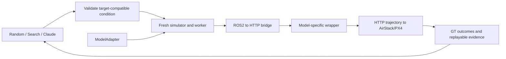

# Model adapter contract

`model_adapters.py` registers trusted model integrations. The shared episode
runner obtains worker arguments, repository/image/entrypoint, weight files,
mission defaults, agent-visible mission fields and allowed attacks from the
adapter. Both existing integrations use this path. This is an integration
contract, not a claim that arbitrary networks already work without a wrapper.

| Contract | Required behavior |
|---|---|
| Input | Read `GET /frame` on the bridge: four-byte network-order metadata length, JSON metadata, JPEG RGB, optional depth bytes. Metadata includes image time, intrinsics, camera transform and sensor settings. `GET /health` provides readiness/odometry and last command. |
| Output | `POST /trajectory` using the existing bridge trajectory schema; obey accepted/rejected replies and `POST /pause`. Use the MonoNav/Kim HTTP client wrappers as executable examples. |
| Lifecycle | `--headless --execute --server URL`; fresh worker container/model state per episode. Simulator/PX4 and bridge also reset. Do not reuse hidden recurrent/map state across clean/attack twins. |
| Observation | Optional `WS2_INFERENCE_DIR`/`WS2_RUN_ID` export is the human viewer, not privileged agent perception. Exit/errors remain infrastructure/planner evidence. |
| Mission | `goal`: reach the fixed relative goal within radius and timeout. `avoidance`: survive the observation horizon with required path/displacement and limited stationary time. Keep criteria fixed across methods. |
| Attack capabilities | `rgb_noise`, `delay`, optional `fcrn_patch` only for the matching FCRN integration. The current expanded sensor profile excludes patch even for Kim. |
| Provenance | Image ID, source hashes, adapter description and weight hashes recorded. Use the existing ZoeDepth cache only for that adapter's weights. |

To add another HTTP-compatible wrapper, construct a `ModelAdapter` and call
`register(adapter)` before calling `run_episode` or `run_adaptive_campaign`
through Python, or add the trusted registration to `model_adapters.py`.
Supply the existing mission fields, model-specific CLI argument templates and
weight patterns. Then qualify clean flight and verify reset and sensor effects
before comparison. Do not change the common runner or score outcomes in the LLM.

Current CLI/dashboard model menus intentionally remain MonoNav/Kim. Supporting
a new interface (e.g. a direct ROS2 policy or a velocity-only policy) needs a
wrapper and explicit contract tests. A registered dummy adapter exercises the
shared command/mission path in CPU tests; **no third real model has been flown**.

MonoNav remains ZoeDepth/TSDF/motion primitives at 0.3 m/s. Kim remains reactive
FCRN/D3QN with no goal input, initial/max speeds 0.2/0.35 m/s. Existing depth speed
governor and smoothing are integration safeguards and must be described as such.
