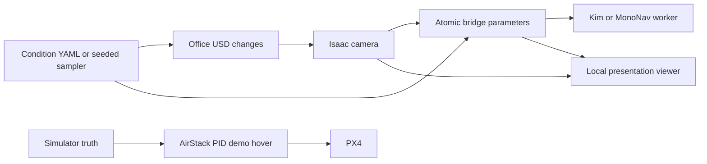

# WS2 Office automated test bench

Automates existing Office prop placement, added plants/columns, lighting, camera
noise/delay and a surface patch. The automated episode adapter runs actual
MonoNav/Kim trajectories on the existing v0.18 AirStack/PX4 control path.
Ravi's metric/report implementation is reused; see [REUSE.md](REUSE.md).
Completed runtime checks and their limits are recorded in [VALIDATION.md](VALIDATION.md).
See [USAGE_KO.md](USAGE_KO.md) for running and screen recording, and
[BACKUP.md](BACKUP.md) for repository scope and asset recovery.

## Automated bench (actual planner flight)

**Presentation workflow:** run `python3 tools/ws2_bench/dashboard.py`, open
`http://127.0.0.1:8892`, select **one target model**, set the flight budget and mission
duration and **Difficulty**, start screen recording, then click **Start tests**. The left panel shows
actual headless Isaac rendering; the right shows the selected model's real
RGB/depth and TSDF/path or D3QN inference. Camera distance/height/orbit persist
between frames and flights without changing the model's sensor camera.
**Pause / Resume / Stop & land** control the campaign. Pause freezes simulator time
and the worker; an in-progress takeoff/landing action finishes before pausing.
Stop lands an intact vehicle and excludes that interrupted trial from performance
rates. After collision the simulator is stopped instead of attempting another flight.
No separate planner or Isaac GUI launcher is needed. Reload existing browser tabs
after updating the dashboard.

This runs `--backend feedback --profile combined --planner <selected model>`:
four rounds, each containing that model's clean/perturbed flights. Each flight starts fresh, runs the
planner, evaluates and finishes automatically. `feedback.py` selects the next
configuration using only that target model's completed results:

- Clean fails: try another saved layout before attributing failure to attacks.
- Clean passes, perturbed fails: repeat the same pair once to check reproducibility;
  if that also fails, keep the scene and lower the search setting: lower sensor
  noise/delay and/or a smaller patch, depending on the profile. Patch size is a
  test condition, not a calibrated or necessarily monotonic attack strength.
- Both pass with low clearance: increase disturbances slightly in the same scene.
- Both pass comfortably: increase disturbances and explore another layout.
- Infrastructure error: keep configuration; do not optimize against that error.

This is deterministic rule-based feedback search, not an LLM or Bayesian optimizer.
Planned LLM support includes sampling new obstacle positions beyond the saved
sets; see [AGENT_ROADMAP.md](AGENT_ROADMAP.md).
Noise/delay values and patch size share a scalar search level; this is not per-parameter causal
attribution. Decisions, input results and explanations are saved. Random/grid
remain predefined baselines and do not use result feedback.

`Vulnerability analysis / Open report` presents candidate failing conditions,
repeat counts, clean/attack metric differences and termination evidence. Reports
are updated after each completed pair and on completion/operator stop as
`vulnerability_report.html`, `.md` and `.json`. A failing clean baseline is reported
separately; partial pairs establish no attack effect. Combined-factor failures
do not identify the individual cause. Select Noise only, Delay only or Patch only
for separate single-factor campaigns. The report is deterministic; no LLM is used.

Office now has24density-tier layouts (three tiers × eight seeds):

| Difficulty | Additional plants | Additional columns |
|---|---:|---:|
| Easy (default) |1|1|
| Medium |3|3|
| Hard |5|5|

One existing plant is also moved; original walls and furniture remain. For the
same seed, higher tiers preserve lower-tier placements and add props. Difficulty
stays fixed within a campaign; feedback selects other seeds in that tier, while
attack magnitude is independent. The UI shows added counts and displacement
ranges. Counts define the tier; monotonic empirical planner difficulty is not claimed.
Generation rejects AABB overlaps, unsupported props and blocked default spawn/8m
goal boxes. A coarse2Dgrid checks a0.35mradius route at1.2maltitude. This does not
prove learned-planner success or feasibility for arbitrary user-defined goals.
The old16furnished_a/b layouts remain for historical replay. Clean/attack twins
use the same layout and illumination; confirmation keeps those settings too.

Use `--difficulty easy|medium|hard` for feedback, random or grid campaigns.
Individual YAML episodes use `condition.layout: easy|medium|hard` and
`condition.layout_seed: 0..7`. To regenerate the tier catalogue against the same
Office assets, run `prepare_difficulty.py /path/to/office.usd` in the USD tooling
environment after the legacy `prepare_layouts.py`. It retains legacy entries.

```bash
python3 tools/ws2_bench/campaign.py --backend feedback --profile combined \
  --budget 8 --planner mononav --wait-for-recording \
  --output robot/ros_ws/ws2_runtime/campaigns/my_feedback_demo
```

Feedback presentation saves GT traces, metrics, configuration, logs and actual
inference snapshots, without large raw bags by default. Add `--record-bags` for
full ROS recording from before takeoff. Worker headless mode now also exports
real inference to the browser; it only disables separate desktop windows.

Use a separate output directory and `--planner kim` to audit Kim. Feedback
requires exactly one model and an even flight budget; it rejects multiple models
and `--matrix`. Historical mixed-model feedback campaigns are preserved as old
evidence but cannot be resumed with this single-target implementation. Random/grid
may still run explicit comparison matrices; those are separate from feedback search.

The following commands own only the named local simulator, robot and planner
containers. They start fresh physics/PX4 and a fresh worker for every episode,
record **before takeoff**, score with simulator GT, finalize the bag/report, and
stop the owned containers. No GUI interaction or video recording is required.

```bash
# Run from AirStack; requires the existing images, mounts and Office assets below.
python3 tools/ws2_bench/episode.py tools/ws2_bench/scenarios/kim_stock.yaml
python3 tools/ws2_bench/episode.py tools/ws2_bench/scenarios/mononav_stock.yaml
# Four flights = two clean/perturbed pairs, one for each planner.
python3 tools/ws2_bench/campaign.py --backend random --budget 4 --seed 42 \
  --output robot/ros_ws/ws2_runtime/campaigns/random_42
python3 tools/ws2_bench/campaign.py --backend grid --budget 4 --seed 42 \
  --output robot/ros_ws/ws2_runtime/campaigns/grid_42
```

Reusing a campaign output directory resumes completed results and reruns only
missing/infrastructure attempts, with a bounded retry count. Every attempt is
retained and reported. Collision, timeout and planner stops are never retried
as infrastructure failures. An interrupted attempt is preserved rather than
overwritten. Use a new output directory to intentionally replay saved YAML:

```bash
python3 tools/ws2_bench/episode.py /path/to/saved/scenario.yaml \
  --output robot/ros_ws/ws2_runtime/episodes/replay_001
```

The clean twin preserves layout/seed, initial pose, illumination, mission and
planner, and switches off RGB/depth noise, additional delay and the surface
patch. Here lighting/layout are **scene conditions**, not attack parameters.
Random/grid baselines use local engineering bounds. The default `--profile sensors`
varies RGB noise and delay; `--profile patch` varies only Rui patch size;
`--profile combined` varies both. Grid enumerates fixed combinations; it is not
LLM- or Bayesian-guided search. These bounds are chosen for WS2 testing, not
claimed to be Rui's training setup or a finalized CyLab threat model.

Each episode produces YAML/JSON configuration, source/image provenance, raw
camera and planner-input MCAP, actual flight/worker logs, GT samples and metrics.
MCAP uses simulation timestamps and internal Zstd compression. The verifier
checks at least one second of grounded GT before flight and monotonic pose time.
Random/grid campaigns produce `report.json`, `trials.csv`, and `report.html`, with success /
collision rates grouped by planner and clean/perturbed role. Infrastructure
errors are excluded from the rate denominator and listed separately. A failed
clean trial is marked `invalid_clean_baseline`, never attack success.

Add `--matrix` to cross each sampled condition with **both** planners. Its
budget must be divisible by `2 * number_of_planners`; e.g. budget 8 gives two
conditions x two planners x clean/perturbed. Without this flag, the small smoke
campaign alternates planners across candidates and is not a fair planner ranking.

Mission timeouts/time-to-goal use simulator time; startup/service watchdogs use
wall time. Defaults are now model-specific, superseding the earlier short demos:

- **MonoNav:**8mforward goal,0.5mradius,180sim-second limit,0.3m/scommand speed.
- **Kim:** no goal input or goal-success check;120sim-second observation period.
  Passing requires collision-free completion, at least3mpath length and1mmaximum
  displacement from start, and no more than50%stationary time (one-second windows
  below0.03m/s). Otherwise the outcome is `insufficient_progress`.
  Initial/max command speeds are0.2/0.35m/s, with a2sreceding trajectory horizon.
  The D3QN action policy and depth-based speed governor remain active; actual
  speed is measured from GT and can be substantially below commanded speed.

These are local evaluation criteria, not paper-reproduction settings. Duration
is an upper bound: collision/planner termination can end a flight earlier. Model
initialization and operator pause are excluded from the mission clock. The web
allows60..600s, MonoNav goals2..30m and2..100even-numbered flights. YAML can set
the motion thresholds and speed/horizon within validated bounds. Existing explicit
diagnostic YAMLs retain their own values. Eight flights can take many
minutes because each trial reloads Isaac/PX4 and model state. For a presentation,
trim initialization/landing waits while retaining the result and next-decision
screens. Verify a completed feedback run independently with:

```bash
python3 tools/ws2_bench/audit_feedback.py robot/ros_ws/ws2_runtime/campaigns/my_feedback_demo
```

Collision uses every drone rigid body's external PhysX contacts. A contact is
armed after takeoff (>0.3 m); planned landing occurs after mission evaluation.
After a mission collision, finalize evidence and stop/reset instead of trying
to fly a crashed vehicle. Clearance queries all external scene colliders,
including floor/ceiling: nearest center-to-collider distance minus a **nominal
0.25 m spherical envelope**, not the exact drone collision hull. This metric is
independent of FCRN/ZoeDepth and does not replace authoritative contact detection.
Report the simulation-time-weighted mean and sampled minimum clearance.

`validate_bridge.yaml` deliberately removes the bridge before arming and must
produce an infrastructure error. `validate_timeout.yaml` uses a short simulated
mission budget. `validate_contact.yaml` deliberately inserts a diagnostic
collider into an airborne vehicle; its result is marked validation-only and
must never be counted as a planner/attack result.

The following diagnostic hover sections describe the legacy CLI, not the main
feedback presentation above. The new dashboard always presents actual inference.

## Data flow



The optional presentation flight holds position using simulator GT and AirStack PID.
The learned worker runs inference with execution disabled. This demonstration
does **not** establish closed-loop obstacle avoidance or attack success.

## Setup and startup

Requires the existing `isaac-sim` and `airstack-robot-desktop-1` containers,
AirStack bind mounts, ROS domain 1, the local Office
asset tree, and a built `mononav_bridge`. No image installation is performed.
Isaac is headless by default; its observer camera publishes JPEG previews to the
local web UI. `WS2_HEADLESS=0` enables its desktop window if X11 is configured.
The simulator must contain Office at
`/tmp/ws2_assets/Isaac/4.5/Isaac/Environments/Office/office.usd`.
Copy the collected `Assets` directory to `/tmp/ws2_assets` with `docker cp`
if rebuilding the container. Preserve the referenced textures and materials.

From the AirStack repository:

```bash
docker exec airstack-robot-desktop-1 bash -lc 'bws --packages-select mononav_bridge'
# Cold start only: both demo containers must already be stopped.
bash tools/ws2_bench/start_existing.sh
python3 tools/ws2_bench/run_conditions.py --config tools/ws2_bench/demo.yaml
```

In its default `demo` mode, the cold-start helper replaces the standard PID
**process only** with the separate GT-feedback PID namespace. Episodes explicitly
select `bench` mode and retain the standard controller. Neither mode changes the
normal robot launch configuration. Do not use this helper for real hardware. Wait for fresh
`robot/ros_ws/ws2_runtime/scene_status.json` and `/health` camera readiness.

The old dashboard buttons for condition sequences and GT hover were removed.
Use `run_conditions.py --random-count 6` for the legacy ground-only diagnostic,
or `run_conditions.py --flight` for the legacy GT hover. These are not the main
automatic presentation and are not learned-planner navigation.

Start Kim separately using its existing `docker/run_airstack_live.sh`, with
`COLLISION_AVOIDANCE_EXECUTE=false`. The bridge also disables command execution.
Restart a worker after bridge/container restarts if its HTTP connection exited.
This optional condition viewer starts no bag or screen recording; actual episodes
above do start a bag before takeoff.
The new dashboard omits Office preview and shows real inference instead. The
native Isaac viewport remains an optional second recording view.

## Conditions and interfaces

`demo.yaml` contains the sequence; `conditions.py` is the validation contract.
Light intensity is a renderer parameter, RGB noise standard deviation uses
0–255 pixel units, simulator-depth noise uses metres, and additional delay uses
simulation seconds. Depth noise modifies the optional GT-depth bridge input,
not the inferred FCRN/ZoeDepth output. All current ranges are local engineering
settings, **not CyLab-approved attack bounds**.

`layout_seed` selects one of eight prevalidated layouts for each of two variants.
Generate the catalogue using an interpreter with OpenUSD:

```bash
python3 tools/ws2_bench/prepare_layouts.py /path/to/Office/office.usd
python3 tools/ws2_bench/run_conditions.py --random-count 6 --seed 42
python3 tools/ws2_bench/run_conditions.py --flight
```

The catalogue moves a native plant and duplicates native plants/columns with
their original materials/colliders. It preserves building walls/floors and
checks coarse AABB overlap and a protected launch region. These checks do not
prove route feasibility or contact-metric correctness. Original launch surfaces
must also be checked: the first candidate at world `[-6,0]` overlapped a sofa;
the corrected launch point is `[-4,0]`.

`scene_command.json` carries an ID and condition/camera request. The simulator
returns `scene_reply.json`; status includes resolved placement and simulator time.
The host then sets `/vision_planner/bridge/set_parameters_atomically` and checks
the resulting camera frame metadata. Scene and ROS updates are sequential, not
a single distributed transaction. There is a rendering settling interval.
Do not classify intermediate frames as a completed test condition.

`/raw.jpg` is the latest camera image; `/image.jpg` is the delayed/disturbed
planner input. They need not represent the same instant. The bridge's original
`/frame` protocol is retained. Pose evidence is published as PoseStamped on
`/ws2/ground_truth/pose`; `/ws2/control/*` is dedicated to demonstration control.

## Patch asset and clean comparison

The default is Rui's supplied 128x128 `assets/learned_patch.png`, bundled with
the AirStack source backup. A clone containing these changes restores it directly.
`python3 tools/ws2_bench/import_patch.py /path/to/learned_patch.png` can verify or
restore the same original image against the SHA-256 in `assets/patch_manifest.json`.
Every episode verifies and records its hash. The obsolete diagnostic checker was
removed during cleanup; the supplied learned image is the retained asset.

The patch is a noncolliding plane on an added column face. The column remains
collidable. The only patch controls are **on/off** (`patch_enabled`) and physical
side length (`patch_size`, 0.1–0.95 m). The center height is fixed at1.2m on the
same column face. The original PNG is rendered opaque, with identity texture
scale and zero bias: no gray mixing, contrast or opacity adjustment. Lighting
and ordinary material shading still affect the camera image. Clean hides the
plane and shows the original column without changing obstacle geometry.

New campaigns record patch policy `original_texture_size_only_v1`. Old configs
containing `patch_strength` or `patch_height` are rejected, and old campaigns
cannot resume under the new policy. Preserve their original results; start a
new campaign (or remove those fields from a copy of a scenario for a new trial).
Historical runs used the previous behavior and are not rewritten or relabeled.

Optional episode `patch_start_s` and `patch_duration_s` control activation relative
to the first executed planner command, using simulator time. Start defaults to
0 (visible from setup), duration 0 means continuously active. Positive start
hides the patch until that mission time; clean twins never activate it. The
actual activation timestamps are recorded in `events.jsonl`. Existing YAML
phase/dwell controls are also available for the hover demonstration.

The physical defaults are our test choices; Rui's image can be used without
requesting a prescribed physical size. His PyTorch training FCRN and the deployed
TensorFlow FCRN were tested on identical input arrays and do not give identical
outputs. Keep the original Kim target unchanged; patch transfer/effectiveness
requires measurement. See `VALIDATION.md` for results, not assumed attack success.

## Evidence, checks, and recovery

Local verification on 2026-09-22: run `20260922_083812` completed all nine
conditions, 1.2 m GT-controlled hover, landing and disarm. Its 58.8 s simulated
flight had 0.05445 m maximum horizontal drift and 0.00759 m hover position RMSE.
Noise sigma 25 produced pre-JPEG RGB RMSE 23.60 (clipping lowers RMSE); the
0.25 s delayed frame was 0.27 s behind the latest odometry timestamp. Kim
FCRN/D3QN continued inference with execution disabled. This verifies these
interfaces and the demonstration flight only.

Each run saves resolved conditions, scene state, camera metadata, pixel noise
RMSE and planner-input JPEGs under `robot/ros_ws/ws2_runtime/runs/`.
Completed flight runs additionally save a GT trace and landing result. Runtime
outputs are git-ignored. Layout changes are refused above 0.35 m world height.
The physics guard pauses on excessive speed or tilt and writes `flight_guard.json`.
Review its cause, stop the two demo containers, and archive that file before
restarting; do not erase it to continue an unresolved flight.

```bash
python3 -m pytest -q tools/ws2_bench/test_conditions.py
```

This validates condition bounds and paired-condition invariants. Runtime
evidence is required separately for rendering, delays, flight and inference.
The episode adapter above provides collision/metric evaluation and isolated
clean/perturbed flights. Rui rendering and inference-input integration are now
implemented. Training reproduction and statistically established adversarial
effectiveness are separate research tasks.
